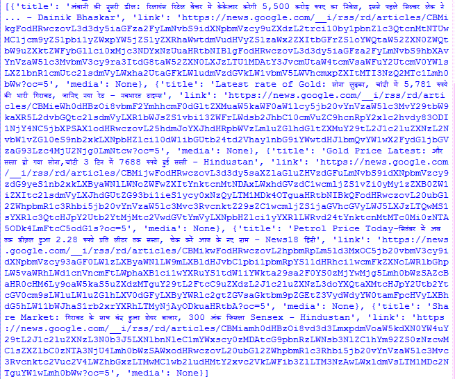
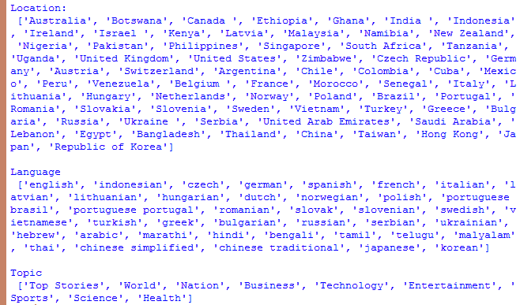
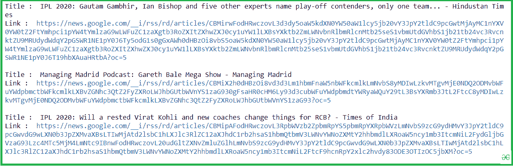
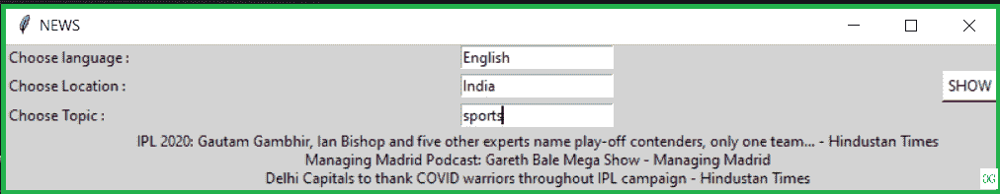

# 使用 Python 构建一个从谷歌新闻提要中提取新闻的应用程序

> 原文:[https://www . geesforgeks . org/build-a-application-to-extract-news-feed-use-python/](https://www.geeksforgeeks.org/build-an-application-to-extract-news-from-google-news-feed-using-python/)

**先决条件**–[蟒蛇 tkinter](https://www.geeksforgeeks.org/python-gui-tkinter/)

在本文中，我们将编写一个 python 脚本，通过使用**gnewclient**模块从 Google News Feed 中提取新闻文章，并将其与 GUI 应用程序绑定。gnewsclient 是谷歌新闻提要的 python 客户端。必须先显式安装该应用编程接口才能使用。

### **安装**

以下终端命令安装 gnewsclient 包及其所有必需的库。所以，人们只需要在他们的终端上运行这个命令。

```py
pip install gnewsclient
```

### 使用模块

1.  导入 gnewsclient 模块
2.  创建新闻客户端对象并设置当前参数设置
3.  获取新闻源

## 蟒蛇 3

```py
# import module
from gnewsclient import gnewsclient

# declare a NewsClient object
client = gnewsclient.NewsClient(language='hindi', location='india', topic='Business', max_results=5)

# get news feed
client.get_news()
```

**输出:**



以下代码描述了如何从该模块收集的信息中打印位置、语言和主题等其他因素:

## 蟒蛇 3

```py
import gnewsclient
from gnewsclient import gnewsclient

client = gnewsclient.NewsClient(language='hindi',
                                location='india',
                                topic='Business',
                                max_results=5)

# prints location
print("Location: \n",client.locations)
print()

# prints languages
print("Language \n",client.languages)
print()

# prints topics
print("Topic \n",client.topics)
```

**输出:**



#### 示例 **:**

**程序 1:**

## 蟒蛇 3

```py
from gnewsclient import gnewsclient

client = gnewsclient.NewsClient(language='english',
                                location='india',
                                topic='sports',
                                max_results=3)

news_list = client.get_news()

for item in news_list:
    print("Title : ", item['title'])
    print("Link : ", item['link'])
    print("")
```

**输出:**



**程序 2** :该代码在 GUI 中实现了程序 1 的方法论。

## 蟒蛇 3

```py
# import modules
from tkinter import *
from gnewsclient import gnewsclient

# defined functions
def news():
    client = gnewsclient.NewsClient(
        language=lang.get(), location=loc.get(), topic=top.get(), max_results=3)
    news_list = client.get_news()
    result_title.set(news_list[0]["title"] + "\n" +
                     news_list[1]["title"] + "\n" + news_list[2]["title"])

# tkinter object
master = Tk()
master.title("NEWS")

# background set to grey
master.configure(bg='light grey')

# Variable Classes in tkinter
result_title = StringVar()
result_link = StringVar()

# Creating label for each information
# name using widget Label
Label(master, text="Choose language :", bg="light grey").grid(row=0, sticky=W)
Label(master, text="Choose Location :", bg="light grey").grid(row=1, sticky=W)
Label(master, text="Choose Topic :", bg="light grey").grid(row=2, sticky=W)

lang = Entry(master)
lang.grid(row=0, column=1)

loc = Entry(master)
loc.grid(row=1, column=1)

top = Entry(master)
top.grid(row=2, column=1)

# Creating label for class variable
# name using widget Entry
Label(master, text="", textvariable=result_title,
      bg="light grey").grid(row=3, column=1, sticky=W)

# creating a button using the widget
# Button to call the submit function
Button(master, text="SHOW", command=news, bg="white").grid(row=1, column=3)

mainloop()
```

**输出:**

