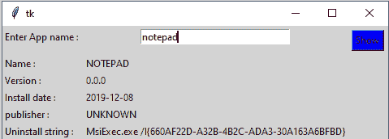
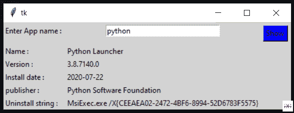

# 使用 Python 构建应用程序来搜索已安装的应用程序

> 原文:[https://www . geesforgeks . org/build-a-application-to-search-installed-application-use-python/](https://www.geeksforgeeks.org/build-an-application-to-search-installed-application-using-python/)

**先决条件–**[**Python 中的 Tkinter**](https://www.geeksforgeeks.org/create-first-gui-application-using-python-tkinter/)**。**

在本文中，我们将编写 python 脚本来搜索在 Windows 上安装的应用程序，并将其与 GUI 应用程序绑定。我们正在使用 **winapps** 模块来管理 Windows 上安装的应用程序。

要安装该模块，请在您的终端中运行以下命令:

> pip 安装 winapps

**下面是 GUI 的样子:-**



### 从 winapps 模块使用的方法

要打印已安装的应用程序，winapps 模块有 **winapps.list_installed()** 方法。T

## 蟒蛇 3

```
# import modules
import winapps

# get each application with list_installed()
for item in winapps.list_installed():
    print(item)
```

**输出:**

> InstalledApplication(名称='Mi 智能共享'，版本='1.0.0.452 '，install_date=None，install_location=None，install_source=None，modify_path=None，publisher='Xiaomi Inc '，uninstall _ string = ' C:\ \ Program Files \ \ Mi \ \ AIoT \ \ MiShare \ \ 1 . 0 . 0 . 452 \ \ uninstall . exe ')
> 
> InstalledApplication(名称='Git version 2.27.0 '，版本='2.27.0 '，install _ date = datetime . date(2020，7，22)，install _ location = WindowsPath(' D:/:Installation _ bulk/Git ')，install_source=None，modify_path=None，publisher = ' The Git Development Community '，uninstall _ string = ' ' D:\ Installation _ bulk \ \ Git \ \ uninstall 000 . exe ')
> 
> InstalledApplication(名称= ' Microsoft 365–en-us '，版本='16.0.13127.20408 '，install_date=None，install _ location = WindowsPath(' C:/Program Files/Microsoft Office ')，install_source=None，modify _ path = ' " C:\ \ Program Files \ \ Common file \ \ Microsoft Shared \ \ ClickToRun \ \ officeclickonn . exe "方案=修复平台=x64 区域性=en-us '，publisher = ' Microsoft Corporation '，uninstall_string='"C:\ "
> 
> InstalledApplication(名称= '屏上显示实用程序'，版本='1.0.0.140 '，安装 _ 日期=无，安装 _ 位置=无，安装 _ 源=无，修改 _ 路径=无，发布者= '小米公司'，卸载 _ 字符串= ' C:\ \程序文件\\MI\\OSD 实用程序\ \ 1 . 0 . 0 . 140 \ \ uninstall . exe ')
> 
> InstalledApplication(名称='Intel(R)管理引擎组件'，版本='1921.14.0.1280 '，install_date=None，install _ location = WindowsPath(' C:/Program file(x86)/Intel/Intel(R)管理引擎组件')，install_source=None，modify_path=None，publisher='Intel Corporation '，uninstall _ string = ' ' C:\ \ ProgramData \ \ Intel \ \ Package Cache \ \ { 1ceac 85d-2590-4760-800 f-88
> 
> ………

为了搜索现有的应用程序，该模块安装了**search _ installed(' App _ name ')**方法。

## 蟒蛇 3

```
for item in winapps.search_installed('chrome'):
    print(item)
```

**输出:**

> InstalledApplication(名称='Google Chrome '，版本='85.0.4183.102 '，install _ date = datetime . date(2020，9，11)，
> install _ location = WindowsPath(' C:/Program Files(x86)/Google/Chrome/Application ')，install_source=None，
> modify_path=None，publisher='Google LLC '，uninstall _ string = '
> " C:\ \ Program Files(x86)\ \ Google \ \ Chrome \ \ Application \ \ 85 . 0 . 40

### **使用 Tkinter 在窗口中搜索应用程序**

## 蟒蛇 3

```
# import modules
from tkinter import *
import winapps

# function to attach output
def app():

    for item in winapps.search_installed(e.get()):
        name.set(item.name)
        version.set(item.version)
        Install_date.set(item.install_date)
        publisher.set(item.publisher)
        uninstall_string.set(item.uninstall_string)

# object of tkinter
# and background set for grey
master = Tk()
master.configure(bg='light grey')

# Variable Classes in tkinter
name = StringVar()
version = StringVar()
Install_date = StringVar()
publisher = StringVar()
uninstall_string = StringVar()

# Creating label for each information
# name using widget Label
Label(master, text="Enter App name : ",
      bg="light grey").grid(row=0, sticky=W)
Label(master, text="Name : ",
      bg="light grey").grid(row=2, sticky=W)
Label(master, text="Version :",
      bg="light grey").grid(row=3, sticky=W)
Label(master, text="Install date :",
      bg="light grey").grid(row=4, sticky=W)
Label(master, text="publisher :",
      bg="light grey").grid(row=5, sticky=W)
Label(master, text="Uninstall string :",
      bg="light grey").grid(row=6, sticky=W)

# Creating label for class variable
# name using widget Entry
Label(master, text="", textvariable=name,
      bg="light grey").grid(row=2, column=1, sticky=W)
Label(master, text="", textvariable=version,
      bg="light grey").grid(row=3, column=1, sticky=W)
Label(master, text="", textvariable=Install_date,
      bg="light grey").grid(row=4, column=1, sticky=W)
Label(master, text="", textvariable=publisher,
      bg="light grey").grid(row=5, column=1, sticky=W)
Label(master, text="", textvariable=uninstall_string,
      bg="light grey").grid(row=6, column=1, sticky=W)

e = Entry(master, width=30)
e.grid(row=0, column=1)

# creating a button using the widget
b = Button(master, text="Show", command=app, bg="Blue")
b.grid(row=0, column=2, columnspan=2, rowspan=2, padx=5, pady=5,)

mainloop()
```

**输出:**



<video class="wp-video-shortcode" id="video-487091-1" width="640" height="360" preload="metadata" controls=""><source type="video/mp4" src="https://media.geeksforgeeks.org/wp-content/uploads/20210214180015/FreeOnlineScreenRecorderProject7.mp4?_=1">[https://media.geeksforgeeks.org/wp-content/uploads/20210214180015/FreeOnlineScreenRecorderProject7.mp4](https://media.geeksforgeeks.org/wp-content/uploads/20210214180015/FreeOnlineScreenRecorderProject7.mp4)</video>