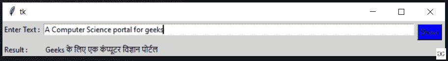

# 用 Python 构建一个将英语翻译成印地语的应用程序

> 原文:[https://www . geesforgeks . org/build-a-application-to-translate-English-to-Hindi-in-python/](https://www.geeksforgeeks.org/build-an-application-to-translate-english-to-hindi-in-python/)

在这些文章中，我们将编写 python 脚本来将英语单词翻译成印地语单词，并将其与 GUI 应用程序绑定。我们正在使用**英语到印地语**模块将英语单词翻译成印地语单词。

**安装:**

将此代码运行到您的终端中:

```
pip install English to Hindi
```

**进场:**

*   将英语导入印地语模块。
*   通过传递消息创建一个 EngtoHindi()的对象。
*   使用 convert()方法进行转换。

**示例:**

## 蟒蛇 3

```
# importing the module
from english to hindi.englishtohindi import EngtoHindi

# message to be translated
message = "Yes, I am geeks"

# creating a EngtoHindi() object
res = EngtoHindi(message)

# displaying the translation
print(res.convert)
```

**输出:**

```
हां, मैं गीक्स हूं
```

**带 Tkinter 的英语到印地语翻译应用程序:**该脚本将上述实现实现到一个图形用户界面中。

## 蟒蛇 3

```
# import modules
from tkinter import *
from englishtohindi.englishtohindi import EngtoHindi

# user define function
def eng_to_hindi():
    trans = EngtoHindi(str(e.get()))
    res = trans.convert
    result.set(res)  

# object of tkinter
# and background set for grey
master = Tk()
master.configure(bg = 'light grey')

# Variable Classes in tkinter
result = StringVar();

# Creating label for each information
# name using widget Label
Label(master, text="Enter Text : " , bg = "light grey").grid(row = 0, sticky = W)
Label(master, text="Result :", bg = "light grey").grid(row = 3, sticky = W)

# Creating label for class variable
# name using widget Entry
Label(master, text="", textvariable=result,bg = "light grey").grid(row = 3,
                                                                   column = 1,
                                                                   sticky = W)

e = Entry(master, width = 100)
e.grid(row = 0, column = 1)

# creating a button using the widget 
# Button that will call the submit function
b = Button(master, text = "Show", command = eng_to_hindi, bg = "Blue")
b.grid(row = 0, column = 2, columnspan = 2, rowspan = 2, padx = 5, pady = 5,)

mainloop()
```

**输出:**

