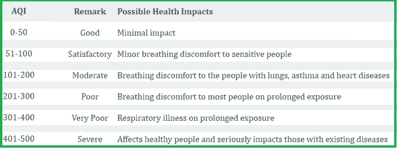
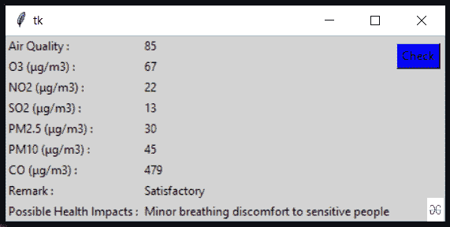

# 使用 Python 构建安贵应用程序以获取实时空气质量信息。

> 原文:[https://www . geesforgeks . org/build-an-GUI-application-to-get-live-air-quality-information-use-python/](https://www.geeksforgeeks.org/build-an-gui-application-to-get-live-air-quality-information-using-python/)

我们生活在一个现代化和工业化的时代。我们的生活变得越来越方便。但是问题是空气污染是随着时间的推移而产生的。这种污染使我们不健康，空气是我们生命的生命线。

在本文中，我们将编写 python 脚本来获取实时空气质量信息，并将其与图形用户界面应用程序绑定。

**所需模块**

*   **bs4:** 美人汤(bs4)是一个从 HTML 和 XML 文件中拉出数据的 Python 库。要安装此软件，请在终端中键入以下命令。

> pip 安装 bs4

*   **请求:**这样可以非常轻松地发送 HTTP/1.1 请求。要安装此软件，请在终端中键入以下命令。

> pip 安装请求

**进场:**

*   从给定的网址提取数据。选择所需位置后，复制网址。
*   借助请求和靓汤模块刮取数据。
*   将数据转换成 HTML 代码。
*   找到所需的详细信息并进行筛选。

**实现:**
**第一步:**导入所有需要的模块

## 蟒蛇 3

```
# import module
import requests
from bs4 import BeautifulSoup
```

**步骤 2:** 创建一个 URL 获取函数

## 蟒蛇 3

```
# link to extract html data

def getdata(url):
    r=requests.get(url)
    return r.text
```

**第 3 步:**现在将 URL 传递给 getdata 函数，并将该数据转换为 HTML 代码。这里使用的网址是**“https://weather . com/en-IN/forecast/air-quality/l/3d bed 5c 769584 b 3604 a 70d 40 a1 A0 a9 F6 ebc 99 c 253d 955 b 548 f 4978 ca 101 eeca 1”**

## 蟒蛇 3

```
htmldata = getdata(# write the URL )
soup = BeautifulSoup(htmldata, 'html.parser')
result = (soup.find_all("div", class_="styles__primaryPollutantGraphNumber__2WgP9"))
result
```

**输出:**

> 【
> 
> 67、
> T8】div class = " styles _ _ primarypollutangtrapnumber _ _ 2w gp9 " class name = " styles _ _ primarypollutantgrapnumber _ _ 2w gp9 ">22</div>、
> T12】div class = " styles _ _ primarypollutangtrapnumber _ _ 2w gp9 " class name = " styles _ _ primarypollutangtrapnumber _ _ 2w gp9 ">13</div【

**第四步:**根据给定的数据过滤你的数据，检查你的空气质量:

## 蟒蛇 3

```
# Traverse the air quality
for item in (soup.find_all("div", class_="styles__aqiGraphNumber__2R6Y9")):
    res_data = item.get_text()

# traverse the content
data = ''
for item in (soup.find_all("div", class_="styles__primaryPollutantGraphNumber__2WgP9")):
    data += item.get_text()
    data += " "
air_data = data.split(" ")
print("Air Quality :", res_data)
print("O3 level :", air_data[0])
print("NO2 level :", air_data[1])
print("SO2 level :", air_data[2])
print("PM2.5 level :", air_data[3])
print("PM10 level :", air_data[4])
print("co level :", air_data[5])
```

**输出:**

```
Air Quality : 85
O3 level : 67
NO2 level : 22
SO2 level : 13
PM2.5 level : 30
PM10 level : 45
co level : 479
```

**第五步:**现在用给定的数据分析空气质量:



## 蟒蛇 3

```
res = int(res_data)

if res <= 50:
    remark = "Good"
    impact = "Minimal impact"

elif res <= 100 and res > 51:
    remark = "Satisfactory"
    impact = "Minor breathing discomfort to sensitive people"

elif res <= 200 and res >= 101:
    remark = "Moderate"
    impact = "Breathing discomfort to the people with lungs, asthma and heart diseases"

elif res <= 400 and res >= 201:
    remark = "Very Poor"
    impact = "Breathing discomfort to most people on prolonged exposure"

elif res <= 500 and res >= 401:
    remark = "Severe"
    impact = "Affects healthy people and seriously impacts those with existing diseases"

print(remark)
print(impact)
```

**输出:**

```
Satisfactory
Minor breathing discomfort to sensitive people
```

**用 Tkinter 应用实时空气质量信息:**该脚本将上述实现实现到图形用户界面中。

## 蟒蛇 3

```
# import modules
from tkinter import *
import requests
from bs4 import BeautifulSoup

# link for extract html data

def getdata(url):
    r = requests.get(url)
    return r.text

def airinfo():
    htmldata = getdata(
        "https://weather.com/en-IN/forecast/air-quality/l/3dbed5c769584b3604a70d40a1a0a9f6ebc99c253d955b548f4978ca101eeca1")
    soup = BeautifulSoup(htmldata, 'html.parser')

    # Traverse the air quality
    for item in (soup.find_all("div",
                               class_="styles__aqiGraphNumber__2R6Y9")):
        res_data = item.get_text()

        # traverse the content
    data = ''
    for item in (soup.find_all("div",
                               class_="styles__primaryPollutantGraphNumber__2WgP9")):
        data += item.get_text()
        data += " "

    air_data = data.split(" ")

    ar.set(res_data)
    o3.set(air_data[0])
    no2.set(air_data[1])
    so2.set(air_data[2])
    pm.set(air_data[3])
    pml.set(air_data[4])
    co.set(air_data[5])
    res = int(res_data)
    if res <= 50:
        remark = "Good"
        impact = "Minimal impact"
    elif res <= 100 and res > 51:
        remark = "Satisfactory"
        impact = "Minor breathing discomfort to sensitive people"
    elif res <= 200 and res >= 101:
        remark = "Moderate"
        impact = "Breathing discomfort to the people with lungs, asthma and heart diseases"
    elif res <= 400 and res >= 201:
        remark = "Very Poor"
        impact = "Breathing discomfort to most people on prolonged exposure"
    elif res <= 500 and res >= 401:
        remark = "Severe"
        impact = "Affects healthy people and seriously impacts those with existing diseases"
    res_remark.set(remark)
    res_imp.set(impact)

# object of tkinter
# and background set to grey
master = Tk()
master.configure(bg='light grey')

# Variable Classes in tkinter
air_data = StringVar()
ar = StringVar()
o3 = StringVar()
no2 = StringVar()
so2 = StringVar()
pm = StringVar()
pml = StringVar()
co = StringVar()
res_remark = StringVar()
res_imp = StringVar()

# Creating label for each information
# name using widget Label
Label(master, text="Air Quality : ",
      bg="light grey").grid(row=0, sticky=W)
Label(master, text="O3 (μg/m3) :",
      bg="light grey").grid(row=1, sticky=W)
Label(master, text="NO2 (μg/m3) :",
      bg="light grey").grid(row=2, sticky=W)
Label(master, text="SO2 (μg/m3) :",
      bg="light grey").grid(row=3, sticky=W)
Label(master, text="PM2.5 (μg/m3) :",
      bg="light grey").grid(row=4, sticky=W)
Label(master, text="PM10 (μg/m3) :",
      bg="light grey").grid(row=5, sticky=W)
Label(master, text="CO (μg/m3) :",
      bg="light grey").grid(row=6, sticky=W)

Label(master, text="Remark :",
      bg="light grey").grid(row=7, sticky=W)
Label(master, text="Possible Health Impacts :",
      bg="light grey").grid(row=8, sticky=W)

# Creating label for class variable
# name using widget Entry
Label(master, text="", textvariable=ar,
      bg="light grey").grid(
    row=0, column=1, sticky=W)
Label(master, text="", textvariable=o3,
      bg="light grey").grid(
    row=1, column=1, sticky=W)
Label(master, text="", textvariable=no2,
      bg="light grey").grid(
    row=2, column=1, sticky=W)
Label(master, text="", textvariable=so2,
      bg="light grey").grid(
    row=3, column=1, sticky=W)
Label(master, text="", textvariable=pm,
      bg="light grey").grid(
    row=4, column=1, sticky=W)
Label(master, text="", textvariable=pml,
      bg="light grey").grid(
    row=5, column=1, sticky=W)
Label(master, text="", textvariable=co,
      bg="light grey").grid(
    row=6, column=1, sticky=W)
Label(master, text="", textvariable=res_remark,
      bg="light grey").grid(row=7, column=1, sticky=W)
Label(master, text="", textvariable=res_imp,
      bg="light grey").grid(row=8, column=1, sticky=W)

# creating a button using the widget
b = Button(master, text="Check",
           command=airinfo, bg="Blue")
b.grid(row=0, column=2, columnspan=2,
       rowspan=2, padx=5, pady=5,)

mainloop()
```

**输出:**

