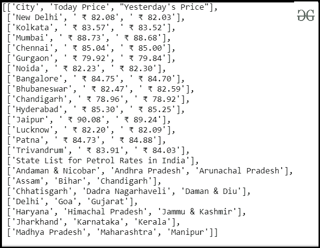
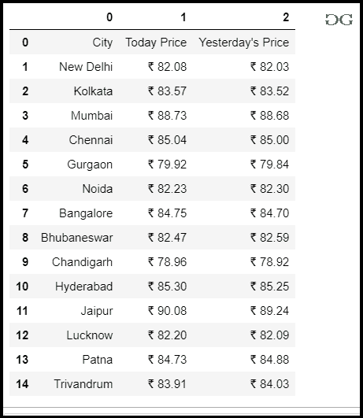

# 使用 Python 构建燃油价格跟踪器

> 原文:[https://www . geesforgeks . org/build-fuel-price-tracker-use-python/](https://www.geeksforgeeks.org/build-fuel-price-tracker-using-python/)

在现代生活方式中，燃料已经成为所有人类的必需品。它是我们生活方式的基础。因此，我们将使用 Python 编写一个脚本来跟踪它们的价格。

**所需模块**

*   [**bs4:**](https://www.geeksforgeeks.org/implementing-web-scraping-python-beautiful-soup/) 美人汤(bs4)是一个从 HTML 和 XML 文件中拉出数据的 Python 库。这个模块没有内置 Python。要安装此软件，请在终端中键入以下命令。

```py
pip install bs4

```

*   [**请求:**](https://www.geeksforgeeks.org/python-requests-tutorial/) 请求让你发送 HTTP/1.1 请求极其轻松。该模块也没有内置 Python。要安装此软件，请在终端中键入以下命令。

```py
pip install requests

```

**我们来看看脚本的分步执行**

**第一步:**导入所有依赖

## 蟒蛇 3

```py
# import module
import pandas as pd
import requests
from bs4 import BeautifulSoup
```

**步骤 2:** 创建一个 URL 获取函数

## 蟒蛇 3

```py
# user define function
# Scrape the data
def getdata(url):
    r = requests.get(url)
    return r.text
```

**步骤 3:** 现在将 URL 传递给 getdata()函数，并将该数据转换为 HTML 代码

## 蟒蛇 3

```py
# link for extract html data
htmldata = getdata("https://www.goodreturns.in/petrol-price.html")
soup = BeautifulSoup(htmldata, 'html.parser')
result = soup.find_all("div", class_="gold_silver_table")
print(result)
```

**输出:**

> [
> 
> <表格边框=“0”cell padding =“1”cell spacing =“1”width =“100%”>
> <tr class =“first”>
> <TD class =“heading”width =“200”>城市</TD>
> t87】TD class =“heading”width =“200”>今日价格</TD>t5 /TD>
> <TD>₹82.03</TD>
> </tr>
> <tr class = " odd _ row ">
> t119】TD><a href = " Kolkata . html " title = " Kolkata ">Kolkata【t123 TD>₹88.73</TD>
> <TD>₹88.68</TD>
> </tr>
> <tr class = " odd _ row ">
> <TD><a href = "/汽油-in-chennai.html" title= " </TD>t29<TD>₹79.92</TD>t30<TD>₹79.84</TD>t31</tr>t32<tr class = " odd _ row ">t33<TD>t201】a >班加罗尔</a></TD>
> <TD>₹84.75</TD>t40<TD>₹84.70</TD>t41</tr>
> t237】tr class = " odd _ row "【t238 >t261/a>t265/TD>t49<TD>₹78.96<TD>T50<TD>₹78.92<TD【t274 class = " even _ row ">
> <TD><a href = "/汽油价格-斋浦尔. html" title= "斋浦尔">斋浦尔</a></TD>
> <TD>₹90.08</TD>
> t311】TD【t312 /tr>
> tr class = " even _ row ">
> <TD><a href = " Patna . html " title = " Patna ">Patna</a>t345】/TD>
> t347】TD>₹84.73</TD

注意:这些脚本将只提供字符串格式的原始数据，您必须根据需要打印数据。

**第四步:**现在，用 soup.find _ all()搜索你需要的数据。

## 蟒蛇 3

```py
# Declare string var
# Declare list
mydatastr = ''
result = []

# searching all tr in the html data
# storing as a string
for table in soup.find_all('tr'):
    mydatastr += table.get_text()

# set accourding to your required
mydatastr = mydatastr[1:]
itemlist = mydatastr.split("\n\n")

for item in itemlist[:-5]:
    result.append(item.split("\n"))

result
```

**输出:**



**第 4 步:**制作一个数据框来显示你的结果。

## 蟒蛇 3

```py
# Calling DataFrame constructor on list
df = pd.DataFrame(result[:-8])
df
```

**完整代码:**

## 蟒蛇 3

```py
# import module
import requests
import pandas as pd
from bs4 import BeautifulSoup

# link for extract html data

def getdata(url):
    r = requests.get(url)
    return r.text

htmldata = getdata("https://www.goodreturns.in/petrol-price.html")
soup = BeautifulSoup(htmldata, 'html.parser')

# Declare string var
# Declare list
mydatastr = ''
result = []

# searching all tr in the html data
# storing as a string
for table in soup.find_all('tr'):
    mydatastr += table.get_text()

# set accourding to your required
mydatastr = mydatastr[1:]
itemlist = mydatastr.split("\n\n")

for item in itemlist[:-5]:
    result.append(item.split("\n"))

# Calling DataFrame constructor on list
df = pd.DataFrame(result[:-8])
df
```

**输出:**

