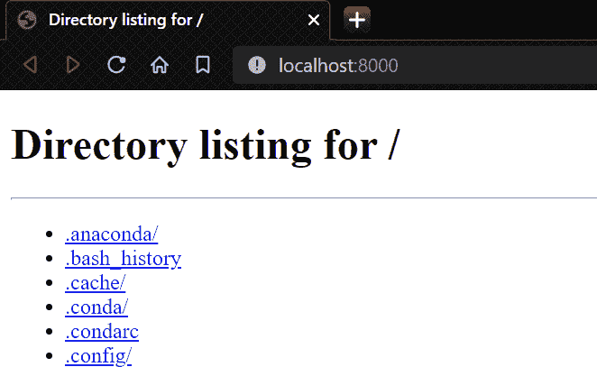
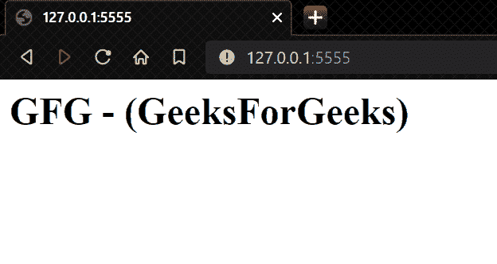

# 用 Python 从头开始构建一个基本的 HTTP 服务器

> 原文:[https://www . geesforgeks . org/building-a-basic-http-server-从零开始-在 python 中/](https://www.geeksforgeeks.org/building-a-basic-http-server-from-scratch-in-python/)

在本文中，我们将学习如何使用 Python 设置一个简单的本地 HTTP 服务器。在开发过程中，HTTP 服务器对于在本地测试安卓、个人电脑或网络应用程序非常有用。它还可以用于在通过同一局域网或无线局域网连接的两台设备之间共享文件。

**安装:**

在终端上运行以下语句:

```
python -m http.server
```

要在本地访问服务器，我们需要访问 [http://localhost:8000/](http://localhost:8000/) 或 [http://127.0.0.1:8000/](http://127.0.0.1:8000/) 在这里我们可以看到您本地存储的所有目录以及所有数据。您还可以访问一个网页，当您访问它时，它将由您的网络浏览器呈现。



**使用的功能:**

*   **BaseHTTPRequestHandler:** 用于处理到达服务器的请求。它不处理实际的 HTTP 请求，但是处理获取和发布请求。
*   **HTTPServer(server_address，BASE _ HTTP _ REQUEST _ HANDLER()):**这是一个函数，用于存储服务器的端口以及服务器的名称。

**分步方法:**

*   我们将创建一个处理服务器请求的类。
*   在那个类中，我们将创建一个用于 GET_REQUESTS 的函数。
*   在该函数中，我们将编写在服务器上显示它的 HTML 代码。
*   最后，我们使用了用于运行我们的服务器的 HTTPServer()函数。

**实施:**

## 蟒蛇 3

```
# importing all the functions 
# from http.server module
from http.server import *

# creating a class for handling 
# basic Get and Post Requests
class GFG(BaseHTTPRequestHandler):

    # creating a function for Get Request
    def do_GET(self):

        # Success Response --> 200
        self.send_response(200)

        # Type of file that we are using for creating our
        # web server.
        self.send_header('content-type', 'text/html')
        self.end_headers()

        # what we write in this function it gets visible on our
        # web-server
        self.wfile.write('<h1>GFG - (GeeksForGeeks)</h1>'.encode())

# this is the object which take port 
# number and the server-name
# for running the server
port = HTTPServer(('', 5555), GFG)

# this is used for running our 
# server as long as we wish
# i.e. forever
port.serve_forever()
```

**如何启动我们的 HTTP-Server:**

在终端中使用以下命令

```
python file_name.py
```


在浏览器中，转到[<u>http://localhost:5555/</u>](http://localhost:5555/)或 [http://127.0.0.1:5555/](http://127.0.0.1:5555/)

