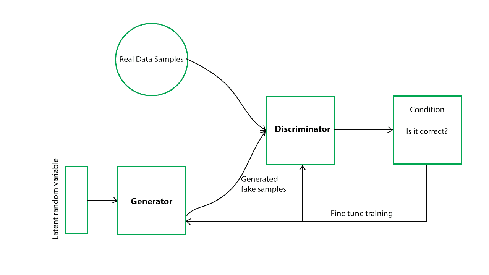
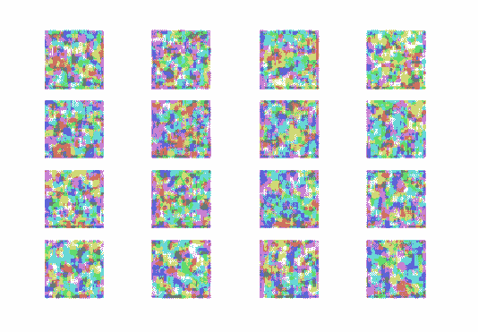
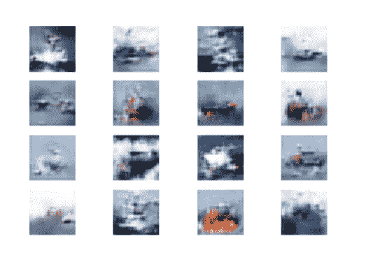
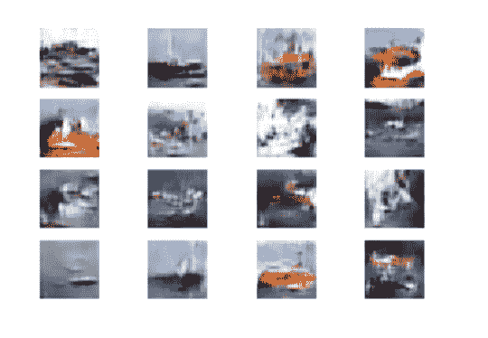
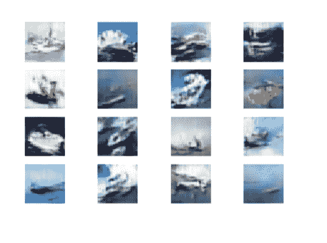
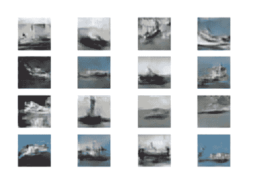
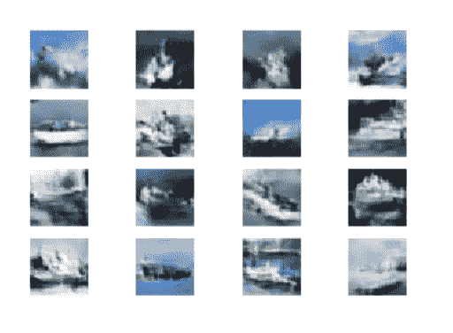
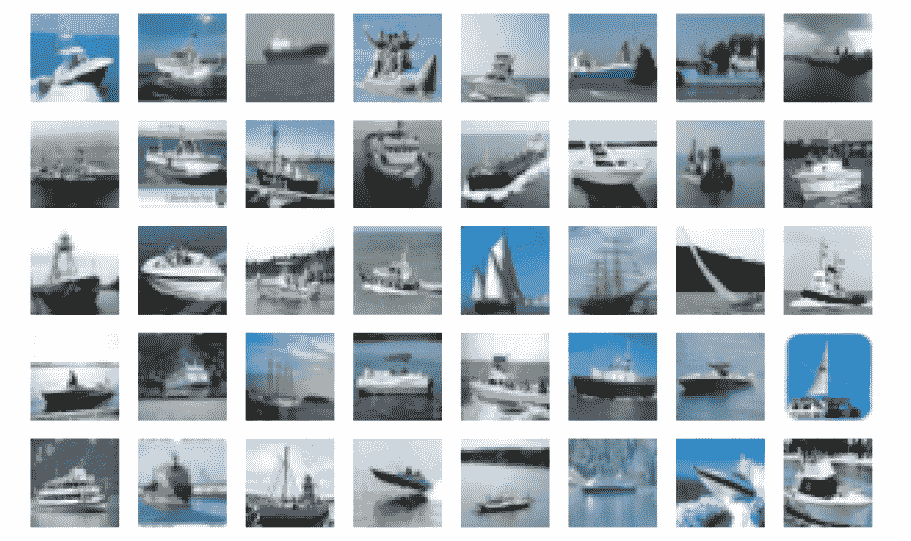
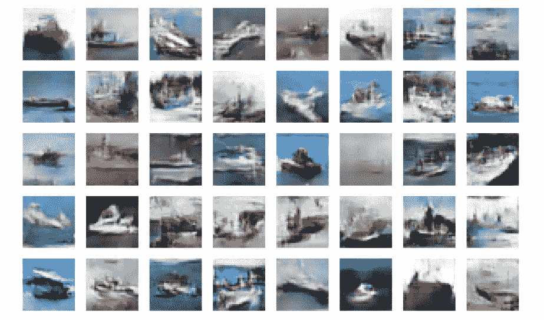

# 使用 Keras 构建生成性对抗网络

> 原文:[https://www . geeksforgeeks . org/building-a-generated-对抗性-network-use-keras/](https://www.geeksforgeeks.org/building-a-generative-adversarial-network-using-keras/)

**先决条件:** [生成性对抗网络](https://www.geeksforgeeks.org/generative-adversarial-network-gan/)

本文将演示如何使用 Keras 库构建一个生成性对抗网络。使用的数据集是预加载到 Keras 中的 **CIFAR10 图像数据集**。你可以在这里阅读数据集[。](https://keras.io/datasets/)



**步骤 1:导入所需的库**

```
import numpy as np
import matplotlib.pyplot as plt
import keras
from keras.layers import Input, Dense, Reshape, Flatten, Dropout
from keras.layers import BatchNormalization, Activation, ZeroPadding2D
from keras.layers.advanced_activations import LeakyReLU
from keras.layers.convolutional import UpSampling2D, Conv2D
from keras.models import Sequential, Model
from keras.optimizers import Adam,SGD
```

**第二步:加载数据**

```
#Loading the CIFAR10 data
(X, y), (_, _) = keras.datasets.cifar10.load_data()

#Selecting a single class images
#The number was randomly chosen and any number
#between 1 to 10 can be chosen
X = X[y.flatten() == 8]
```

**第三步:定义用于后续流程的参数**

```
#Defining the Input shape
image_shape = (32, 32, 3)

latent_dimensions = 100
```

**第 4 步:定义一个实用函数来构建生成器**

```
def build_generator():

        model = Sequential()

        #Building the input layer
        model.add(Dense(128 * 8 * 8, activation="relu",
                        input_dim=latent_dimensions))
        model.add(Reshape((8, 8, 128)))

        model.add(UpSampling2D())

        model.add(Conv2D(128, kernel_size=3, padding="same"))
        model.add(BatchNormalization(momentum=0.78))
        model.add(Activation("relu"))

        model.add(UpSampling2D())

        model.add(Conv2D(64, kernel_size=3, padding="same"))
        model.add(BatchNormalization(momentum=0.78))
        model.add(Activation("relu"))

        model.add(Conv2D(3, kernel_size=3, padding="same"))
        model.add(Activation("tanh"))

        #Generating the output image
        noise = Input(shape=(latent_dimensions,))
        image = model(noise)

        return Model(noise, image)
```

**步骤 5:定义一个实用函数来构建鉴别器**

```
def build_discriminator():

        #Building the convolutional layers
        #to classify whether an image is real or fake
        model = Sequential()

        model.add(Conv2D(32, kernel_size=3, strides=2,
                         input_shape=image_shape, padding="same"))
        model.add(LeakyReLU(alpha=0.2))
        model.add(Dropout(0.25))

        model.add(Conv2D(64, kernel_size=3, strides=2, padding="same"))
        model.add(ZeroPadding2D(padding=((0,1),(0,1))))
        model.add(BatchNormalization(momentum=0.82))
        model.add(LeakyReLU(alpha=0.25))
        model.add(Dropout(0.25))

        model.add(Conv2D(128, kernel_size=3, strides=2, padding="same"))
        model.add(BatchNormalization(momentum=0.82))
        model.add(LeakyReLU(alpha=0.2))
        model.add(Dropout(0.25))

        model.add(Conv2D(256, kernel_size=3, strides=1, padding="same"))
        model.add(BatchNormalization(momentum=0.8))
        model.add(LeakyReLU(alpha=0.25))
        model.add(Dropout(0.25))

        #Building the output layer
        model.add(Flatten())
        model.add(Dense(1, activation='sigmoid'))

        image = Input(shape=image_shape)
        validity = model(image)

        return Model(image, validity)
```

**第 6 步:定义一个实用函数来显示生成的图像**

```
def display_images():
        r, c = 4,4
        noise = np.random.normal(0, 1, (r * c,latent_dimensions))
        generated_images = generator.predict(noise)

        #Scaling the generated images
        generated_images = 0.5 * generated_images + 0.5

        fig, axs = plt.subplots(r, c)
        count = 0
        for i in range(r):
            for j in range(c):
                axs[i,j].imshow(generated_images[count, :,:,])
                axs[i,j].axis('off')
                count += 1
        plt.show()
        plt.close()
```

**第七步:构建生成性对抗网络**

```
# Building and compiling the discriminator
discriminator = build_discriminator()
discriminator.compile(loss='binary_crossentropy',
                      optimizer=Adam(0.0002,0.5),
                    metrics=['accuracy'])

#Making the Discriminator untrainable
#so that the generator can learn from fixed gradient
discriminator.trainable = False

# Building the generator
generator = build_generator()

#Defining the input for the generator
#and generating the images
z = Input(shape=(latent_dimensions,))
image = generator(z)

#Checking the validity of the generated image
valid = discriminator(image)

#Defining the combined model of the Generator and the Discriminator
combined_network = Model(z, valid)
combined_network.compile(loss='binary_crossentropy',
                         optimizer=Adam(0.0002,0.5))
```

**第八步:训练网络**

```
num_epochs=15000
batch_size=32
display_interval=2500
losses=[]

#Normalizing the input
X = (X / 127.5) - 1.

#Defining the Adversarial ground truths
valid = np.ones((batch_size, 1))

#Adding some noise 
valid += 0.05 * np.random.random(valid.shape)
fake = np.zeros((batch_size, 1))
fake += 0.05 * np.random.random(fake.shape)

for epoch in range(num_epochs):

            #Training the Discriminator

            #Sampling a random half of images
            index = np.random.randint(0, X.shape[0], batch_size)
            images = X[index]

            #Sampling noise and generating a batch of new images
            noise = np.random.normal(0, 1, (batch_size, latent_dimensions))
            generated_images = generator.predict(noise)

            #Training the discriminator to detect more accurately
            #whether a generated image is real or fake
            discm_loss_real = discriminator.train_on_batch(images, valid)
            discm_loss_fake = discriminator.train_on_batch(generated_images, fake)
            discm_loss = 0.5 * np.add(discm_loss_real, discm_loss_fake)

            #Training the Generator

            #Training the generator to generate images
            #which pass the authenticity test
            genr_loss = combined_network.train_on_batch(noise, valid)

            #Tracking the progress                
            if epoch % display_interval == 0:
                 display_images()
```

**纪元 0:**



**纪元 2500:**



**纪元 5000:**



**纪元 7500:**



**纪元 10000:**



**纪元 12500:**



请注意，图像质量随着每个时期而提高。

**第八步:评估绩效**

网络的性能将通过将上一个时期生成的图像与原始图像进行视觉比较来评估。

a) **绘制原始图像**

```
#Plotting some of the original images 
s=X[:40]
s = 0.5 * s + 0.5
f, ax = plt.subplots(5,8, figsize=(16,10))
for i, image in enumerate(s):
    ax[i//8, i%8].imshow(image)
    ax[i//8, i%8].axis('off')

plt.show()
```



b) **绘制上一个纪元**生成的图像

```
#Plotting some of the last batch of generated images
noise = np.random.normal(size=(40, latent_dimensions))
generated_images = generator.predict(noise)
generated_images = 0.5 * generated_images + 0.5
f, ax = plt.subplots(5,8, figsize=(16,10))
for i, image in enumerate(generated_images):
    ax[i//8, i%8].imshow(image)
    ax[i//8, i%8].axis('off')

plt.show()
```



从视觉上比较两组图像，可以得出结论，网络工作在可接受的水平。通过对网络进行更多时间的训练或调整网络参数，可以提高图像质量。