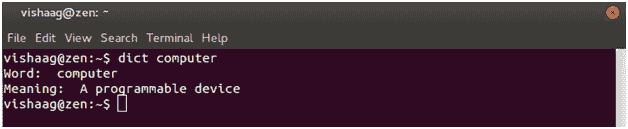
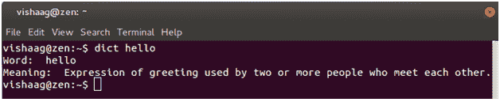

# 用 Python 和 bash 构建基于终端的在线词典

> 原文:[https://www . geeksforgeeks . org/building-a-terminal-bash-online-dictionary-with-python-and-bash/](https://www.geeksforgeeks.org/building-a-terminal-based-online-dictionary-with-python-and-bash/)

[](https://media.geeksforgeeks.org/wp-content/cdn-uploads/vv1.png)

昨天我在看电影，有些用词不理解。所以我所做的是，每次我听不懂任何单词时，我会打开浏览器，输入“define [word]”，谷歌就会告诉我这个单词的意思。但是每次打开浏览器都很烦(怪我；p)。

我们这些极客用户喜欢在我们的 linux 系统上操作什么？是的。终点站！

因为打开一个终端就像 Ctrl+Alt+T 一样简单，所以我想如果有一个应用程序在里面使用字典会有所帮助。因此，建造这个的动机！

所以我们现在需要的是，字典的单词数据库(废话！).有一个免费且容易使用的在线词典叫做[](http://glosbe.com/)**。它提供了一个相当整洁的[**API**](http://glosbe.com/a-api) ，虽然处于测试阶段。它以一种叫做 JSON 的格式给出输出，这是所有应用编程接口的标准格式。**

**为了使用这个应用编程接口，需要给 Glosbe 一个包含单词的查询(HTTP GET 请求)，它将返回含义(+其他项目，如短语等)。)这个词。**

**例如，要搜索单词“hello”，我们需要使用:**

**[http://glosbe.com/gapi/translate?from=eng&dest = eng&format = JSON&短语=hello &挺=真](http://glosbe.com/gapi/translate?from=eng&dest=eng&format=json&phrase=hello&pretty=true)**

**很明显，这个词是“你好”。Glosbe 也可以提供从一种语言到另一种语言的翻译。但是现在，我们只需要一本英语词典。所以把从目的地到目的地都设为英语。当然，这里的输出格式是 JSON(也可以更改为 XML)。访问上面的链接，查看 JSON 中的输出格式。**

**现在，剩下的任务是编写一个脚本，将单词“hello”(这里)替换为用户想要输入的单词，接收输出，单独解析其含义并显示。**

****巨蟒**进场！我们需要编写 python 脚本来解析返回的 JSON 对象。**

```
import urllib #library for fetching internet resources 
import json     #library for json operations 
#import os 
#title=os.environ["word"] 
title = input("Enter word to search: ") #Input word to search dictionary 
print ("Word: ",title )

#stores the json formatted output to a variable 
url = 'http://glosbe.com/gapi/translate?from=eng&dest=eng&\ 
format=json&phrase='+title+'&pretty=true' 

#json representation of url is stored in variable result 
result = json.load(urllib.urlopen(url)) 

#get the first text in "meaning" in "tuc" from result 
print ("Meaning: ", result["tuc"][0]["meanings"][0]["text"]) 
```

****输入**** 

```
Geek
```

****输出:****

```
Enter word to search: Word:  geek
Meaning:  expert in a technical field, particularly to do with computers
```

**惊讶吗？仅仅 9 行代码就可以完成这个任务！运行这个，看看你是否安装了 python 编译器。**

****它是如何工作的？****

*   **这里，变量“url”存储来自 Glosbe 的 JSON 格式的输出。**
*   **load 将获取一个 python 对象，并将其转储到一个字符串[存储在变量‘result’中],该字符串是该对象的 JSON 表示。**
*   **最后，单独使用‘结果[“TUC”][0][“含义”][0][“文本”]解析 JSON 的含义，并打印出来。**

**所以现在当这个脚本被执行时它就工作了。为此，我必须导航到存储它的目录，然后运行它。同样，我们可以通过编写一个调用 python 脚本的 shell 脚本来简化这一点。关键是，无论终端在哪个目录下，都可以从任何地方访问它。**

**因此，为了调用 python 代码，编写了一个 bash 脚本。**

```
#!/bin/bash
word="$1"
export word
python /home/vishaag/hacks/bash_scripts/terminal_dictionary.py "word" 
```

**要使 bash 文件全局可访问，需要，**

*   **添加您希望 Linux 搜索的目录，这也是您的脚本所在的位置。**
*   **在文件中添加目录。bashrc(位于主文件夹中并隐藏；按 Ctrl+H 查看隐藏文件)。例如，我必须在顶部添加目录**/home/vishaag/hacks/bash _ scripts**。bashrc 文件(使用文本编辑器，如 gedit/kate 等。).**
*   **之后，linux 可以从这个文件夹访问您的 bash 脚本。**

**单词="$1？脚本中的 export word 是将 bash 中的参数传递给 python 脚本。**

**$1 表示第一个参数($2 表示第二个参数，依此类推。为 n 个参数写入$@)。例如，当你写作时，**

```
**$dict hello**
```

**(dict 是 bash 脚本的名称)hello 存储在 **$1** 中(并复制到这里的“**字**)**

**然后将其导出到 python 脚本中。**

***注意:删除上面 python 代码上的注释，并删除/comment 'title = raw_input("输入要搜索的单词: ")'，以便使用 bash 中的参数。***

```
import os
title=os.environ["word"]
#title = input("Enter word to search: ") 
```

**完成了！！**

**现在您所要做的就是保存 shell 脚本，并像在终端上运行任何应用程序一样运行它。**

**这是另一个示例输出**

****

**干杯！**

**参考文献:**

*   **[http://www . python orbeginers . com/code-snippets/parse-JSON-objects-in-python](http://www.pythonforbeginners.com/code-snippets/parse-json-objects-in-python)**
*   **[http://xmodolo . com/2013/05/如何解析-json-string-in-python.html](http://xmodulo.com/2013/05/how-to-parse-json-string-in-python.html)**
*   **http://linuxcommand . org/LC 3 _ WSS 0010 . PHP**

**本文由**维沙格·苏里亚·纳拉亚南**供稿。如果你喜欢极客博客并想投稿，你也可以写一篇文章并把你的文章邮寄到 contribute@geeksforgeeks.org。看到你的文章出现在极客博客主页上，帮助其他极客。**

**如果您发现任何不正确的地方，或者您想分享更多关于上面讨论的主题的信息，请写评论**