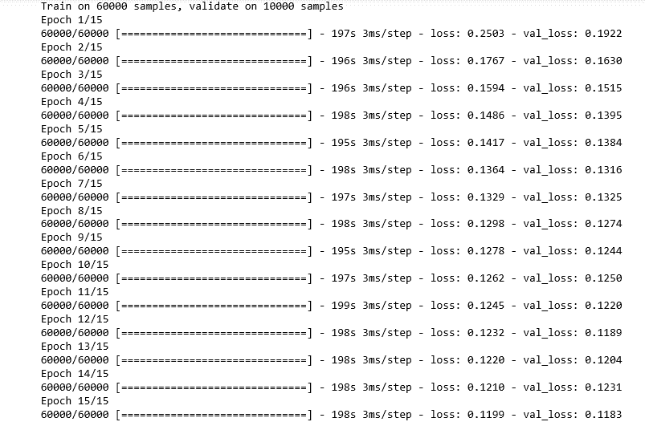
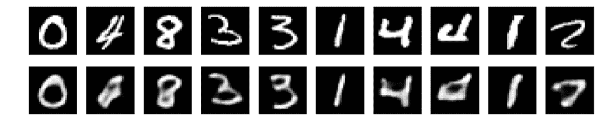

# 使用 Keras 构建自动编码器

> 原文:[https://www . geesforgeks . org/building-an-auto-encoder-using-keras/](https://www.geeksforgeeks.org/building-an-auto-encoder-using-keras/)

**先决条件:**自动编码器

本文将演示数据压缩的过程和使用**机器学习**重建编码数据的过程，首先使用 [Keras](https://keras.io/) 构建自动编码器，然后重建编码数据并可视化重建。我们将使用 **MNIST 手写数字数据集**，该数据集预加载到 Keras 模块中，您可以在此处阅读。

代码的结构如下:首先定义自动编码器构建的不同步骤所需的所有实用函数，然后相应地调用每个函数。

**步骤 1:导入所需的库**

```
import numpy as np
import matplotlib.pyplot as plt
from random import randint
from keras import backend as K
from keras.layers import Input, Dense, Conv2D, MaxPooling2D, UpSampling2D
from keras.models import Model
from keras.datasets import mnist
from keras.callbacks import TensorBoard
```

**第二步:定义一个实用函数来加载数据**

```
def load_data():
    # defining the input image size 
    input_image = Input(shape =(28, 28, 1))

    # Loading the data and dividing the data into training and testing sets
    (X_train, _), (X_test, _) = mnist.load_data()

    # Cleaning and reshaping the data as required by the model
    X_train = X_train.astype('float32') / 255.
    X_train = np.reshape(X_train, (len(X_train), 28, 28, 1))
    X_test = X_test.astype('float32') / 255.
    X_test = np.reshape(X_test, (len(X_test), 28, 28, 1))

    return X_train, X_test, input_image
```

**注意:**加载数据时，注意加载训练标签的空间保持为空，因为压缩过程不涉及输出标签

**步骤 3:定义一个效用函数来构建自动编码器神经网络**

```
def build_network(input_image):

    # Building the encoder of the Auto-encoder
    x = Conv2D(16, (3, 3), activation ='relu', padding ='same')(input_image)
    x = MaxPooling2D((2, 2), padding ='same')(x)
    x = Conv2D(8, (3, 3), activation ='relu', padding ='same')(x)
    x = MaxPooling2D((2, 2), padding ='same')(x)
    x = Conv2D(8, (3, 3), activation ='relu', padding ='same')(x)
    encoded_layer = MaxPooling2D((2, 2), padding ='same')(x)

    # Building the decoder of the Auto-encoder
    x = Conv2D(8, (3, 3), activation ='relu', padding ='same')(encoded_layer)
    x = UpSampling2D((2, 2))(x)
    x = Conv2D(8, (3, 3), activation ='relu', padding ='same')(x)
    x = UpSampling2D((2, 2))(x)
    x = Conv2D(16, (3, 3), activation ='relu')(x)
    x = UpSampling2D((2, 2))(x)
    decoded_layer = Conv2D(1, (3, 3), activation ='sigmoid', padding ='same')(x)

    return decoded_layer
```

**步骤 4:定义一个实用函数来构建和训练自动编码器网络**

```
def build_auto_encoder_model(X_train, X_test, input_image, decoded_layer):

    # Defining the parameters of the Auto-encoder
    autoencoder = Model(input_image, decoded_layer)
    autoencoder.compile(optimizer ='adadelta', loss ='binary_crossentropy')

    # Training the Auto-encoder
    autoencoder.fit(X_train, X_train,
                epochs = 15,
                batch_size = 256,
                shuffle = True,
                validation_data =(X_test, X_test),
                callbacks =[TensorBoard(log_dir ='/tmp / autoencoder')])

    return autoencoder
```

**第五步:定义一个效用函数来可视化重建**

```
def visualize(model, X_test):

    # Reconstructing the encoded images
    reconstructed_images = model.predict(X_test)

    plt.figure(figsize =(20, 4))
    for i in range(1, 11):

        # Generating a random to get random results
        rand_num = randint(0, 10001)

        # To display the original image
        ax = plt.subplot(2, 10, i)
        plt.imshow(X_test[rand_num].reshape(28, 28))
        plt.gray()
        ax.get_xaxis().set_visible(False)
        ax.get_yaxis().set_visible(False)

        # To display the reconstructed image
        ax = plt.subplot(2, 10, i + 10)
        plt.imshow(reconstructed_images[rand_num].reshape(28, 28))
        plt.gray()
        ax.get_xaxis().set_visible(False)
        ax.get_yaxis().set_visible(False)

    # Displaying the plot
    plt.show()
```

**步骤 6:以适当的顺序调用实用程序功能**

a) **加载数据**

```
X_train, X_test, input_image = load_data()
```

b) **建网**

```
decoded_layer = build_network(input_image)
```

c) **建立和训练自动编码器**

```
auto_encoder_model = build_auto_encoder_model(X_train,
                                             X_test,
                                             input_image,
                                             decoded_layer)
```



d) **可视化重建**

```
visualize(auto_encoder_model, X_test)
```

