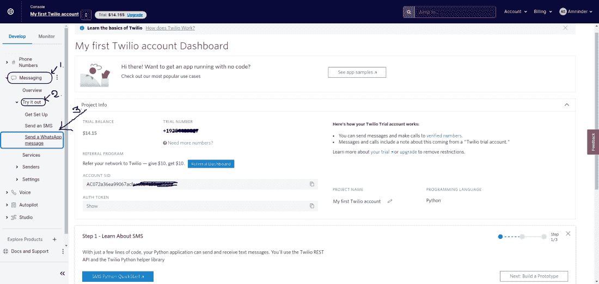
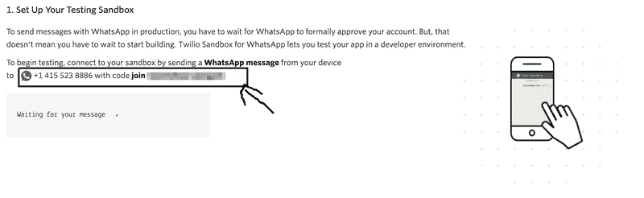
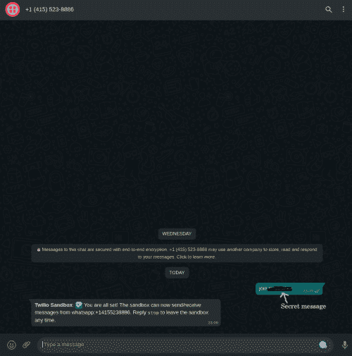
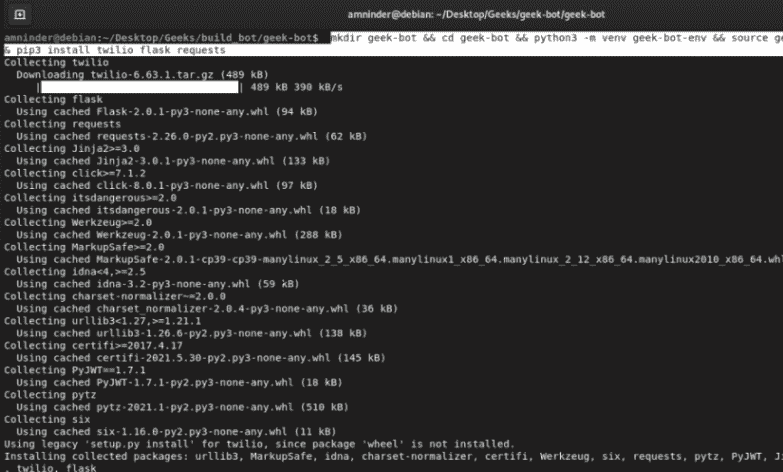
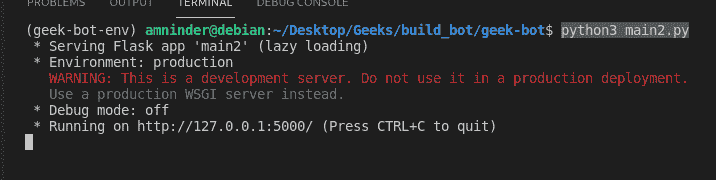
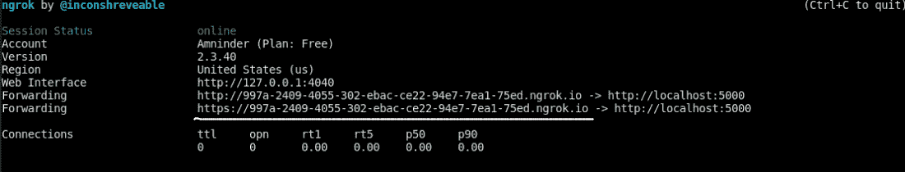
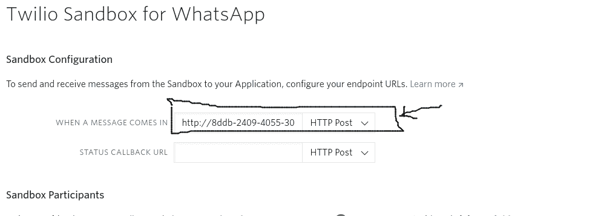
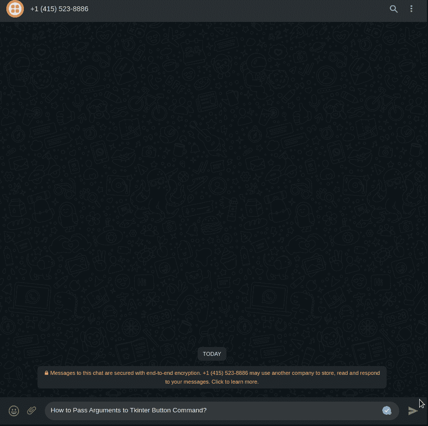

# 在 Python 上构建 WhatsApp 机器人

> 原文:[https://www . geesforgeks . org/building-whatsapp-bot-on-python/](https://www.geeksforgeeks.org/building-whatsapp-bot-on-python/)

WhatsApp 机器人是一种应用软件，能够以口头或书面方式与人类进行通信。今天我们将学习如何使用 python 创建一个 WhatsApp 机器人。首先，让我们看看使用 python 语言构建 WhatsApp bot 的需求。

## **系统要求:**

*   一个 Twilio 账户和一部装有活跃电话号码和 WhatsApp 的智能手机。
*   必须在系统中安装 **Python 3.9 或更新的**。
*   **Flask:** 我们将使用 Flask 创建一个 web 应用程序，用它来响应传入的 WhatsApp 消息。
*   **ngrok:** Ngrok 将帮助我们将您系统上运行的 **Flask 应用程序连接到 Twilio 可以连接到的公共 URL**。这对于开发版本的聊天机器人是必要的，因为你的计算机可能在路由器或防火墙后面，所以它不能直接在互联网上访问。

## 入门指南

**步骤 1:** 使用 [**Twilio WhatsApp API 设置 Twilio 账户。**](https://www.twilio.com/whatsapp)

转到此链接，点击**注册并开始构建**按钮，填写您的详细信息并验证您的电子邮件 ID 和手机号码。


签约雇用

登录后，从左侧菜单中选择**开发**选项，然后进一步选择**消息**主题，然后选择**试用**选项，最后点击**发送一条 WhatsApp 消息。**这将为设置 WhatsApp 沙盒打开一个新的网页。



设置 Whatsapp 消息

**第 2 步:**通过向这个 WhatsApp 号码发送一条消息来配置 Twilio WhatsApp 沙箱，该消息带有秘密的唯一安全代码，如下图所示:

将以下格式的代码发送到以下号码:+14155238886

> **密语:**加入<密语>



设置沙盒

现在，将密码发送到上面的 WhatsApp 消息，您将收到如下确认消息:



确认信息

**第三步:**打开终端，运行以下命令，为机器人创建一个可怕的 **c** 历史，为 python 创建一个虚拟环境，安装所有必要的包。

*   **要创建目录并导航到该目录**:

```
mkdir geeks-bot && cd geeks-bot
```

*   **创建和激活 python 虚拟环境:**

```
python3 -m venv geek-bot-env && source geek-bot-env/bin/activate
```

*   **安装 Twilio、烧瓶和请求:**

```
pip3 install twilio flask requests
```

**以下是上述命令中的一行:**

> mkdir geek-bot & & CD geek-bot & & python 3-m venv geek-bot-env & & source geek-bot-env/bin/activate & & pip 3 install twilio flask requests(安装 twilio flask 请求)

**输出:**



设置文件夹结构

### 创建一个烧瓶聊天机器人服务，用于在本地运行机器人:

**步骤 1:** 导入运行这个烧瓶应用程序所需的必要文件。

## 蟒蛇 3

```
from flask import Flask, request
import requests
from twilio.twiml.messaging_response import MessagingResponse
```

**第二步:**接收用户输入的消息并发送响应。我们可以使用“ **Body** 键访问开机自检请求有效负载中的用户响应。

## 蟒蛇 3

```
from flask import request

incoming_msg = request.values.get('Body', '').lower()
```

要向用户发送消息/做出响应，我们将使用 Twilio 的 **MessagingResponse()** 功能。

## 蟒蛇 3

```
from twilio.twiml.messaging_response import MessagingResponse

response = MessagingResponse()
msg = response.message()
msg.body('this is the response/reply  from the bot.)
```

**第三步:**现在我们将构建聊天机器人逻辑，我们将要求用户输入他/她想学习的主题，然后我们将消息发送给机器人，机器人将搜索查询，并向用户回复来自**极客博客**的最相关的文章。

## 蟒蛇 3

```
# chatbot logic
def bot():

    # user input
    user_msg = request.values.get('Body', '').lower()

    # creating object of MessagingResponse
    response = MessagingResponse()

    # User Query
    q = user_msg + "geeksforgeeks.org"

    # list to store urls
    result = []

    # searching and storing urls
    for i in search(q, tld='co.in', num=6, stop=6, pause=2):
        result.append(i)

    # displaying result
    msg = response.message(f"--- Result for '{user_msg}' are  ---")

    msg = response.message(result[0])
    msg = response.message(result[1])
    msg = response.message(result[2])
    msg = response.message(result[3])
    msg = response.message(result[4])

    return str(response)
```

这里，在该功能中，使用 **user_msg** 将会收到用户的响应/查询。然后我们使用**谷歌** **搜索**从用户查询的谷歌搜索中获取前 5 个链接，并将其存储到名为**结果**的列表中。之后，我们只需使用 Twilio 消息服务向用户发送前 5 个链接。

**运行机器人将遵循以下步骤:**

首先，使用以下命令运行上述脚本:

```
python3 main2.py
```

**输出**:



运行机器人脚本

其次，打开另一个终端窗口，运行以下命令启动 ngrok 服务器。

```
ngrok http 5000
```

**输出:**



而第三步也是最后一步我们要做的就是在 **WhatsApp 沙盒设置中设置转发 URL。**导航到以下链接，将转发网址粘贴到所选位置，然后点击保存。

**链接:**[https://www . twilio . com/console/SMS/whatsapp/sandbox](https://www.twilio.com/console/sms/whatsapp/sandbox)



Twilio 中的设置网址

### 下面是完整的实现:

在这里，我们已经导入了所有必要的库，我们将在 chatbot 的执行过程中使用这些库，然后我们将创建一个名为 bot 的函数，在这里我们将实现我们的 chatbot 逻辑。在 bot 函数中，首先，我们获取用户使用 WhatsApp 做出的响应，并将其保存到名为 user_msg 的变量中。之后，我们创建了一个 MessagingResponse()的对象，我们需要它来使用 WhatsApp 向用户发送回复。我们将用户查询附加到单词“geeksforgeeks.org”上，因为我们已经针对可能有研究相关查询的用户制作了这个机器人，他/她可以询问任何与研究相关的疑问。之后，我们创建了一个名为 result 的列表，我们将保存我们必须发送给用户的网址。我们使用谷歌搜索库进行谷歌搜索。使用 for 循环，我们获取前 5 篇文章的链接，并将它们保存到结果中。使用 response.message()函数，我们只是通过 WhatsApp 将结果发送回用户。

## 蟒蛇 3

```
from flask import Flask
from googlesearch import search
import requests
from twilio.twiml.messaging_response import MessagingResponse

app = Flask(__name__)

@app.route("/", methods=["POST"])

# chatbot logic
def bot():

    # user input
    user_msg = request.values.get('Body', '').lower()

    # creating object of MessagingResponse
    response = MessagingResponse()

    # User Query
    q = user_msg + "geeksforgeeks.org"

    # list to store urls
    result = []

    # searching and storing urls
    for i in search(q, tld='co.in', num=6, stop=6, pause=2):
        result.append(i)

    # displaying result
    msg = response.message(f"--- Result for '{user_msg}' are  ---")

    msg = response.message(result[0])
    msg = response.message(result[1])
    msg = response.message(result[2])
    msg = response.message(result[3])
    msg = response.message(result[4])

    return str(response)

if __name__ == "__main__":
    app.run()
```

**输出:**

