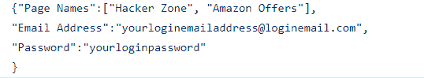

# 使用硒在脸书页面批量发布

> 原文:[https://www . geesforgeks . org/bulk-post-on-Facebook-pages-use-selenium/](https://www.geeksforgeeks.org/bulk-posting-on-facebook-pages-using-selenium/)

正如我们所知，营销机构中有多项任务是手动进行的，其中一项任务是在几个脸书页面上批量发布，这非常耗时，有时做起来非常繁琐。

在这篇基于项目的文章中，我们将探索一个基于 python selenium 库的解决方案，并看看我们如何使用它&实现它以在日常生活中使用它。

### **要求:**

*   Python 硒库(这个库像 API 一样访问硒 web 驱动来控制 Chrome、Firefox 等。
*   铬网络驱动程序(要使用和控制铬浏览器，这个驱动程序需要出现在你的系统中)

### **安装:**

*   安装硒。

```py
pip install selenium
```

*   对于 web 驱动程序，您需要下载[chromedriver.exe](https://chromedriver.chromium.org/)文件，并需要将其放在提取该项目的同一文件夹中。

**注**:也给 chromedriver.exe 提供了项目。但是最好从官网下载最新的驱动，避免版本问题。

**我们来探究一下项目文件:**

*   **PostingContents.txt:** 在这个文件中，我们需要给出我们想要在脸书网页上发布的内容。
*   **credentials_load.json** :在这个 json 文件中，我们需要给出这些细节:
    *   在“**页面名称**”字段中，您需要给出我们要发布内容的脸书页面名称。页面名称应该在双引号之间。例如，我添加了一些我的脸书页面名称，用您的页面替换它们。
    *   在“**邮箱地址**字段，需要给出你的脸书登录邮箱地址，这个信息只是登录脸书。
    *   在“**密码**”字段中，您需要给出您的脸书密码才能登录。此信息仅用于登录脸书。



**credentials_load.json**

### **它是如何工作的？**

对于批量发布，脚本做了几件事:

*   加载**凭证 _loads.json** 并发布内容文件，用于登录和发布
*   打开浏览器，加载脸书登录页面。
*   登录页面加载后，会自动填写登录电子邮件地址和密码(将从**凭证 _loads.json** 文件中获取)。
*   在此之后，脚本暂停并告诉用户执行操作，如如果 2FA 在此之后启用，则允许登录，显示通知框出现(单击阻止选项)
*   完成这些任务后，在 cmd(脚本正在运行的地方)中键入“ **y** ，然后单击回车键，以便脚本可以开始运行。
*   现在，脚本加载脸书页面列表，并逐个打开给定页面(在**凭证 _loads.json** 文件中提到的页面)并发布内容。在每次发布中，脚本会暂停几秒钟，以便元素可以完全加载。否则会产生一些错误。
*   完成发帖工作后，脚本会自动注销并关闭 chrome。

**下面是实现:**

## 蟒蛇 3

```py
# Social Bot Version 1 Codes:

from selenium import webdriver
from selenium.webdriver.common.keys import Keys
import time
import json
import os

class Social_bot:
    def __init__( self ):

        # instance/class variables
        # Facebook page url
        self.login_page = "https://www.facebook.com/"

        # Facebook Page Menu Url
        self.page_ref = "https://www.facebook.com/pages/?category=your_pages&ref=bookmarks"

        # Chrome Driver path, Important
        self.chromium_path = os.path.abspath( "chromedriver.exe" )

        # By default session is None,
        # will set after Starting the chrome
        self.browser_session = None

        # By default is set to 0,
        # if any website visits then
        # will be increment by one, only set to integer
        self.browser_visit = 0

        # By default is set to 0,
        # which represents no login
        self.login = 0

        # By default is set to 5,
        # will be used by time patterns
        self.time_pattern = 5 #seconds

        # Xpath For Facebook login id - email
        self.user_xpath = "//input[@id='email']"

        # Xpath for Facebook login password
        self.pass_xpath = "//input[@id='pass']"

        # For facebook login id credentials
        self.user = None

        # For Facebook login password credentials
        self.password = None

        # Xpath for facebook logout
        self.logout_fb = ["/html[1]/body[1]/div[1]/div[1]/div[1]/div[1]/div[2]/div[4]/div[1]/span[1]/div[1]/div[1]/i[1]",
                         "/html[1]/body[1]/div[1]/div[1]/div[1]/div[1]/div[2]/div[4]/div[2]/div[1]/div[1]/div[1]/div[1]/div[1]/div[1]/div[1]/div[1]/div[1]/div[1]/div[1]/div[1]/div[1]/div[1]/div[3]/div[1]/div[5]/div[1]/div[1]/div[2]/div[1]",
                         "//div[@class='oajrlxb2 s1i5eluu gcieejh5 bn081pho humdl8nn izx4hr6d rq0escxv nhd2j8a9 j83agx80 p7hjln8o kvgmc6g5 cxmmr5t8 oygrvhab hcukyx3x jb3vyjys d1544ag0 qt6c0cv9 tw6a2znq i1ao9s8h esuyzwwr f1sip0of lzcic4wl l9j0dhe7 abiwlrkh p8dawk7l beltcj47 p86d2i9g aot14ch1 kzx2olss cbu4d94t taijpn5t ni8dbmo4 stjgntxs k4urcfbm tv7at329']//div[@class='rq0escxv l9j0dhe7 du4w35lb j83agx80 pfnyh3mw taijpn5t bp9cbjyn owycx6da btwxx1t3 c4xchbtz by2jbhx6']"]

        # Page Name list
        self.fb_page_partial = None

        # Xpath for Facebook posting
        self.fb_posting = ["/html[1]/body[1]/div[1]/div[1]/div[1]/div[1]/div[3]/div[1]/div[1]/div[1]/div[1]/div[2]/div[1]/div[1]/div[4]/div[2]/div[1]/div[2]/div[1]/div[1]/div[1]/div[1]/div[2]/div[1]",
                           "/html[1]/body[1]/div[1]/div[1]/div[1]/div[1]/div[4]/div[1]/div[1]/div[1]/div[1]/div[2]/div[1]/div[1]/div[1]/form[1]/div[1]/div[1]/div[1]/div[2]/div[2]/div[1]/div[1]/div[1]/div[1]/div[1]/div[1]/div[1]/div[1]/div[2]/div[1]/div[1]/div[1]/div[1]",
                           "/html[1]/body[1]/div[1]/div[1]/div[1]/div[1]/div[4]/div[1]/div[1]/div[1]/div[1]/div[2]/div[1]/div[1]/div[1]/form[1]/div[1]/div[1]/div[1]/div[2]/div[3]/div[4]/div[1]"]

        # Text posting content variable
        # Will be set via text_posting_content_load function
        # By default set to None
        self.textContents = None

    def initiate_chrome( self ):
        # This function is to start chrome
        # Successful login will return 1

        if self.browser_session == None:
            self.browser_session = webdriver.Chrome(self.chromium_path)
            return 1
        else:
            return -1

    def close_session( self ):
        # This function is to close the session
        # Successful operation will return 1

        if self.browser_session == None:
            return
        else:
            self.browser_session.close()
            self.browser_session.quit()
            self.browser_session = None
            return 1

    def page_load( self , path = None ):
        # This function is to load page,
        # successful operation will return None

        if path == None:

            # if no url given, then it will return -1
            if self.browser_session == None:
                return -1
            else:
                self.browser_session.get(self.login_page)
                self.browser_visit+=1
        else:

            # if session is not created, then will return -1
            if self.browser_session == None:
                return -1
            else:

                # Successful operation will also
                # add one in instance variable to
                # track number of visited pages
                self.browser_session.get( path )
                self.browser_visit+=1

    def reverse_visit( self , back_v = None ):

        # This function is to go back to previous page
        # This function takes argument back_v for
        # telling function to back number of pages
        # If no value pass for back_v then it will go back to main page(starting page).

        if self.browser_visit == None:

            # if self.browser_visit instance
            # variable is None, then it will return -1
            return -1
        else:

            # if back_v is not given,
            # then with help of loop will go back
            # also set the browser_visit to 0
            if back_v == None :
                for vp in range( self.browser_visit ):
                    self.browser_session.back()
                self.browser_visit = 0
                return 1
            else:

                # if back_v is given, then go back with the help of loop
                for vp in range( back_v ):
                    self.browser_session.back()
                    self.browser_visit - = vp
                return 1

    def do_login( self, user_name = None, user_pass = None ):

        # This function is to do login on social media,
        # takes two arguments user name and password
        # By default these argument set to None, and in no use

        if self.browser_session == None or self.login == 1:

            # if self.browser not started,
            # or already login happened then it will return -1
            return -1

        elif user_name != None or user_pass != None :
            return -1

        else:

            # Successful operations will use xpath,
            # and login to use the site
            # self.browser_visit will increment by 1
            # self.login will be set to 1 for successful login

            self.browser_session.find_element_by_xpath(self.user_xpath).send_keys(self.user)
            self.browser_session.find_element_by_xpath(self.pass_xpath).send_keys(self.password, Keys.ENTER)
            self.browser_visit+=1
            self.login = 1
            return 1

    def do_logout(self):

        # This function is to use
        # log out the social media
        if self.browser_session == None or self.login == 0:

            # if no session available or
            # login then it will return -1
            return -1

        else:

            # To logout the site via xpath,
            # and also follow time_patterns()
            # function to pause the
            # script for sometime.
            # Important bcz sometimes some xpath are not loaded,
            # and take time to load, so this function is important
            # Failed operation will return -1, and successful will return 1
            try:

                self.browser_session.find_element_by_xpath(
                                      self.logout_fb[0]).click()

                self.time_patterns()

                self.browser_session.find_element_by_xpath(
                                      self.logout_fb[1]).click()

                self.time_patterns()

                self.browser_session.find_element_by_xpath(
                                      self.logout_fb[2]).click()
                return 1
            except:
                return -1

    def time_patterns( self , tp = None ):

        # This function is to pause the script for sometime
        # Also takes argument as second,
        # if not given then it will
        # take by default seconds to wait
        # Successful operation will return 1

        if tp == None :
            time.sleep( self.time_pattern )
            return 1
        else:
            self.time_pattern = tp
            time.sleep( self.time_pattern )
            return 1

    def page_navigation_partial( self , pg_name ):

        # This function is use to load only specified page,
        # need to given page name
        # for navigating the page

        if self.browser_session == None:

            # if no browser session
            # available then it will return -1
            return -1
        else:

            # it will return find specified text partially
            # successful operation will also
            # increment the browser_visit by one

            self.browser_session.
                    find_element_by_partial_link_text(pg_name).click()

            self.browser_visit+=1

    def page_posting(self):

        # This function is to do posting on website
        # Takes argument for posting text
        # Successful operation will return 1

        if self.browser_session == None:

            # if no browser_session
            # started then it will return -1
            return -1

        else:

            # These operations will be followed
            # by time patterns function,
            # and in the end also
            # use reverse_visit to reverse the page by one

            self.browser_session.find_element_by_xpath(
                                  self.fb_posting[0]).click()

            self.time_patterns()
            self.browser_session.find_element_by_xpath(
                          self.fb_posting[1]).send_keys(
                                  Keys.ENTER, self.textContents)

            self.time_patterns()

            self.browser_session.find_element_by_xpath(
                                      self.fb_posting[2]).click()

            self.time_patterns()
            self.reverse_visit(1)
            self.time_patterns()
            return 1

    def credential_loads_using_json(self):

        # This function is to load
        # credentials from json file
        # Will help to set credentials
        # instead of manual
        try:
            with open("credentials_load.json") as filePointer:
                contents = filePointer.read()

            contents = json.loads(contents)

            self.fb_page_partial = contents["Page Names"]
            self.user = contents["Email Address"]
            self.password = contents["Password"]

            # for freeing the json memory part
            del(contents)
            return 1
        except:
            return -1

    def text_posting_content_load(self):
        try:
            with open("PostingContents.txt","r") as filePointer:
                textContents = filePointer.read()

            self.textContents = textContents
            return 1
        except:
            return -1

def soc_bot():

    # Creating an Instance of Social bot object
    bot = Social_bot()

    # Calling the initiate
    # chrome method to start the chrome
    bot.initiate_chrome()

    # For loading credentials and other things
    bot.credential_loads_using_json()

    # For loading text based posting content
    bot.text_posting_content_load()

    # for loading the facebook
    bot.page_load()

    # for login the website
    bot.do_login()

    ask_to_block_notif = input("[+] Perform these tasks:\n1.Accept the 2FA if required to do \n2\. Once FB Page Load, Please Block the Show Notification Dialog box. Once done, Please press to start the posting Script(Y/N) > ")

    # Below statement will pause the script
    # until you clear the above given instructions
    if ask_to_block_notif.upper() == "Y":

        # will load the specified page
        bot.page_load(bot.page_ref)

        # for pausing the script for sometime
        bot.time_patterns()

        # Iterate through Page Names
        for link in bot.fb_page_partial:

            # load given facebook page by their name
            bot.page_navigation_partial(link)

            # pause the script for sometime
            bot.time_patterns()

            # for posting the text based content
            bot.page_posting()

            # Print Page Name on Screen
            print("[+] Posting Done on {}".format(link))

        # for logging out the facebook
        bot.do_logout()

        # for closing chrome & session
        bot.close_session()
        print( "[+] Posting Work Done!" )

        # return 1 for successful operation
        return 1
    else:
        bot.close_session()
        return -1  

if __name__ == "__main__":
    print("SOCIAL BOT SCRIPT INITIATED")
    soc_bot()
```

**输出:**

<video class="wp-video-shortcode" id="video-517247-1" width="640" height="360" preload="metadata" controls=""><source type="video/mp4" src="https://media.geeksforgeeks.org/wp-content/uploads/20201123194534/Output-of-Social-Bot.mp4?_=1">[https://media.geeksforgeeks.org/wp-content/uploads/20201123194534/Output-of-Social-Bot.mp4](https://media.geeksforgeeks.org/wp-content/uploads/20201123194534/Output-of-Social-Bot.mp4)</video>