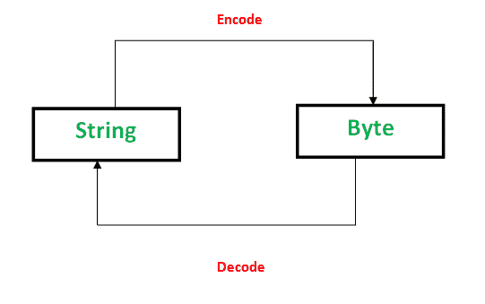

# Python 中字节对象对字符串

> 原文:[https://www . geesforgeks . org/byte-objects-vs-string-python/](https://www.geeksforgeeks.org/byte-objects-vs-string-python/)

在 Python 2 中，字符串和字节都是相同类型的字节对象，而在 Python 3 中，定义在 Python 3 中的字节对象是字节序列的“**，类似于 Python 2 中的“ **unicode** ”对象。然而，字符串和字节对象有许多不同之处。其中一些描述如下:
`** 

*   字节对象是**字节**的序列，而字符串是**字符**的序列。
*   字节对象在内部是机器可读的形式，字符串只是人类可读的形式。
*   由于字节对象是机器可读的，所以它们可以**直接存储在磁盘**上。然而，字符串**需要编码**才能存储在磁盘上。



有一些方法可以将字节对象转换为字符串，并将字符串转换为字节对象。

**Encoding**

PNG、JPEG、MP3、WAV、ASCII、UTF-8 等都是不同形式的编码。编码是一种以字节表示音频、图像、文本等的格式。将**字符串转换为字节**对象称为编码。这是必要的，以便文本可以使用使用 **ASCII** 或 **UTF-8** 编码技术的映射存储在磁盘上。
此任务使用 **encode()** 实现。它以编码技术为参数。默认手法为“ **UTF-8** ”手法。

## 计算机编程语言

```
# Python code to demonstrate String encoding

# initialising a String
a = 'GeeksforGeeks'

# initialising a byte object
c = b'GeeksforGeeks'

# using encode() to encode the String
# encoded version of a is stored in d
# using ASCII mapping
d = a.encode('ASCII')

# checking if a is converted to bytes or not
if (d==c):
    print ("Encoding successful")
else : print ("Encoding Unsuccessful")
```

输出:

```
Encoding successful
```

**Decoding**

同样，解码是将**字节对象转换为字符串**的过程。使用**解码()**实现。一个字节串可以被解码成一个字符串，如果你知道是用哪种编码来编码的话。编码和解码是**逆**过程。

## 计算机编程语言

```
# Python code to demonstrate Byte Decoding

# initialising a String
a = 'GeeksforGeeks'

# initialising a byte object
c = b'GeeksforGeeks'

# using decode() to decode the Byte object
# decoded version of c is stored in d
# using ASCII mapping
d = c.decode('ASCII')

# checking if c is converted to String or not
if (d==a):
    print ("Decoding successful")
else : print ("Decoding Unsuccessful")
```

输出:

```
Decoding successful
```

本文由 [**【曼吉特·辛格】**](https://auth.geeksforgeeks.org/profile.php?user=manjeet_04&list=practice) 供稿。如果你喜欢 GeeksforGeeks 并想投稿，你也可以使用[write.geeksforgeeks.org](https://write.geeksforgeeks.org)写一篇文章或者把你的文章邮寄到 review-team@geeksforgeeks.org。看到你的文章出现在极客博客主页上，帮助其他极客。
如果发现有不正确的地方，或者想分享更多关于上述话题的信息，请写评论。