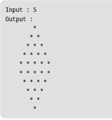

# 程序打印菱形

> 原文:[https://www . geesforgeks . org/c-program-print-diamond-shape/](https://www.geeksforgeeks.org/c-program-print-diamond-shape/)

给定一个数字 n，编写一个程序来打印一个 2n 行的菱形。
**例:**



## C++

```py
// C++ program to print diamond shape
// with 2n rows
#include <bits/stdc++.h>
using namespace std;

// Prints diamond pattern with 2n rows
void printDiamond(int n)
{
    int space = n - 1;

    // run loop (parent loop)
    // till number of rows
    for (int i = 0; i < n; i++)
    {
        // loop for initially space,
        // before star printing
        for (int j = 0;j < space; j++)
            cout << " ";

        // Print i+1 stars
        for (int j = 0; j <= i; j++)
            cout << "* ";

        cout << endl;
        space--;
    }

    // Repeat again in reverse order
    space = 0;

    // run loop (parent loop)
    // till number of rows
    for (int i = n; i > 0; i--)
    {
        // loop for initially space,
        // before star printing
        for (int j = 0; j < space; j++)
            cout << " ";

        // Print i stars
        for (int j = 0;j < i;j++)
            cout << "* ";

        cout << endl;
        space++;
    }
}

// Driver code
int main()
{
    printDiamond(5);
    return 0;
}

// This is code is contributed
// by rathbhupendra
```

## C

```py
// C program to print
// diamond shape with
// 2n rows
#include<stdio.h>

// Prints diamond
// pattern with 2n rows
void printDiamond(int n)
{
    int space = n - 1;

    // run loop (parent loop)
    // till number of rows
    for (int i = 0; i < n; i++)
    {
        // loop for initially space,
        // before star printing
        for (int j = 0;j < space; j++)
            printf(" ");

        // Print i+1 stars
        for (int j = 0;j <= i; j++)
            printf("* ");

        printf("\n");
        space--;
    }

    // Repeat again in
    // reverse order
    space = 0;

    // run loop (parent loop)
    // till number of rows
    for (int i = n; i > 0; i--)
    {
        // loop for initially space,
        // before star printing
        for (int j = 0; j < space; j++)
            printf(" ");

        // Print i stars
        for (int j = 0;j < i;j++)
            printf("* ");

        printf("\n");
        space++;
    }
}

// Driver code
int main()
{
    printDiamond(5);
    return 0;
}
```

## Java 语言(一种计算机语言，尤用于创建网站)

```py
// JAVA Code to print
// the diamond shape
import java.util.*;

class GFG
{

    // Prints diamond pattern
    // with 2n rows
    static void printDiamond(int n)
    {
        int space = n - 1;

        // run loop (parent loop)
        // till number of rows
        for (int i = 0; i < n; i++)
        {
            // loop for initially space,
            // before star printing
            for (int j = 0; j < space; j++)
                System.out.print(" ");

            // Print i+1 stars
            for (int j = 0; j <= i; j++)
                System.out.print("* ");

            System.out.print("\n");
            space--;
        }

        // Repeat again in
        // reverse order
        space = 0;

        // run loop (parent loop)
        // till number of rows
        for (int i = n; i > 0; i--)
        {
            // loop for initially space,
            // before star printing
            for (int j = 0; j < space; j++)
                System.out.print(" ");

            // Print i stars
            for (int j = 0; j < i; j++)
                System.out.print("* ");

            System.out.print("\n");
            space++;
        }
    }

    // Driver Code
    public static void main(String[] args)
    {
        printDiamond(5);

    }
}

// This code is contributed
// by Arnav Kr. Mandal.
```

## 蟒蛇 3

```py
# Python program to
# print Diamond shape

# Function to print
# Diamond shape
def Diamond(rows):
    n = 0
    for i in range(1, rows + 1):
        # loop to print spaces
        for j in range (1, (rows - i) + 1):
            print(end = " ")

        # loop to print star
        while n != (2 * i - 1):
            print("*", end = "")
            n = n + 1
        n = 0

        # line break
        print()

    k = 1
    n = 1
    for i in range(1, rows):
        # loop to print spaces
        for j in range (1, k + 1):
            print(end = " ")
        k = k + 1

        # loop to print star
        while n <= (2 * (rows - i) - 1):
            print("*", end = "")
            n = n + 1
        n = 1
        print()

# Driver Code
# number of rows input
rows = 5
Diamond(rows)
```

## C#

```py
// C# Code to print
// the diamond shape
using System;

class GFG
{

    // Prints diamond pattern
    // with 2n rows
    static void printDiamond(int n)
    {
        int space = n - 1;

        // run loop (parent loop)
        // till number of rows
        for (int i = 0; i < n; i++)
        {
            // loop for initially space,
            // before star printing
            for (int j = 0; j < space; j++)
                Console.Write(" ");

            // Print i+1 stars
            for (int j = 0; j <= i; j++)
                Console.Write("* ");

            Console.Write("\n");
            space--;
        }

        // Repeat again in
        // reverse order
        space = 0;

        // run loop (parent loop)
        // till number of rows
        for (int i = n; i > 0; i--)
        {
            // loop for initially space,
            // before star printing
            for (int j = 0; j < space; j++)
                Console.Write(" ");

            // Print i stars
            for (int j = 0; j < i; j++)
                Console.Write("* ");

            Console.Write("\n");
            space++;
        }
    }

    // Driver Code
    public static void Main()
    {
        printDiamond(5);

    }
}

// This code is contributed
// by Smitha Semwal.
```

## 服务器端编程语言（Professional Hypertext Preprocessor 的缩写）

```py
<?php
// PHP program to print
// diamond shape with
// 2n rows

// Prints diamond $
// pattern with 2n rows
function printDiamond($n)
{
    $space = $n - 1;

    // run loop (parent loop)
    // till number of rows
    for ($i = 0; $i < $n; $i++)
    {

        // loop for initially space,
        // before star printing
        for ($j = 0;$j < $space; $j++)
            printf(" ");

        // Print i+1 stars
        for ($j = 0;$j <= $i; $j++)
            printf("* ");

        printf("\n");
        $space--;
    }

    // Repeat again in
    // reverse order
    $space = 0;

    // run loop (parent loop)
    // till number of rows
    for ($i = $n; $i > 0; $i--)
    {

        // loop for initially space,
        // before star printing
        for ($j = 0; $j < $space; $j++)
            printf(" ");

        // Pr$i stars
        for ($j = 0;$j < $i;$j++)
            printf("* ");

        printf("\n");
        $space++;
    }
}

    // Driver code
    printDiamond(5);

// This code is contributed by Anuj_67
?>
```

## java 描述语言

```py
<script>
      // JavaScript program to print diamond shape
      // with 2n rows

      // Prints diamond pattern with 2n rows
      function printDiamond(n) {
        var space = n - 1;

        // run loop (parent loop)
        // till number of rows
        for (var i = 0; i < n; i++) {
          // loop for initially space,
          // before star printing
          for (var j = 0; j < space; j++) document.write("  ");

          // Print i+1 stars
          for (var j = 0; j <= i; j++) document.write("*" + "  ");

          document.write("<br>");
          space--;
        }

        // Repeat again in reverse order
        space = 0;

        // run loop (parent loop)
        // till number of rows
        for (var i = n; i > 0; i--)
        {

          // loop for initially space,
          // before star printing
          for (var j = 0; j < space; j++) document.write("  ");

          // Print i stars
          for (var j = 0; j < i; j++) document.write("*" + "  ");

          document.write("<br>");
          space++;
        }
      }

      // Driver code
      printDiamond(5);

      // This code is contributed by rdtank.
    </script>
```

**输出:**

```py
        *
       * *
      * * *
     * * * *
    * * * * *
    * * * * *
     * * * *
      * * *
       * *
        *
```

本文由**拉胡尔·辛格(尼特·KKR)**供稿。如果你喜欢 GeeksforGeeks 并想投稿，你也可以使用[contribute.geeksforgeeks.org](http://www.contribute.geeksforgeeks.org)写一篇文章或者把你的文章邮寄到 contribute@geeksforgeeks.org。看到你的文章出现在极客博客主页上，帮助其他极客。
如果你发现任何不正确的地方，或者你想分享更多关于上面讨论的话题的信息，请写评论。