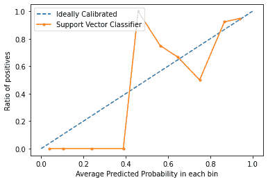

# 校准曲线

> 原文:[https://www.geeksforgeeks.org/calibration-curves/](https://www.geeksforgeeks.org/calibration-curves/)

一般来说，对于任何分类问题，我们都预测最有可能成为真正类别标签的类别值。然而，有时，我们希望预测属于每个类标签的数据实例的**概率。例如，假设我们正在构建一个模型来对水果进行分类，我们有三个类别标签:苹果、橘子和香蕉(每个水果都是其中之一)。对于任何水果，我们都希望水果是苹果、橘子或香蕉的概率。
这对于分类模型的评估非常有用。它可以帮助我们理解一个模型在预测一个类别标签时有多“确定”，并可能帮助我们解释一个分类模型有多决定性。通常，具有预测每个类别标签的线性概率的分类器被称为**校准的**。问题是，并不是所有的分类模型都经过校准。
有些模型对类概率的估计很差，有些甚至不支持概率预测。**

**校准曲线:**
校准曲线用于评估分类器的校准程度，即预测每个类别标签的概率如何不同。x 轴表示每个箱中的平均预测概率。y 轴是阳性率(阳性预测的比例)。**理想校准模型**的曲线是从(0，0)开始线性移动的线性直线。

**在 Python3 中绘制校准曲线:**
对于本例，我们将使用二进制数据集。我们将使用流行的糖尿病数据集。你可以在这里了解更多关于这个数据集[的信息。](https://archive.ics.uci.edu/ml/datasets/diabetes)

**代码:实现支持向量机的校准曲线，并将其与完全校准的模型曲线进行比较。**

## 蟒蛇 3

```
# Importing required modules

from sklearn.datasets import load_breast_cancer
from sklearn.svm import SVC
from sklearn.model_selection import train_test_split
from sklearn.calibration import calibration_curve
import matplotlib.pyplot as plt

# Loading dataset
dataset = load_breast_cancer()
X = dataset.data
y = dataset.target

# Splitting dataset into training and testing sets
X_train, X_test, y_train, y_test = train_test_split(X, y,
                     test_size = 0.1, random_state = 13)

# Creating and fitting model
model = SVC()
model.fit(X_train, y_train)

# Predict Probabilities
prob = model.decision_function(X_test)

# Creating Calibration Curve
x, y = calibration_curve(y_test, prob, n_bins = 10, normalize = True)

# Plot calibration curve

# Plot perfectly calibrated
plt.plot([0, 1], [0, 1], linestyle = '--', label = 'Ideally Calibrated')

# Plot model's calibration curve
plt.plot(y, x, marker = '.', label = 'Support Vector Classifier')

leg = plt.legend(loc = 'upper left')
plt.xlabel('Average Predicted Probability in each bin')
plt.ylabel('Ratio of positives')
plt.show()
```

**输出:**



从图中，我们可以清楚地看到，支持向量分类器也没有很好地校准。模型曲线越接近完美校准模型曲线(虚线)，校准得越好。

**结论:**
现在你已经知道了机器学习方面的校准是什么，以及如何绘制校准曲线，下次你的分类器给出不可预测的结果，而你找不到原因时，试着绘制校准曲线，检查模型是否校准良好。