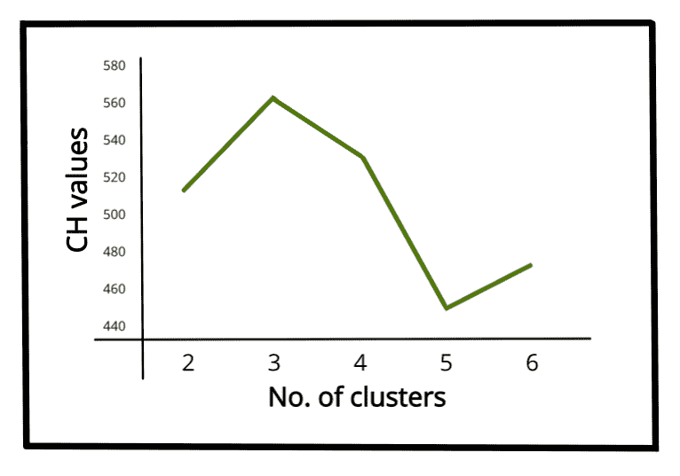

# 卡林斯基-哈拉巴斯指数–聚类有效性指数|第 3 集

> 原文:[https://www . geesforgeks . org/calin ski-harabasz-index-cluster-validation-indexs-set-3/](https://www.geeksforgeeks.org/calinski-harabasz-index-cluster-validity-indices-set-3/)

**先决条件:** [<u>集群有效性指数</u>](https://www.geeksforgeeks.org/dunn-index-and-db-index-cluster-validity-indices-set-1/)

聚类验证被认为是聚类算法成功的重要因素之一。如何有效地评估聚类算法的聚类结果是问题的关键。通常，聚类有效性度量分为三类(内部聚类验证、外部聚类验证和相对聚类验证)。

在本文中，我们关注一个内部聚类验证指数，即 ***【卡林斯基-哈拉巴斯指数】*** 。

**卡林斯基-哈拉巴斯指数:**

当不知道地面真实标签时，可以使用 Calinski-Harabasz (CH)索引(由 Calinski 和 Harabasz 于 1974 年引入)来评估模型，其中使用数据集固有的数量和特征来验证聚类做得有多好。CH 指数(也称为**方差比标准**)是一种衡量一个对象与其自身聚类(内聚性)相比与其他聚类(分离性)相似程度的指标。这里，内聚性是基于从聚类中的数据点到其聚类质心的距离来估计的，分离是基于聚类质心到全局质心的距离。CH 指数有一种形式 *(a .分离)/(b .凝聚)，其中 a 和 b 是权重。*

**卡林斯基-哈拉巴斯指数计算:**

数据集 D =[ d <sub>1</sub> 、d <sub>2</sub> 、d <sub>3</sub> 、… d <sub>N</sub> 上 K 个聚类的 CH 指数定义为:

<center>
![$\left.C H=\left[\frac{\sum_{k=1}^{K} n_{k}\left\|c_{k}-c\right\|^{2}}{K-1}\right] / \frac{\sum_{k=1}^{K} \sum_{i=1}^{n_{k}}\left\|d_{i}-c_{k}\right\|^{2}}{N-K}\right]$](img/c56bd0923390652a62fbc6aab4615cd3.png "Rendered by QuickLaTeX.com")</center>

其中， *n <sub>k</sub>* 和 *c <sub>k</sub>* 分别为 *k <sup>th</sup>* 聚类的点数和质心，c 为全局质心，N 为数据点总数。

CH 指数值越高，说明团簇密集，分离良好，虽然没有“可接受”的截止值。我们需要选择在 ch 指数的线图上给出一个峰值或至少一个突变点的解。另一方面，如果直线是平滑的(水平或上升或下降)，那么就没有理由选择一种解决方案。

<center>

虹膜数据集的 CH 值与聚类数的线图

</center>

下面是使用 sklearn 库的上述 CH 索引的 Python 实现:

```
from sklearn import datasets
from sklearn.cluster import KMeans
from sklearn import metrics
from sklearn.metrics import pairwise_distances
import numpy as np

# loading the dataset
X, y = datasets.load_iris(return_X_y=True)

# K-Means
kmeans = KMeans(n_clusters=3, random_state=1).fit(X)

# we store the cluster labels
labels = kmeans.labels_

print(metrics.calinski_harabasz_score(X, labels))
```

**输出:**

```
561.62
```

**参考文献:**[<u>https://sci kit-learn . org/stable/modules/clustering . html # calinski-harabasz-index</u>](https://scikit-learn.org/stable/modules/clustering.html#calinski-harabasz-index)