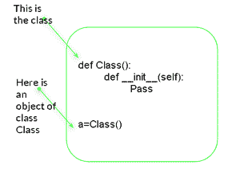
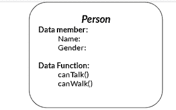
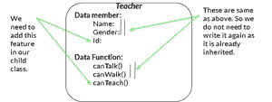
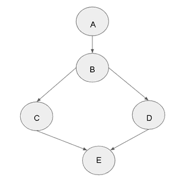

# 在 Python 中调用超类构造函数

> 原文:[https://www . geesforgeks . org/calling-a-super-class-constructor-in-python/](https://www.geeksforgeeks.org/calling-a-super-class-constructor-in-python/)

**类**就像为一个对象创建蓝图。如果我们想建造一座建筑，那么我们必须有它的蓝图，比如有多少房间，它的尺寸等等，所以这里实际的建筑是一个物体，建筑的蓝图是一个类。

*   类是用户定义的数据类型，具有数据成员和成员函数。
*   数据成员是数据变量，成员函数是用于操作这些变量的函数，这些数据成员和成员函数一起定义了类中对象的属性和行为。

在 Python 中，使用关键字`class`后跟类名来定义一个类。

[](https://media.geeksforgeeks.org/wp-content/uploads/20200708220501/classpic1-300x211.PNG)

***类和对象结构***

**在 python 中声明对象:**定义类时，只定义对象的规范；没有分配内存或存储空间。为了使用类中定义的数据和访问函数，我们需要创建对象。

**语法:**

```py
object = ClassName()
```

**访问数据成员和成员函数:**可以通过点(“.”)进行访问)运算符与各自类的对象进行比较。例如，如果对象是汽车，我们想要访问名为 drive 的功能，那么我们将不得不编写`car.drive()`。

## 遗产

继承允许我们定义一个从另一个类继承所有方法和属性的类。被继承的类称为**基类**或**父类。**继承其他类的类称为**子类**或**派生类。**

**示例:**

[](https://media.geeksforgeeks.org/wp-content/uploads/20200708230346/personclass-300x187.PNG)

***人类(父类)***T5】

[](https://media.geeksforgeeks.org/wp-content/uploads/20200708230523/teacherclass-300x113.PNG)

***教师班(幼儿班)***T5】

在这里我们可以看到班级的人和老师，因为我们继承了老师的人类，所以我们有许多共同的特征，比如每个人都有一个名字，性别，canTalk(在大多数情况下)，canWalk(在大多数情况下)等。，所以在教师类中，我们不需要再次实现这个东西，因为它是由教师类继承的，所以无论一个人有什么样的特征，教师都必须有，所以我们可以添加更多的特征，比如 canTeach()和教师 id 等。

所以基本思想是，如果任何类继承了其他类，那么它必须有父类的特性(如果你想用你可以用它)，我们可以在它们上面添加更多的特性。

## 构造器

构造函数通常用于实例化对象。构造函数的任务是在创建类的对象时初始化(赋值)类的数据成员。在 Python 中，`__init__()`方法被称为构造函数，并且总是在创建对象时被调用。

**语法:**

```py
def __init__(self):
   # body of the constructor
```

## 极好的

Python 有一个超级函数，允许我们访问超级类的临时对象。

超级类的使用:

*   我们不需要显式地使用基类名称。
*   有助于处理多重继承。

**单遗传超级:**

**示例:**

```py
# this is the class which will become
# the super class of "Subclass" class
class Class():
    def __init__(self, x):
        print(x)

# this is the subclass of class "Class"
class SubClass(Class):
    def __init__(self, x):

        # this is how we call super
        # class's constructor
        super().__init__(x)

# driver code
x = [1, 2, 3, 4, 5]
a = SubClass(x)
```

**输出:**

```py
[1, 2, 3, 4, 5]

```

**多重继承的 Super:**
**示例:**使用 Super 函数在 python 中实现以下继承结构:

[](https://media.geeksforgeeks.org/wp-content/uploads/20200709004800/dia-297x300.PNG)

***继承结构***

```py
# defining class A
class A:
  def __init__(self, txt):
    print(txt, 'I am in A Class')

# B class inheriting A
class B(A):
  def __init__(self, txt):
    print(txt, 'I am in B class')
    super().__init__(txt)

# C class inheriting B
class C(B):
  def __init__(self, txt):
    print(txt, 'I am in C class')
    super().__init__(txt)

# D class inheriting B
class D(B):
  def __init__(self, txt):
    print(txt, 'I am in D class')
    super().__init__(txt)

# E class inheriting both D and C
class E(D, C):
  def __init__(self):
    print( 'I am in E class')
    super().__init__('hello ')

# driver code
d = E()
print('')
h = C('hi')
```

**输出:**

```py
I am in E class
hello  I am in D class
hello  I am in C class
hello  I am in B class
hello  I am in A Class

hi I am in C class
hi I am in B class
hi I am in A Class
```