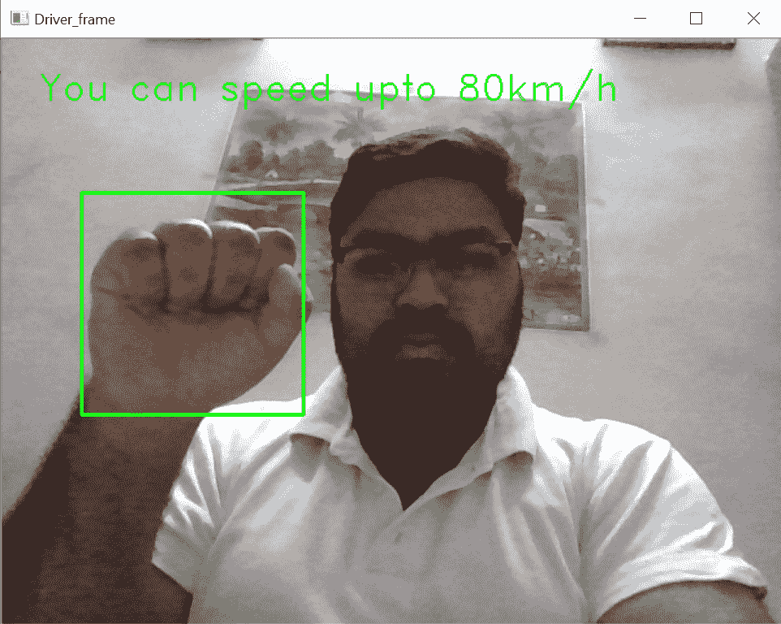
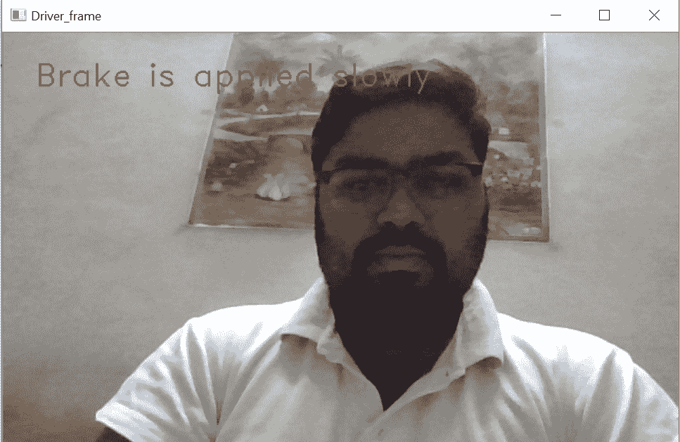

# Python 中使用手部检测的汽车驾驶

> 原文:[https://www . geesforgeks . org/汽车驾驶-使用 python 中的手部检测/](https://www.geeksforgeeks.org/car-driving-using-hand-detection-in-python/)

在这个项目中，我们将演示如何通过检测方向盘上的手势来驾驶汽车。假设需求是这样的–

*   如果司机想发动汽车，那就把双手放在方向盘上。
*   如果有人没有手放在方向盘上，那就意味着汽车刹车会很慢。
*   如果在方向盘上检测到一只手，这意味着出于安全目的，他/她可以将汽车开到某个极限。
*   如果有人双手握着方向盘，这意味着他/她可以以任何速度驾驶，因为根据我们的系统，您是安全的，可以用双手安全地操纵汽车。

对于这个项目，我们需要导入两个 Python 库，即 **OpenCV** 和 **numpy** 。如何安装这两个库？

```
1) pip install opencv-python
2) pip install numpy

```

下面是实现:

**代码#1:**

```
import cv2
import numpy as np

cap = cv2.VideoCapture(0)
hand_cascade = cv2.CascadeClassifier('hand.xml')
```

**说明:**
我们已经导入了两个名为 **opencv** 和 **numpy** 的库。然后在下一行中，我们使用 opencv 的函数`VideoCapture(0)`并将参数作为 0 传递，因为您的笔记本电脑网络摄像头支持端口 0 来使用摄像头。现在，使用函数`CascadeClassifier('hand.xml')`并将 xml 文件作为参数传递。将 *hand.xml* 的文件存储在与 Python 文件相同的目录中。

**代码#2 :**

```
count = 0

while(True):
    ret, frame = cap.read()
    gray = cv2.cvtColor(frame, cv2.COLOR_BGR2GRAY)
    hands = hand_cascade.detectMultiScale(gray, 1.5, 2)
    contour = hands
    contour = np.array(contour)

    if count==0:

        if len(contour)==2:
            cv2.putText(img=frame, text='Your engine started',
                        org=(int(100 / 2 - 20), int(100 / 2)),
                        fontFace=cv2.FONT_HERSHEY_DUPLEX, 
                        fontScale=1, color=(0, 255, 0))

            for (x, y, w, h) in hands:
                cv2.rectangle(frame, (x, y), (x + w, y + h), (0, 255, 0), 2)
            count += 1

    if count>0:

        if len(contour)>=2:
            cv2.putText(img=frame, text='You can take your car on long drive',
                        org=(int(100 / 2 - 20), int(100 / 2)),
                        fontFace=cv2.FONT_HERSHEY_DUPLEX, 
                        fontScale=1, color=(255, 0, 0))

            for (x, y, w, h) in hands:
                cv2.rectangle(frame, (x, y), (x + w, y + h), (0, 255, 0), 2)

        elif len(contour)==1:
            cv2.putText(img=frame, text='You can speed upto 80km/h',
                        org=(int(100 / 2 - 20), int(100 / 2)),
                        fontFace=cv2.FONT_HERSHEY_DUPLEX, 
                        fontScale=1, color=(0, 255, 0))

            for (x, y, w, h) in hands:
                cv2.rectangle(frame, (x, y), (x + w, y + h), (0, 255, 0), 2)

        elif len(contour)==0:
            cv2.putText(img=frame, text='Brake is applied slowly',
                        org=(int(100 / 2 - 20), int(100 / 2)),
                        fontFace=cv2.FONT_HERSHEY_DUPLEX, 
                        fontScale=1, color=(0, 0, 255))

        count += 1

cv2.imshow('Driver_frame', frame)
k = cv2.waitKey(30) & 0xff
if k == 27:
    break
```

**输出:**


**解释:**
在这个代码部分，我们使用可以帮助我们启动汽车发动机的计数器，在汽车启动后，我们使用方向盘上轮廓的计数。

**项目的 GitHub 链接–**[点击此处](https://github.com/Jitender46559/AI-Ignition-system)