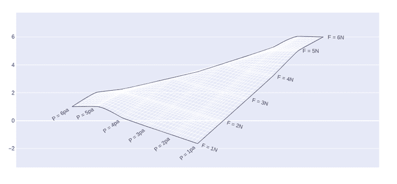

# 使用 Python 中的 Plotly 绘制地毯等高线图

> 原文:[https://www . geeksforgeeks . org/地毯-等高线-绘图-使用-plotly-in-python/](https://www.geeksforgeeks.org/carpet-contour-plot-using-plotly-in-python/)

Plotly 是一个 Python 库，用于设计图形，尤其是交互式图形。它可以绘制各种图形和图表，如直方图、条形图、箱线图、展开图等。它主要用于数据分析以及财务分析。plotly 是一个交互式可视化库。

## 地毯等高线图

地毯等高线图是一种图形技术，通过在二维格式上绘制称为等高线的恒定 z 切片来表示三维表面。x 和 Y 属性用于设置 x 和 Y 坐标。如果 x 的值丢失，那么它将形成一个欺骗阴谋。应该使用 a 和 B 属性来保存参数的值。

> **语法:** plotly.graph_objects。contourcarpet(a =无，b =无，xaxis =无，yaxis =无，z =无)

**参数:**

<figure class="table">

| 名字 | 描述 |
| a | 设置 x 坐标。 |
| b | 设置 y 坐标。 |
| xaxis | 设置该轨迹的 x 坐标和 2D 笛卡尔 x 轴之间的参考。如果为“x”(默认值)，则 x 坐标指布局。x 轴。如果为“x2”，则 x 坐标指布局。x 轴 2 |
| 亚克斯 | 设置此轨迹的 y 坐标和 2D 笛卡尔 y 轴之间的参考。如果是“y”(默认值)，y 坐标指的是 layout.yaxis。如果是“y2”，y 坐标指的是 layout.yaxis2 |
| z | 设置 z 数据。 |

</figure>

**示例:**

## 蟒蛇 3

```
import plotly.graph_objects as go

fig = go.Figure(go.Carpet(
    a=[1, 2, 3, 4, 5, 6],
    b=[6, 5, 4, 3, 2, 1],
    y=[1, 2, 3, 4, 5, 6],

    aaxis=dict(
        tickprefix='F = ',
        ticksuffix='N',
        smoothing=0.2,
        minorgridcount=10,
    ),
    baxis=dict(
        tickprefix='P = ',
        ticksuffix='pa',
        smoothing=0.4,
        minorgridcount=9,
    )
))

fig.show()
```

**输出:**



## 添加等高线

在绘图中，可以使用 **go 添加轮廓。 **graph_object** 类的 Contourcarpet()** 方法。轮廓的添加方式应使图体位于适当的线段上。

**示例:**

## 蟒蛇 3

```
import plotly.graph_objects as go

fig = go.Figure()

fig.add_trace(go.Contourcarpet(
    a = [1, 2, 3, 4, 5, 6],
    b = [6, 5, 4, 3, 2, 1],
    z = [1, 1.96, 5, 6.1028, 4, 5.0625],
    autocontour = False,
    contours = dict(
        start = 1,
        end = 14,
        size = 1
    ),
    line = dict(
        width = 2,
        smoothing = 0
    ),
    colorbar = dict(
       len = 0.4,
        y = 0.25
    )
))

fig.add_trace(go.Carpet(
    a=[1, 2, 3, 4, 5, 6],
    b=[6, 5, 4, 3, 2, 1],
    y=[1, 2, 3, 4, 5, 6],

    aaxis=dict(
        tickprefix='F = ',
        ticksuffix='N',
        smoothing=0.2,
        minorgridcount=10,
    ),
    baxis=dict(
        tickprefix='P = ',
        ticksuffix='pa',
        smoothing=0.4,
        minorgridcount=9,
    )
))

fig.show()
```

**输出:**

