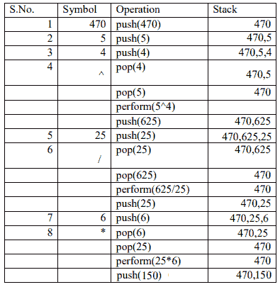
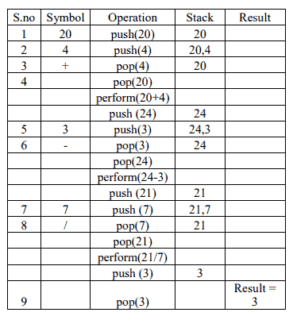
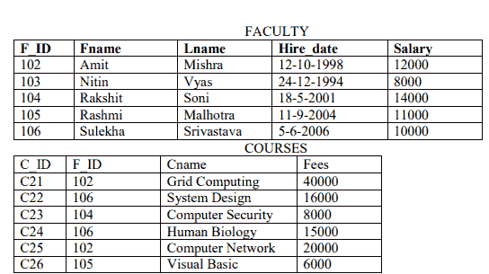
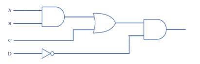
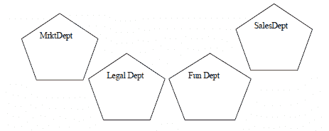
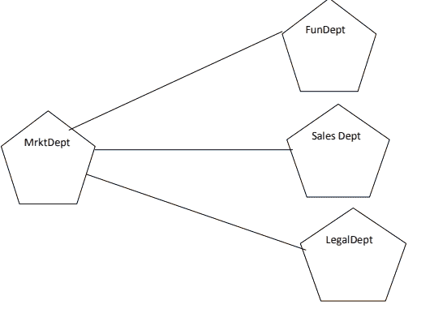

# CBSE 第十二届论文解答–2015-16 届

> 原文:[https://www . geesforgeks . org/cbse-12-class-paper-soled-2015-16-session/](https://www.geeksforgeeks.org/cbse-12th-class-paper-solved-2015-16-session/)

样题纸–第二套
计算机科学(083)
第十二类(2015-16)
时间:3 小时制

**说明:**
一、所有问题为必答。
二。编程语言:A 节:C++
三。编程语言:B 节:Python
iv。回答 A 节或 B 节，C 节是必修的

#### 第一节:A (C++)

**Q1 a .用合适的例子**定义[宏](https://www.geeksforgeeks.org/c-language-2-gq/macro-preprocessor-gq/)。2

**Ans:** 宏是使用# define 创建的预处理器指令，用作符号常量。它们是已被命名的代码片段。每当使用该名称时，它都会被宏的内容替换。创建它们是为了简化和减少重复编码的数量。
例如，

```py
#define sum (a, b) a + b
```

定义宏和，取两个参数 a 和 b。这个宏可以像任何函数一样被调用。因此，预处理后:

```py
z = sum(x, y);
is replaced with Z = x + y;
```

**b .将包含哪个 C++ [头文件](https://www.geeksforgeeks.org/difference-header-file-library/)来运行/执行以下 C++代码？1**

 ```py
void main()
{
    int Last = 26.5698742658;
    cout << setw(5) << setprecision(9) << Last;
}
```** 

**Ans:** 需要包含的两个头文件是:
**iostream:** iostream 代表标准输入输出流。这个头文件包含像 cin，cout 等对象的定义。
**iomanip:** iomanip 代表输入输出操纵器。该文件中声明的方法用于操作流。该文件包含 setw、setprecision 等的定义。

**c .删除任何语法错误后，重写以下程序。在所做的每项更正下面画线。2**

 ```py
#include<iostream.h>
void main() int A[10];
A = [ 3, 2, 5, 4, 7, 9, 10 ];
for (p = 0; p <= 6; p++) {
    if (A[p] % 2 = 0)
        int S = S + A[p];
}
cout << S;
}
```** 

**Ans:** 上面的代码中，main()后面的花括号缺失，数组的元素声明错误，变量 p 没有声明，S 不能在块内部声明。因此，进行了以下更正:

```py
#include <iostream.h>
<u>void main() {</u> 

    <u>int A[10] = { 3, 2, 5, 4, 7, 9, 10 };</u>
     <u>int S = 0, p</u>;
    for (p = 0; p <= 6; p++) { <u>if (A[p] % 2 == 0)</u>
            S = S + A[p];
    }
    cout << S;
}=>
```

**d .找到以下 C++程序的输出:2**

 ```py
#include <iostream.h>
void repch(char s[])
{
    for (int i = 0; s[i] != '\0'; i++) {
        if (((i % 2) != 0) && (s[i] != s[i + 1])) {
            s[i] = '@';
        }
        else if (s[i] == s[i + 1]) {
            s[i + 1] = '!';
            i++;
        }
    }
}
void main()
{
    char str[] = "SUCCESS";
    cout << "Original String" << str
    repch(str);
    cout << "Changed String" << str;
}
```** 

**Ans:** *Output:* 将‘@’替换为 U，‘！”代替第二个 C 和'！'代替第三个 S

```py
Original String SUCCESS
Changed String S@C!ES! 
```

**e .找到以下的输出:3**

 ```py
#include <iostream.h>

void switchover(int A[], int N, int split)
{

    for (int K = 0; K < N; K++)
        if (K < split)
            A[K] += K;
        else
            A[K] *= K;
}

void display(int A[], int N)
{
    for (int K = 0; K < N; K++)
        (K % 2 == 0) ? cout << A[K] << "%" : cout << A[K] << endl;
}
void main()
{
    int H[] = { 30, 40, 50, 20, 10, 5 };
    switchover(H, 6, 3);
    display(H, 6);
}
```** 

**Ans:** 在上面的程序中，当通过传递数组的地址、数组的大小和 split = 3 来调用 switch()函数时。在这个 K = 0，1，2 的函数中，如果条件被执行并且 K 被加到数组元素上，即 30+0 = 30，40+1 = 41，50+2 = 52，然后条件被遵循并且数组元素被相乘，20*3 = 60，10*4 = 40，5*5 = 25。
Display()打印修改后数组的值，输出为:

```py
30%41
52%60
40%25

```

**f .观察下面的 C++代码，找出给定选项 I)到 iv)中哪一个是预期的正确输出。同时指定变量“Go”的最大值和最小值。2**

```py
void main()
{
    int X[4] = { 100, 75, 10, 125 };
    int Go = random(2) + 2;
    for (int i = Go; i < 4; i++)
        cout << X[i] << "$";
}
```

**100 元 75 两。75 美元 10 美元 125 美元三。75 美元 10 美元 iv.10 美元 125 美元**

**Ans:** 选项**(四)**可以是 Go=2 的唯一正确答案。在这种情况下，将打印 10 美元 125 美元。
Go 的最小值= 2(当随机(2)= 0)
Go 的最大值= 3(当随机(2) = 1)

**Q2 a .区分[数据抽象和](https://www.geeksforgeeks.org/abstraction-in-c/)数据隐藏。** 2
**Ans:** 数据隐藏可以定义为对外界隐藏一个类的数据的机制。这样做是为了保护数据免受任何意外或有意的访问。数据隐藏是通过使类的成员私有来实现的。
数据抽象是指，只向外界提供必不可少的信息，并隐藏它们的背景细节。程序的所有部分都可以访问用公共标签定义的成员。类型的数据抽象视图由其公共成员定义。

**b .完成以下课程后回答问题(一)和(二):2**

 ```py
class Exam {
    int Rollno;
    char Cname[25];
    float Marks;

public:
    Exam() // Function 1
    {
        Rollno = 0;
        Cname ="";
        Marks = 0.0;
    }
    Exam(int Rno, char candname) // Function 2
    {
        Rollno = Rno;
        strcpy(Cname, candname);
    }
    ~Exam() // Function 3
    {
        cout << "Result will be intimated shortly" << endl;
    }
    void Display() // Function 4
    {
        cout << "Roll no :"<< Rollno;
        cout <<"Name :" << Cname;
        cout <<" Marks :"<< Marks;
    }
};
```** 

**(i)功能 1 和功能 2 实现了哪个面向对象概念。解释一下？**
**Ans:** 函数 1 和函数 2 是[构造函数](https://www.geeksforgeeks.org/constructors-c/)，实现了[重载和多态](https://www.geeksforgeeks.org/polymorphism-in-c/)的概念，因为构造函数的多个定义是在同一个范围内给出的。函数 1 是[默认构造函数](https://www.geeksforgeeks.org/c-internals-default-constructors-set-1/)，函数 2 是参数化构造函数。

**(二)函数 3 叫什么？什么时候调用？**
**Ans:** 函数 3 是一个[析构函数](https://www.geeksforgeeks.org/destructors-c/)，当对象超出范围时被调用。

**c .用以下规范在 C++中定义一个[类](https://www.geeksforgeeks.org/c-classes-and-objects/)候选:4**
私有成员:

*   一个数据成员 Rno(注册号)类型长
*   字符串类型的数据成员 Cname
*   一个数据成员包含浮点类型的标记(聚合标记)
*   字符类型的数据成员等级
*   成员函数 setGrade()根据学生获得的总成绩来查找分数。等效骨料标号范围及各自等级如下所示:
    T21】小于 65 且>= 50T29】DT31

    | 聚合标记 | 级别 |
    | >= 80 | A |
    | 小于 80 且>= 65 | B |
    | C |
    | 不到 50 |

公众成员:

*   为数据成员分配默认值的构造函数:Rno=0，Cname="N.A "，Agg_marks=0.0
*   允许用户为 Rno 输入值的函数 Getdata()。Cname，Agg_marks 并调用函数 setGrade()来查找等级。
*   一个函数，允许用户查看所有数据成员的内容。

****年:** :**

```py
class Candidate {
    long Rno;
    char Cname[20];
    float Agg_marks;
    char Grade;
    void setGrade()
    {
        if (Agg_marks >= 80)
            Grade = ‘A’;
        else if (Agg_marks < 80 && Agg_marks >= 65)
            Grade = ‘B’;
        else if (Agg_marks < 65 && Agg_marks >= 50)
            Grade =’C’;
        else
            Grade =’D’;
    }

public:
    Candidate()
    {
        Rno = 0;
        Strcpy(Cname, "N.A.");
        Agg_marks = 0.0;
    }
    void Getdata()
    {
        cout << "Registration No";
        cin >> Rno;
        cout << "Name";
        cin >> Cname;
        cout << Aggregate Marks "; 
        cin >> Agg_marks;
        setGrade();
    }
    void dispResult()
    {
        cout << "Registration No" << Rno;
        cout << "Name" << Cname;
        cout << Aggregate Marks "<< Agg_marks; 
    }
```

**d .给出以下类定义回答如下问题:4**

```py
class University {

    char name[20];

protected:
    char vc[20];

public:
    void estd();
    void inputdata();
    void outputdata();
} 

class College : protected University { 

        int regno;
        protected
        char principal()

public :
   int no_of_students;
   void readdata();
   void dispdata ( );
};

class Department : public College {

             char name[20];
public:
        void fetchdata(int);
        void displaydata();  };
```

i) **命名学院的基类和派生类。**1
T3】Ans:T5】基类:大学
派生类:系

ii) **命名可以从函数 displaydata()** 访问的数据成员。
T3】Ans:char name[20]，char HOD[20]，char principal()，int no _ of _ students，char vc[20]

iii) **上面的类定义描述了什么类型的继承？**
**Ans:** [多级继承](https://www.geeksforgeeks.org/inheritance-in-c/)

iv)**class Department 的一个对象的大小会是多少(以字节为单位)？**
**Ans:** 85 字节

**Q3 a .沿存储器中的列存储整数数组 A [30][40]。如果元素 A[20][25]存储在 50000，找出 A[25][30]的位置。3**
**Ans:**

A[I][J]= B+W[行数 x(I-Lr)+(J-Lc)]
A[20][25]= B+2[30 x(20-0)+(25-0)]
50000 = B+2[30 x(20-0)+(25-0)]
B = 48750

A[7][10]= 48750+2[30 x(7-0)+(10-0)]
A[7][10]= 49190

**b .为包含乘客信息的链接实现队列编写函数定义如下:4**

 ```py
struct NODE {
    int Ticketno;
    char PName[20];
    NODE* NEXT;
};
class Queueofbus {
    NODE *Rear, *Front;

public:
    Queueofbus()
    {
        Rear = NULL;
        Front = NULL;
    };
    void Insert();
    void Delete();
    ~Queueofbus()
    {
        cout << "Object destroyed";
    }
};
```** 

**年:**

```py
void Queueofbus::Insert()
{
    NODE* p = new NODE;
    cout << "Enter Ticket no";
    cin >> p->Ticketno;
    cout << "Enter Name";
    cin >> p->PName;
    p->NEXT = NULL;
    if (rear == NULL) {
        Rear = p;
        Front = Rear;
    }
    else {
        Rear->NEXT = p;
        Rear = Rear->NEXT;
    }
}
```

c .编写一个函数，使用[插入排序](https://www.geeksforgeeks.org/insertion-sort/)对任意 n 个元素的数组进行排序。数组应该作为参数传递给函数。 3

**年:**

```py
void insertsort(int a[], int n)
{
    int p, ptr;
    // Assuming a[0] = int_min i.e. smallest integer
    for (p = 1; p <= n; p++) {
        temp = a[p];
        ptr = p - 1;
        while (temp <= a[ptr]) {
            a[ptr + 1] = a[ptr]; // Move Element Forward
            ptr--;
        }
        a[ptr + 1] = temp; // Insert Element in Proper Place
    }
```

**d .在 C++中编写一个函数 NewMAT(int A[][]，int r，int c)，该函数接受一个 2d 整数数组及其大小作为参数，将 2d 数组**中所有不在 60 到 600(两个值都包括在内)范围内的数组元素除以 6。2

**年:**

```py
void NewMAT(int A[][], int r, int c)
{
    for (int i = 0; i < r; i++)
        for (j = 0; j < c; j++)
            if ((A[i][j] >= 60) && (A[i][j] <= 600))
                A[i][j] /= 6;
    or A[i][j] = A[i][j] / 6;
}
```

**e .使用堆栈计算以下[后缀表达式，并显示每个操作执行后的内容:470，5，4，^，25，/，6，*](https://www.geeksforgeeks.org/stack-set-4-evaluation-postfix-expression/)** 2

**年:**



**Q4 a .考虑一个包含 Emp 类对象 E 的文件 F。** 1

**i)写语句将文件指针定位到文件的末尾**
**Ans:** F.seekg(0，IOs::end)；

**ii) Write 语句，返回从文件开始到文件指针当前位置的字节数。**
**Ans:**f . tellg()；

**b .编写一个函数 RevText()读取一个文本文件“Input.txt”，并以相反的顺序只打印以‘I’开头的单词。2
示例:如果文本文件中的值为:INDIA IS MY COUNTRY
输出将为:aidini SI MY COUNTRY**
**Ans:**

```py
void RevText()
{
    ifstream in("Input.txt");
    char word[25];
    while (in) {
        in >> word;
        if (word[0] ==’I’)
            cout << rrev(word);
        else
            cout << word;
```

**c .用 C++编写一个函数来搜索和显示细节，其目的地是二进制文件“Flight”中的“Chandigarh”。Dat”。假设二进制文件包含以下类的对象:** 3

```py
class FLIGHT {

    int Fno;           // Flight Number
    char From[20];    // Flight Starting Point
    char To[20];     // Flight Destination
public:
    char* GetFrom();
    {
        return from;
    }
    char* GetTo();
    {
        return To;
    }
    void input()
    {
        cin >> Fno >> ;
        gets(From);
        get(To);
    }
    void show() { cout Fno << ": " From ":" To endl; }
};
```

**年:**

```py
void Dispdetails()
{
    ifstream fin("Flight.Dat");
    Flight F;
    while (fin) {
        fin.read((char*)&F, sizeof(F)) if (strcmp(F.GetTo(), "Chandigarh"))
            F.show();
    }
}
```

**段:B (Python)**

**Q1 a .[列出](https://www.geeksforgeeks.org/python-list/)和[字典数据类型的一个相似和一个不同之处。](http://geeksforgeeks.org/python-dictionary/)T5】2**

**年:**

相似性:列表和字典都是可变的数据类型。
不同:列表是一种顺序数据类型，即它们被索引。
字典是一种映射数据类型。它由键:值对组成。
Eg: L =[1，2，3，4，5]是一个列表
D = { 1:“Ajay”，2:“Prashant，4:“Himani”}是一个字典，其中 1，2，4 是键，“Ajay”，Prashant，“Himani”是它们对应的值。

**b .观察以下 Python 函数，并写出它们所属模块的名称:** 1
i) uniform() ii) findall()

**年:** i)随机 ii) re

**c .在删除所有语法错误(如果有)后，重写以下 Python 程序，在每个更正下面加下划线:2**

```py
def checkval : x = raw_input("Enter a number") 
if x % 2 = 0 : 
print x, "is even" 
else if x < 0 : 
print x, "should be positive" 
else;
print x, "is odd"
```

**年:**

```py
def checkval():
    x = raw_input("Enter a number")
    if x % 2 == 0:
       print x, "is even" 
   elif x < 0 : 
       print x, "should be positive" 
else:
       print x, "is odd"

```

**d .找到以下 Python 程序的输出:3**

 ```py

def makenew(mystr):
    newstr = " "
    count = 0
    for i in mystr:
        if(count % 2 != 0):
            newstr = newstr + str(count)
        else:
          if(i.islower()):
              newstr = newstr + i.upper()
          else:
              newstr = newstr + i 
        count += 1
    newstr = newstr + mystr[:1]
    print("The new string is :", newstr)
makenew("sTUdeNT")
```** 

**Ans:** 新字符串为:S1U3E5Ts

**e .找到以下程序的输出 2**

 ```py
def calcresult():
    i = 9 
    while i > 1:
       if (i % 2 == 0):
          x = i % 2 
          i = i - 1 
       else: 
          i = i - 2
          x = i 
       print x * *2
```** 

**年:**

*输出:*

```py
49
25
9
1 

```

**f .观察下面的 Python 代码，找出给定选项 I)到 iv)中哪一个是预期的正确输出。同时指定变量“Go”的最大值和最小值。2**

```py
import random X =[100, 75, 10, 125] 
Go = random.randint(0, 3)
for i in range(Go) :
print X[i], "$", 
```

我也是。100 块 75 块 10 块 2。75 块 10 块 125 块 3 块。75 美元 10 美元 4.10 美元 125 美元 100 美元

**Ans:**
i. 100$75$10$
可分配给 Go 的最小值为 0
可分配给 Go 的最大值为 3

**Q2 a .讨论 python 使用的内存分配策略？** 2

**Ans:** Python 使用两种内存分配策略- [引用计数和自动垃圾收集:](https://www.geeksforgeeks.org/garbage-collection-python/)
T5【引用计数:通过计算一个对象被系统中其他对象引用的次数来工作。当对象的引用计数为零时，Python 会自动收集它。
**自动垃圾收集:** Python 基于对象分配和对象取消分配的阈值来调度垃圾收集。当分配数减去解除分配数大于阈值数时，垃圾收集器将运行，未使用的内存块将被回收。

**b .在完成以下课程定义后回答问题(一)和(二):2**

```py
class Toy :
tid =0;
tcat = " "
def __init__(self):// Function1 
10
..................................... // Blank 2
```

 **i .解释函数 1 的相关性。** 

**Ans:** __init__ 函数用于初始化一个类的成员。当创建类的对象时，会自动调用它。

**ii (a)。用一条语句填空，创建 TOY 类的对象。**

**年:**t =玩具()

**(b)。编写语句检查 tprice 是否是 TOY 类的属性。**

**年:**hasttr(t，tprice)

**c .用 PYTHON 定义一个类 Train，描述如下:4**

**数据成员
类型字符串的 src
类型字符串的 Tnm
类型字符串的 Dest
费用的 float
成员函数 Getdata 为费用**

**T21

| 建筑环境及 HVAC 系统模拟的软件平台 | expense |
| Bombay | One thousand |
| Chinnai |** 

公共成员:
·初始化数据成员的构造函数。
·函数输入数据()允许用户输入值
·函数显示数据()显示全部并调用获取数据函数

**年:**

```py
class train : 
    def __init__(self):
        _src = "" 
        _tnm = ""
        _dest = "" 
        _charges = 0.0

    def getdata(self): 
        if self._dest == "mumbai" or self._dest == "MUMBAI":
           self._charges = 1000
        elif self._dest == "chennai" or self._dest == "CHENNAI" : 
            self._charges = 2000
        elif self._dest == "kolkata" or self._dest == "KOLKATA" : 
            self._charges = 2500

    def inputdata(self): 
        self._src = raw_input("enter the source of journey")    
        self._tnm = raw_input("enter the train name")
        self._dest = raw_input("enter the destination")                                                 
```

**d .观察以下类定义，回答以下问题:2**

 ```py
class ParentClass(objects):
    def__init__(self)
        self, x = 1
        self.y = 10
    def print(self):
        print(self.x, self.y)
class ChildClass(ParentClass):
    def__init__(self):
        super(ChildClass, self).init_() # Line 1
        self, x = 2
        self.y = 20
c = ChildClass()
c.print()      
```** 

**一、解释第一行的相关性。**。

**Ans:** super()函数用于调用派生类中已经扩展的基类的方法。此外，派生类 __init__()调用基类 __init__()也很重要。

**二。上面的代码演示了什么类型的继承？**

**Ans:**[Python 中单级继承](https://www.geeksforgeeks.org/oop-in-python-set-3-inheritance-examples-of-object-issubclass-and-super/)

**e .编写一个用户自定义函数 findname(name)，其中 name 是 Python 中的一个参数，根据 name 从字典电话簿中删除电话号码，其中 name 是关键。**

**年:**

```py
def findname(name): 
     if phonebook.has_key():
         del phonebook[name] 
     else: 
         print "Name not found" 
print "Phonebook Information"
```

**Q3 答:解释尝试..除了…否则…借助用户定义的函数 def divide(x，y ),当分母为零时，def divide(x，y)会产生一个错误，而用 x 除以 y，则显示商。3**

****Ans:****

```py
def divide(x, y):
  try:
    result = x / y
  except ZeroDivisionError:
    print "division by zero!"
  else:
    print "result is", result
```

在上例中:try 块由可能引发错误的代码组成。当 y(分母)的值为 0 时，会引发零除错误，该错误由 except 子句处理。在没有异常的情况下，执行其他语句。如果没有错误，将执行 else 子句中的语句

**b .编写一个用户自定义函数 arrangement elements(X)，接受一个整数列表 X，将列表左边的所有负元素和右边的所有正元素都设置好。
Eg:如果 L =[1，-2，3，4，-5，7]，输出应为:[-2，-5，3，4，7] 3
Eg:如果 L =[1，-2，3，4，-5，7]，输出应为:[-2，-5，3，4，7] 3**

**年:**

```py
def arrangelements(X):
    L = len(X)
    for i in range(L):
        if a[i] < 0 and i != 0:
            j = i
    while j != 0 and a[j - 1] > 0:
        a[j], [j - 1] = a[j - 1], a[j]
        j = j - 1 
```

**c .考虑以下类定义:- 3**

 ```py
class book ():
    bk = []
    def _ init _ (self, bno):
        self .bno = bno
    def addbook (self):
        ……………
    def removebook (self):
        ……………
```**  **使用队列** 实现类书**。请记住，完成添加图书 addbook()和删除图书 removebook()的函数定义。**

**年:**

```py
def addbook(self):
    a = input("enter book number: ")
    book.bk.append(a)
    def removebook (self):
        if (book.bk ==[]):
            print "Queue empty"
        else:
            print "deleted element is: ", book.bk[0]
del book.bk[0]
```

**d .编写 python 函数生成 fibo(n)其中 n 是极限使用生成器函数斐波那契(max)其中 max 是产生斐波那契数列的极限 n。** 3

**年:**

```py
def Fibonacci (max):
 a, b = 0, 1
  while a <= max:
    yield a
      a, b = b, a + b
 def generatefibo(n)
   for i in Fibonacci (n):
     print i 
```

**e .使用堆栈评估以下后缀&显示每个后缀执行后堆栈的内容:** 2

**20，4，+，3，-，7，1**

**年:**



**Q4 a .考虑以下代码:1**

```py
f = open("mytry", "w+")
f.write("0123456789abcdef")
f.seek(-3, 2)   // 1
printf.read(2) // 2
```

解释语句 1 并给出输出 2。

**Ans:** 语句 1 使用 seek()方法可用于将文件对象定位在文件中的特定位置。它的语法是:fileobject.seek(offset [，from_what])。因此，f.seek(-3，2)将 fileobject 定位到文件结束前的 3 个字节。

2 的输出是:de(它从文件对象所在的位置读取 2 个字节。)

**b .用 Python 写一个用户自定义函数，显示文件 Para.txt.Eg 中以‘H’开头的行数:如果文件包含:2**

**这些是谁的树林我想我知道。
他的房子虽然在村里；
他不会看到我停在这里
看着他的树林被雪填满。
那么行数应该是 2。**

**年:**

```py
def countH():
  f = open ("Para.txt", "r")
  lines = 0
  l = f.readlines()
  for i in l:
    if i[0] == 'H':
       lines += 1
print "no. of lines is", lines
```

**c .考虑一个包含 empno: ename: salary(分隔符' :')等详细信息的二进制文件 Employee.dat。编写一个 python 函数来显示那些收入在 20000 到 40000 之间的员工的详细信息。(包括两个值)** 3

**年:**

```py
def Readfile(): 
 i = open("Employee.dat", "rb+")
 x = i.readline() 
    while (x):
        I = x.split(':') 
    if (20000 >= float(I[2]) <= 5000): 
        print x
x = i.readline()
```

**段:C**

**Q5 a .借助例子区分[表的基数和度](https://www.geeksforgeeks.org/relational-model/)。** 2

**Ans:**
基数定义为表中的行数。
度数是表中的列数。

**b)考虑下表“教员”和“课程”。为语句(I)至(v)编写 SQL 命令，并给出 SQL 查询(vi)至(vii)的输出 6**



**i)显示薪资大于 12000 的院系的详细信息。**

**年:**

```py
Select * from faculty
  where salary > 12000

```

**ii)显示费用在 15000 至 50000(包括两个值)范围内的课程的详细信息。**

**年:**

```py
Select * from Courses
  where fees between 15000 and 50000

```

**iii)将所有课程的费用增加 500 的“系统设计”课程。**
**Ans:**

```py
Update courses set fees = fees + 500
     where Cname = "System Design" 

```

**iv)按课程降序显示由“Sulekha”教授的课程的详细信息。**

**年:**

```py
Select *from faculty fac, courses cour 
   where fac.f_id = cour.f_id and 
   fac.fname = 'Sulekha' order by cname desc

```

**v)从课程中选择计数(DISTINCT F _ ID)；**
**Ans:** 4

vi) **从“课程”中选择“最低工资”。F_ID =教职工。F _ ID**T2**俺们:** 6000

**Q6 a .代数陈述和验证吸收定律。** 2

**年:**

吸收定律指出:
A + AB = A 和 A(A+B)= A

代数法:
取 LHS : A + AB
= (A.1) + (A.B)乘恒等式
= A(1+B)乘分布
= A.1 乘零元素
= A

**b .为下面的布尔表达式画一个逻辑电路:A . b+ C . D’。** 2

**年:**



**c .写出布尔函数 F 的 SOP 形式，用真值表表示如下:**1
A B C F
0 0 0 0 0
0 0 1 1
0 1 0 1
0 1 0
1 0 0 1
1 0 1 1
1 1 0 0
1 1 1 0

**年:***a ' b ' c+a ' BC '+ab ' c '+ab ' c/*

**d .获取布尔表达式的简化形式:F (U，V，W，Z) = II (0，1，3，5，6，7，15)**

**年:** (u + v + w)。(u + z)。(v+w)。(u+w+z)

**Q7 a .写出总线拓扑的任意 1 个优点和 1 个缺点。** 1

**Ans:**
优势:由于有一条单一的公共数据路径连接所有节点，总线拓扑使用非常短的电缆长度，这大大降低了安装成本。
缺点:故障检测和隔离困难。这是因为对网络的控制没有集中在任何特定的节点上。如果总线上的某个节点出现故障，则可能必须在网络上的多个点进行故障检测。然后，故障节点必须在该连接点进行校正。

**b. SunRise Pvt 有限公司正在艾哈迈达巴德建立网络。有四个部门被命名为 MrktDept、FunDept、LegalDept、SalesDept。** 4



各建筑物之间的距离如下:

| MrktDept 到 functiondept | 80 米 |
| MrktDept 到 LegalDept | 180 米 |
| dept 部门销售部门 | 100 米 |
| 法律部至销售部 | 150 米 |
| 基金法律部 | 100 米 |
| fundept to salesdept(为销售部门筹资) | 50 m |

建筑物中的计算机数量:

| MrktDept | Twenty |
| 法律部 | Ten |
| 投资者 | 08 |
| 肮脏的部门 | forty-two |

**i)建议部门间连接的电缆布局，并指定拓扑。**

**年:**



**ii)建议最合适的建筑放置服务器，并给出合适的理由。**
**Ans:** 按照 80–20 规则，MrktDept 因为它的电脑数量最多。

**iii)建议在网络中放置 I)调制解调器 ii)集线器/交换机**。

**Ans:** 每个建筑都应该有一个集线器/交换机和调制解调器，以防需要互联网连接

**iv)该组织计划将其位于同一城市不同地区的销售柜台连接起来/将形成局域网、广域网、城域网以外的哪种类型的网络？？证明。**

**Ans:** 城域网

**c .命名协议** 1

**i .用于使用分组交换网络传输语音。**

**Ans:** VOIP(互联网语音协议)，用于在基于互联网的网络上传输语音流量。

**二。用于两个小组之间或两个人之间的聊天。**

**Ans:** 互联网中继聊天是一种开放的协议，允许用户在线相互聊天。它在客户机/服务器模式下运行。

**d .什么是 IP 地址？** 1
**Ans:** 互联网协议(IP)地址是互联网上唯一标识设备的地址。它允许一个系统被万维网上的其他系统识别。使用的 IP 地址格式有两种主要类型——IP v4 和 IPv6。互联网上的数据传输和路由需要发送方和接收方计算机的 IP 地址。

**e .什么是 HTTP？** 1

**Ans:** 超文本传输协议(HTTP)是一种应用层协议，用于通过网络传输文本、图形、图像、声音、视频和其他多媒体文件等数据。HTTP 是互联网协议套件的一部分，使用服务器-客户端模式来传输数据。

**f .解释饼干**的重要性。一

**Ans:** Cookies 是存储在用户浏览器目录或数据文件夹中的小文本文件，用于保留用户的浏览信息，如登录凭据、浏览的网页以识别客户并定制其浏览体验。cookie 的主要目的是识别用户，并可能准备定制的网页或为用户保存网站登录信息。

**g . 4G 和 3G 有什么不同？** 1

**Ans:** 3G 代表第三代，4G 是第四代移动宽带互联网。3G 和 4G 的基本区别是移动数据的传输速度。3G 的平均速度被认为是 3 MBps，而在 4G 中，印度的平均速度高达 15 MBps。