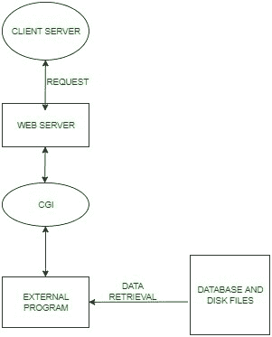

# Python 中的 CGI 编程

> 原文:[https://www.geeksforgeeks.org/cgi-programming-python/](https://www.geeksforgeeks.org/cgi-programming-python/)

**什么是 CGI？**
通用网关接口(也称为 CGI)不是一种语言，而只是一个**规范(规则集)**，它有助于在网络应用程序和浏览器(或客户端应用程序)之间建立动态交互。CGI 程序使客户端和网络服务器之间的**通信成为可能**。每当客户端浏览器向网络服务器发送请求时，CGI 程序都会根据客户端-服务器提供的输入将输出发送回网络服务器。

1.  CGI 是程序与 HTTP 服务器接口的标准。
2.  CGI 编程是动态生成响应用户输入的网页或与服务器上的软件交互的网页

**CGI**
的工作当客户端-服务器向网络服务器发出请求时，CGI 使用**外部脚本文件**来处理此类请求。这些文件可以用任何语言编写。这些脚本文件的主要目的是更快、更有效地从数据库中检索数据。这些脚本将检索到的数据转换成 Html 格式，然后以 Html 格式的页面将数据发送到这些 web 服务器。


**在你的系统上安装 apache2 可以吗我们会在主机‘127 . 0 . 0 . 1’**
上运行‘hello . py’建议先有 HTML 的基础知识再尝试这个例子。
T4

```py
#!/usr/bin/python3
# Importing the 'cgi' module
import cgi

print("Content-type: text/html\r\n\r\n")
print("<html><body>")
print("<h1> Hello Program! </h1>")
# Using the inbuilt methods

form = cgi.FieldStorage()
if form.getvalue("name"):
    name = form.getvalue("name")
    print("<h1>Hello" +name+"! Thanks for using my script!</h1><br />")
if form.getvalue("happy"):
    print("<p> Yayy! I'm happy too! </p>")
if form.getvalue("sad"):
    print("<p> Oh no! Why are you sad? </p>")

# Using HTML input and forms method
print("<form method='post' action='hello2.py'>")
print("<p>Name: <input type='text' name='name' /></p>")
print("<input type='checkbox' name='happy' /> Happy")
print("<input type='checkbox' name='sad' /> Sad")
print("<input type='submit' value='Submit' />")
print("</form")
print("</body></html>")
```

**CGI 的一些优点讨论如下:**
1 它们是可移植的，几乎可以在任何网络服务器和操作系统上工作。
2 它们是独立于语言的。
3 它们本质上是相当可扩展的程序，这意味着它们可以执行简单和复杂的任务。
4 个 CGI 增强了 web 应用程序中的动态通信。
5 它们还通过降低开发和维护成本来帮助企业提高利润。

**CGI 的一些缺点如下:**
1 每次启动程序时，解释器都要评估一个 CGI 脚本，这会产生大量的流量，因为客户端-服务器端的请求太多了。
2 CGI 程序的编程和设计非常复杂和模糊。
3 CGI 程序可能会危及服务器安全，因为它们大多数都是免费的，而且很容易获得，因此很容易受到攻击。

本文由 **Harsh Wardhan Chaudhary(实习生)**供稿。如果你喜欢 GeeksforGeeks 并想投稿，你也可以使用[contribute.geeksforgeeks.org](http://www.contribute.geeksforgeeks.org)写一篇文章或者把你的文章邮寄到 contribute@geeksforgeeks.org。看到你的文章出现在极客博客主页上，帮助其他极客。