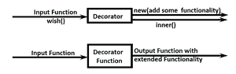

# 用 Python 链接多个装饰器

> 原文:[https://www . geesforgeks . org/chain-multi-decorator-in-python/](https://www.geeksforgeeks.org/chain-multiple-decorators-in-python/)

装饰器是一个函数，它可以把一个函数作为参数，扩展它的功能，并返回具有扩展功能的修改过的函数。



因此，在这篇文章中，我们将学习装饰链。链接装饰器意味着在一个函数中应用多个装饰器。Python 允许我们为一个函数实现多个装饰器。它使装饰者有用，因为它积累了几个效果在一起。它在 Python 中也被称为嵌套装饰器。

**语法:**

```py
@decor1
@decor
def num():
    statement(s)    
```

**示例:**对于 num()函数，我们应用了 2 个装饰函数。首先内部装饰者会工作，然后外部装饰者。

## 蟒蛇 3

```py
# code for testing decorator chaining
def decor1(func):
    def inner():
        x = func()
        return x * x
    return inner

def decor(func):
    def inner():
        x = func()
        return 2 * x
    return inner

@decor1
@decor
def num():
    return 10

print(num())
```

**输出:**

```py
400
```