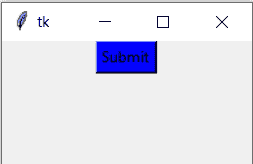

# 在 Python 中更改按钮的颜色–Tkinter

> 原文:[https://www . geesforgeks . org/change-of-color-of-button-in-python-tkinter/](https://www.geeksforgeeks.org/change-color-of-button-in-python-tkinter/)

**先决条件:** [**在 tkinter 中创建按钮**](https://www.geeksforgeeks.org/python-creating-a-button-in-tkinter/)**[**Python GUI–tkinter**](https://www.geeksforgeeks.org/python-gui-tkinter/)**

**在本文中，我们将编写一个 Python 脚本来更改 Tkinter 中按钮的颜色。这可以通过两种方法实现:**

*   **使用 bg 属性。**
*   **使用活动背景属性。**

****实施例 1:** 使用 bg 属性。**

**我们可以用 **bg** 属性改变按钮背景颜色，按钮的默认颜色是灰色，但是在这里我们要改变。**

## **蟒蛇 3**

```
# import tkinter module 
from tkinter import *   

# create a tkinter window
master = Tk()  

# Open window having dimension 200x100
master.geometry('200x100')  

# Create a Button
button = Button(master, 
                text = 'Submit', 
                bg='blue').pack()  

master.mainloop()
```

****输出:****

****

****示例 2:** 使用活动背景属性。**

**这些属性将在单击按钮时更改按钮背景颜色。**

## **蟒蛇 3**

```
# import tkinter module 
from tkinter import *   

# create a tkinter window
master = Tk()  

# Open window having dimension 200x100
master.geometry('200x100')  

# Create a Button
button = Button(master, 
                text = 'Submit', 
                bg='white', 
                activebackground='blue').pack()  

master.mainloop()
```

****输出:****

**<video class="wp-video-shortcode" id="video-523364-1" width="640" height="360" preload="metadata" controls=""><source type="video/mp4" src="https://media.geeksforgeeks.org/wp-content/uploads/20201203225241/www_screencapture_com_2020-12-3_22_50.mp4?_=1">[https://media.geeksforgeeks.org/wp-content/uploads/20201203225241/www_screencapture_com_2020-12-3_22_50.mp4](https://media.geeksforgeeks.org/wp-content/uploads/20201203225241/www_screencapture_com_2020-12-3_22_50.mp4)</video>**