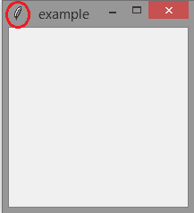
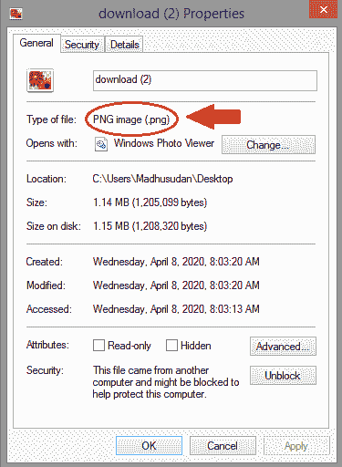
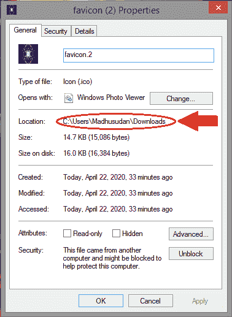
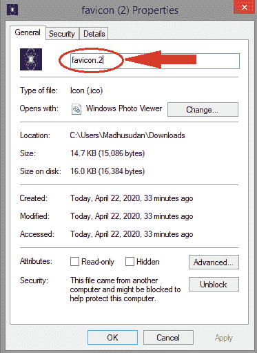
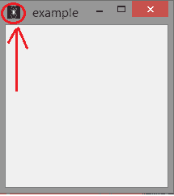

# 更改 Tkinter 消息框的图标

> 原文:[https://www . geesforgeks . org/change-icon-for-tkinter-messagebox/](https://www.geeksforgeeks.org/change-icon-for-tkinter-messagebox/)

我们知道很多模块，其中之一就是**[【Tkinter】](https://www.geeksforgeeks.org/python-gui-tkinter/)**。Tkinter 是一个模块，它是 Python 到 Tk GUI 工具包的标准接口。这个接口 Tk 和 Tkinter 模块，它们都可以在大多数的 Unix 平台上使用。它也可以在 Windows 操作系统和许多其他系统上使用。但它通常是一个共享库或 DLL 文件，在某些情况下，它是与 Python 解释器静态链接的。

## 消息框的默认图标

每当我们使用 Tkinter 创建一个消息框时，我们总是会在消息框中看到一个类似的图标。让我们用一个例子再看一遍。

**示例:**

```
import tkinter as tk

win = tk.Tk()

# as it does not have any mentions 
# of the icon we get a default icon.
win.title("example") 
win.mainloop()
```

**输出:**


在上面的例子中，在我们得到的默认图标的圆圈内，代码中没有提到它。是的，我们可以根据自己的意愿改变它。选择您想要保存为图标的照片。选择，然后[右键–>属性]。您看到的文件类型将采用(**)的格式。png** )。



但是我们需要它的格式(**)。ico** )。可能会有一个问题，为什么我们需要把`.png`转换成`.ico`？为什么我们不能用？巴布亚新几内亚？对于这一点，答案是图标位图功能(取决于编程语言)应该用于在窗口图标化时为窗口设置位图图像。为此，只需在网上搜索**在线 icoconverter** ，转到那里，只需转换您想要转换的图像即可(**)。ico** )。因此，我们已经将图像准备好所需的格式，接下来回到编码部分，让我们学习如何将默认图标更改为我们选择的图标，请按照步骤操作。

**第一步:**添加一条线，定义图标位图，即 win.iconbitmap(r”)

```
import tkinter as to

win = tk.Tk()
win.title("example")
win.iconbitmap(r'')
win.mainloop()
```

**第二步:**提到我们想要作为图标的图像的文件路径。复制文件位置并将其粘贴到“win.iconbitmap”中。



```
win.iconbitmap(r'C:\Users\Madhusudan\Downloads\')
```

**第三步:**提到文件名。复制文件名，并将其粘贴在您提到文件位置的“\”之后。



```
win.iconbitmap(r'C:\Users\Madhusudan\Downloads\favicon(2).ico')

```

最后，我们得到了如何改变图标的完整代码。让我们把它放在一起。

```
import tkinter as tk

win = tk.Tk()
win.title("example")
win.iconbitmap(r'C:\Users\Madhusudan\Downloads\favicon(2).ico')

win.mainloop() 
```

**输出:**
