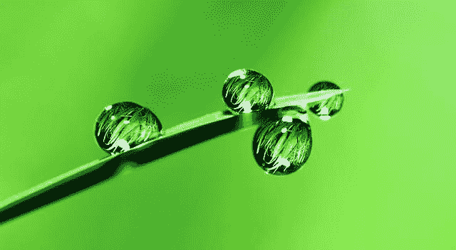
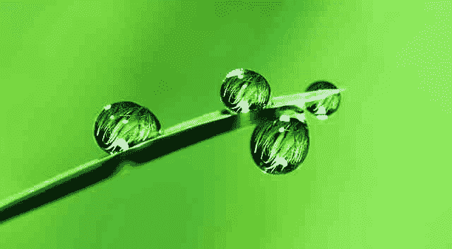
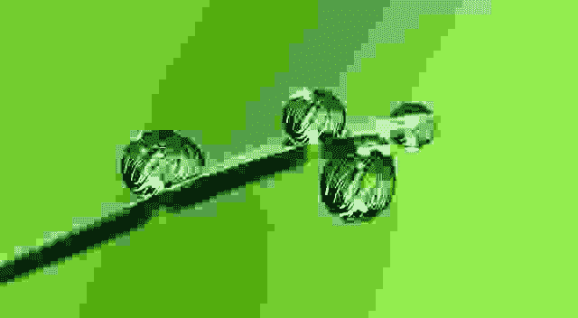

# 使用 Python 中的枕头改变图像分辨率

> 原文:[https://www . geesforgeks . org/change-image-resolution-使用 python 中的枕头/](https://www.geeksforgeeks.org/change-image-resolution-using-pillow-in-python/)

**先决条件:** [蟒枕](https://www.geeksforgeeks.org/python-pillow-a-fork-of-pil/)

PIL 是 python 图像库，它为 Python 解释器提供了深入的文件格式支持、高效的内部表示和相当强大的图像处理能力。改变图像的分辨率仅仅意味着减少或增加图像中的像素数量，而不改变其尺寸或任何其他因素。在本文中，我们将学习如何借助 python PIL(枕头)库来更改图像的质量/分辨率。

## 更改图像分辨率

**使用质量参数:**

图像质量是衡量和存储图像分辨率的标尺。它在 0 到 100 的范围内，其中 95 被认为是最好的，因为 100 禁用 jpeg 压缩算法的某些部分，导致非常大的文件。而另一方面，图像质量或分辨率的增益从 95 到 100 也是微不足道的。该功能可以通过以下步骤实现:

1.  从枕头导入图像模块。
2.  使用打开图像。通过指定图像路径打开( )方法。
3.  image_file.save()方法有一个名为 quality 的参数，它指定了 1-100 比例的图像分辨率，其中 95 被认为是最佳质量。

**程序:**

## 蟒蛇 3

```py
# Import the Images module from pillow
from PIL import Image

# Open the image by specifying the image path.
image_path = "image_name.jpeg"
image_file = Image.open(image_path)

# the default
image_file.save("image_name.jpg", quality=95)

# Changing the image resolution using quality parameter
# Example-1
image_file.save("image_name2.jpg", quality=25)

# Example-2
image_file.save("image_name3.jpg", quality=1)
```

**原图:**



**输出:**

**默认/高分辨率(质量=95):**


**中等分辨率(质量=25):**



**低分辨率(质量=1):**

