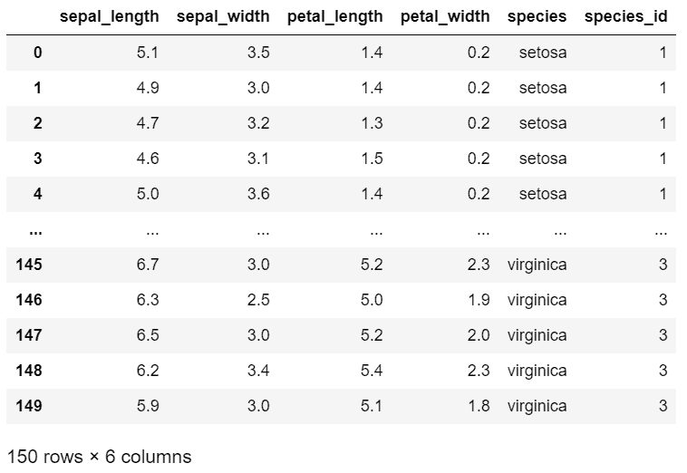
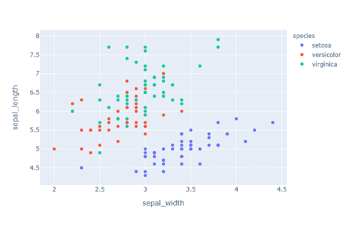
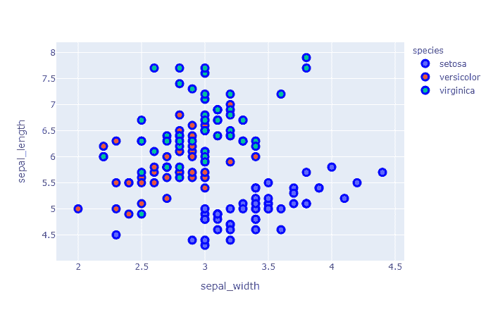
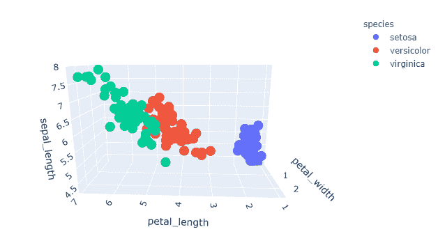
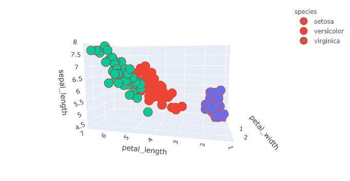

# 在 Plotly–Python 中更改标记边框颜色

> 原文:[https://www . geesforgeks . org/change-marker-border-color-in-plotly-python/](https://www.geeksforgeeks.org/change-marker-border-color-in-plotly-python/)

在本文中，我们将讨论如何使用 Python 中的*模块来更改标记边框颜色。*

*Plotly* 绝对是可视化的必备工具，因为它功能强大，易于使用，并且具有很大的交互性优势我们能够导出可视化，能够在浏览器上运行，使用 DASH 构建，DASH 是基于 web 的 python 接口，它消除了这种类型的分析 web 应用程序中对 javascript 的需求，我们还可以离线运行这些 Plotly。在本文中，我们将使用*plot*模块，即*plot . express*，它是高级 python 可视化库，它将简单的语法暴露给复杂的图表，它是 plot . py 的包装器。

**安装:**

可以使用以下命令安装该模块:

```
pip install plotly
```

在本文中，我们将借助 *plotly.express .散点. update_traces()* 和 *plotly.express .散点 _3d.update_traces()()* 方法来更改标记边框颜色。

**分步方法:**

*   输入*剧情*和*熊猫*库。
*   首先，我们必须在*熊猫*库的帮助下加载我们绘制图形的数据集。
*   为了绘制曲线图，我们将使用*plot . scatter()*进行散点图，并将其放入变量 let 名称中作为*图*
*   然后我们使用*图更新 _ 轨迹*函数，该函数具有标记属性，我们可以从中更改标记的边界。

我们将在各种示例中使用下面的*虹膜*数据集:

## 蟒蛇 3

```
# importing library
import plotly.express as px

# importing iris dataset from plotly
df = px.data.iris()

# display dataset
df
```

**输出:**



**示例 1:** 在*虹膜*数据集上绘制默认散点图。

## 计算机编程语言

```
# importing library
import plotly.express as px

# importing iris dataset from plotly
df = px.data.iris()

# plotting the scatter plot on sepal_width 
# and sepal_length and giving color with 
# respect to species
fig = px.scatter(df, x='sepal_width', 
                 y='sepal_length', 
                 color='species')

# showing the plot with default settings
fig.show()
```

**输出:**



在虹膜数据集上绘制散点图并更改标记边框颜色。

## 计算机编程语言

```
# importing library
import plotly.express as px

# importing iris dataset from plotly
df = px.data.iris()

# plotting the scatter plot on sepal_width
# and sepal_length and giving color 
# with respect to species
fig = px.scatter(df, x='sepal_width', 
                 y='sepal_length', 
                 color='species')

# setting up marker and in line 
# Attribute giving the width and color of border
fig.update_traces(marker=dict(size=10, 
                              line=dict(width=3,
                                        color='blue')))

# showing the plot with default settings
fig.show()
```

**输出:**



在上面的代码中，我们使用了 *update_traces()* 函数，因为我们给了标记属性来创建边框，在该属性中，我们传递了字典，其中我们传递了大小=10 来给圆赋予大小，而在第一行中，我们传递了字典，其中我们传递了宽度和颜色，宽度指的是边框的宽度，颜色指的是边框的颜色。

**示例 3:** 在*虹膜*数据集上绘制默认*散点 _3d* 图。

## 计算机编程语言

```
# importing library
import plotly.express as px

# importing iris dataset from plotly
df = px.data.iris()

# plotting the scatter 3d plot by giving 
# three axis, petal length, petal width 
# and sepal length 
# giving color with respect to species
fig = px.scatter_3d(df,x='petal_length',
                    y='petal_width',
                    z='sepal_length',
                    color='species')

# showing the plot with default settings
fig.show()
```

**输出:**



**示例 4:** 在带有标记边框颜色的虹膜数据集上绘制散点图 _3d 图。

## 计算机编程语言

```
# importing library
import plotly.express as px

# importing iris dataset from plotly
df = px.data.iris()

# plotting the scatter_3d plot by 
# giving three axis on petal_length, 
# petal_width and sepal_length  
# and giving color with respect to species
fig = px.scatter_3d(df,x='petal_length',
                    y='petal_width',
                    z='sepal_length',
                    color='species')

# setting up marker and in line Attribute 
# giving the width and color of border
fig.update_traces(marker=dict(size=10,
                              line=dict(width=10,
                                        color='red')))

# showing the plot 
fig.show()
```

**输出:**

