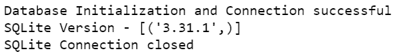

# 使用 Python 更改 SQLite 连接超时

> 原文:[https://www . geesforgeks . org/change-SQLite-connection-time out-use-python/](https://www.geeksforgeeks.org/change-sqlite-connection-timeout-using-python/)

在本文中，我们将讨论如何在从 Python 连接时更改 SQLite 连接超时。

## 什么是连接超时，是什么导致的？

连接超时是当服务器响应用户请求的时间过长时发生的错误。

连接超时通常发生在有多个到数据库的活动连接时，其中一个连接正在执行涉及修改存储数据的操作。在这种情况下，其他连接必须等到该操作完成后才能执行自己的操作。当等待时间超过时间限制时，会导致连接超时。

## 更改连接超时值

这是一个示例 python 代码片段，使用 sqlite3 包创建并连接到数据库，然后输出其版本。

**接近**

*   首先，导入内置的 sqlite3 包。
*   接下来，我们使用连接器类的**连接方法**连接到数据库，将其名称作为参数传递。
*   之后，使用连接器类的**游标对象**，我们必须创建一个可以执行查询的游标实例。
*   然后，execute 方法执行查询并返回结果。
*   然后使用**胎儿**方法从光标中提取结果。
*   最后，不管查询是否成功执行，数据库游标和连接都必须关闭。

## 蟒蛇 3

```
# import module
import sqlite3

try:
    # esatblish connecyion
    sqliteConnection = sqlite3.connect('sqlite.db')

    # create cursor object
    cursor = sqliteConnection.cursor()
    print('Database Initialization and Connection successful')

    # display version
    query = 'select sqlite_version();'
    cursor.execute(query)

    # get data
    record = cursor.fetchall()
    print(f'SQLite Version - {record}')
    cursor.close()

except sqlite3.Error as error:
    print('Error occured - ', error)

finally:
    # If the connection was established then close it
    if sqliteConnection:
        sqliteConnection.close()
        print('SQLite Connection closed')
```

**输出:**



正常情况下，上面的代码片段可以很好地工作。但是，当数据库已经被另一个进程使用时，它必须等到该进程的查询被解析后才能执行自己的查询。如果等待时间超过连接超时值，就会导致连接超时。

连接超时的默认值为 **5 秒**。但是可以在**连接()**方法本身进行更改。它接受一个可选参数**超时**，该参数接受以秒为单位的连接超时值。代码片段现已被修改，连接超时为 **20 秒**。

## 蟒蛇 3

```
# import module
import sqlite3

try:
    # esatblish connecyion
    sqliteConnection = sqlite3.connect('sqlite.db', timeout=20)

    # create cursor object
    cursor = sqliteConnection.cursor()
    print('Database Initialization and Connection successful')

    # display version
    query = 'select sqlite_version();'
    cursor.execute(query)

    # get data
    record = cursor.fetchall()
    print(f'SQLite Version - {record}')
    cursor.close()

except sqlite3.Error as error:
    print('Error occured - ', error)

finally:

    # If the connection was established then
    # close it
    if sqliteConnection:
        sqliteConnection.close()
        print('SQLite Connection closed')
```

**输出:**


在上例中，由于 **connect()** 方法中的**超时**参数被指定为 20，python 程序将连接到 SQLite 数据库 20 秒。这样，当从 python 连接时，可以更改 SQLite 连接超时。