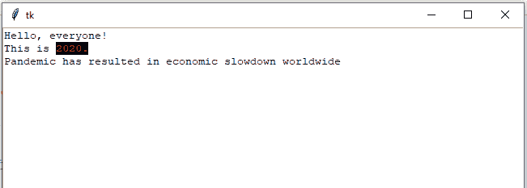
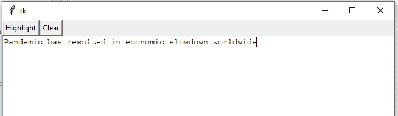
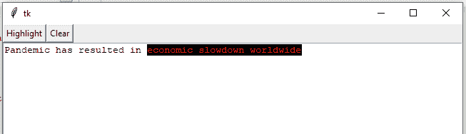

# 更改 tkinter 文本小部件

中某些单词的颜色

> 原文:[https://www . geeksforgeeks . org/更改某些文字的颜色-在-tkinter-text-widget/](https://www.geeksforgeeks.org/change-the-color-of-certain-words-in-the-tkinter-text-widget/)

Python 有各种图形用户界面开发选项。其中一个选项是 [Tkinter](https://www.geeksforgeeks.org/python-gui-tkinter/) 。Tkinter 和 Python 一起为 GUI 开发提供了更快的方式。Tk GUI 工具包提供了一个面向对象的界面。

**要使用 Tkinter 创建 GUI 应用程序，我们必须遵循几个步骤–**

*   导入 Tkinter module。
*   创建主窗口。
*   根据需要向图形用户界面应用程序添加各种小部件。
*   用户执行特定操作的每个触发器的主事件循环。

文本小部件具有高级选项，用于编辑多行文本并格式化该文本的显示设置，例如字体、文本颜色、背景颜色。我们还可以使用标签和标记来定位和编辑数据部分。我们也可以在文本中使用图像并插入边框。一切都可以按照要求格式化。

> **语法:**文本(主，选项，…)
> 
> **参数:** master 代表父窗口，option 代表各种小部件选项。它们可以用逗号分隔的键值对给出。
> 
> **返回:**返回一个文本对象。

**示例 1 :** 在第一个示例中，我们将通过指定索引并突出显示所选文本来为文本部分添加标签。这里，我们使用的是 tag_add 和 tag_config。

## 蟒蛇 3

```
# import all functions from the tkinter
from tkinter import *

# Create a GUI window  
root = Tk()

# Create a text area box   
# for filling or typing the information.
text = Text(root)

# insert given string in text area
text.insert(INSERT, "Hello, everyone!\n")

text.insert(END, "This is 2020.\n")

text.insert(END, "Pandemic has resulted 
             in economic slowdown worldwide")

text.pack(expand=1, fill=BOTH)

# add tag using indices for the
# part of text to be highlighted
text.tag_add("start", "2.8", "1.13")

#configuring a tag called start
text.tag_config("start", background="black",
                 foreground="red")

# start the GUI
root.mainloop()
```

**输出:**



**示例 2 :** 在该示例中，用户可以通过选择要高亮显示的文本来根据他们的意愿高亮显示文本。在这里，我们使用标记 _ 配置和标记 _ 添加。

## 蟒蛇 3

```
# import all functions from the tkinter   
import tkinter as tk
from tkinter.font import Font

# create a Pad class
class Pad(tk.Frame):

    # constructor to add buttons and text to the window
    def __init__(self, parent, *args, **kwargs):
        tk.Frame.__init__(self, parent, *args, **kwargs)

        self.toolbar = tk.Frame(self, bg="#eee")
        self.toolbar.pack(side="top", fill="x")

        # this will add Highlight button in the window
        self.bold_btn = tk.Button(self.toolbar, text="Highlight",
                                  command=self.highlight_text)
        self.bold_btn.pack(side="left")

        # this will add Clear button in the window
        self.clear_btn = tk.Button(self.toolbar, text="Clear",
                                   command=self.clear)
        self.clear_btn.pack(side="left")

        # adding the text 
        self.text = tk.Text(self)
        self.text.insert("end", "Pandemic has resulted in economic slowdown worldwide")
        self.text.focus()
        self.text.pack(fill="both", expand=True)

        #configuring a tag called start
        self.text.tag_configure("start", background="black", foreground="red")

    # method to highlight the selected text
    def highlight_text(self):

        # if no text is selected then tk.TclError exception occurs
        try:
            self.text.tag_add("start", "sel.first", "sel.last")        
        except tk.TclError:
            pass

    # method to clear all contents from text widget.
    def clear(self):
        self.text.tag_remove("start",  "1.0", 'end')

# function
def demo():

    # Create a GUI window 
    root = tk.Tk()

    # place Pad object in the root window
    Pad(root).pack(expand=1, fill="both")

    # start the GUI
    root.mainloop()

# Driver code
if __name__ == "__main__":

    # function calling
    demo()
```

**输出:**

**在选择文本并点击** **高亮按钮之前:**



**选择文本后点击** **高亮按钮:**

