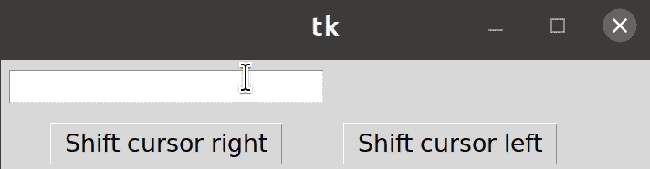

# 在 Tkinter 的入口小部件

中更改光标的位置

> 原文:[https://www . geesforgeks . org/change-光标在 tkinters-entry-widget 中的位置/](https://www.geeksforgeeks.org/change-the-position-of-cursor-in-tkinters-entry-widget/)

tkinter 中的一个小部件，用于输入一行文本的显示，称为输入小部件。您是否在 tkinter 中创建了一个包含大量信息的入口小部件？大量文本是否会导致您在其中的任何其他位置出现问题？别担心，我们有解决这个问题的办法。你需要做的只是设置一个按钮，当你点击这个按钮时，它会把你带到入口小部件中想要的位置。

### 所需步骤:

**第一步:**首先导入库 tkinter。

```
from tkinter import *
```

**步骤 2:** 现在，使用 tkinter 创建一个 GUI 应用程序。

```
app = Tk()
```

**步骤 3:** 然后，创建一个参数为无的函数，将光标移动到条目小部件中您想要的任何位置。

```
def shift_cursor(event=None):
   position = entry_label.index(INSERT)
   entry_label.icursor(#Specify the position \
   where you want to move the cursor)
```

**第 4 步:**接下来，创建并显示一个要更改位置的入口小部件。

```
entry_label=Entry(app)
entry_label.grid(column=#Specify the column value, 
                 row=#Specify the row value, 
                 padx=#Specify the padding value of x, 
                 pady=#Specify the padding value of y)
```

**步骤 5:** 一旦声明了一个入口小部件，将焦点设置到指定的入口小部件。

```
entry_label.focus()
```

**第 6 步:**此外，创建并显示一个按钮，当点击该按钮时，将改变光标在入口小部件中的位置。

```
button1 = Button(app, 
                 text="#Text you want to display in button", 
                 command=shift_cursor)

button1.grid(column=#Specify the column value, 
             row=#Specify the row value, 
             padx=#Specify the padding value of x, 
             pady=#Specify the padding value of y)
```

**第七步:**最后做一个无限循环，在屏幕上显示 app。

```
app.mainloop()
```

**示例:**

在这个程序中，我们将通过点击按钮“**向左移动光标**来改变光标向左一个字符的位置，同时通过点击按钮“**向右移动光标**来改变光标向右一个字符的位置

## 计算机编程语言

```
# Python program to change position
# of cursor in Entry widget

# Import the library tkinter
from tkinter import *

# Create a GUI app
app = Tk()

# Create a function to move cursor one character
# left
def shift_cursor1(event=None):
    position = entry_label.index(INSERT)

    # Changing position of cursor one character left
    entry_label.icursor(position - 1)

# Create a function to move the cursor one character
# right
def shift_cursor2(event=None):
    position = entry_label.index(INSERT)

    # Changing position of cursor one character right
    entry_label.icursor(position + 1)

# Create and display the button to shift cursor left
button1 = Button(app, text="Shift cursor left", command=shift_cursor1)
button1.grid(row=1, column=1, padx=10, pady=10)

# Create and display the button to shift the cursor right
button2 = Button(app, text="Shift cursor right", command=shift_cursor2)
button2.grid(row=1, column=0, padx=10, pady=10)

# Create and display the textbox
entry_label = Entry(app)
entry_label.grid(row=0, column=0, padx=10, pady=10)

# Set the focus in the textbox
entry_label.focus()

# Make the infinite loop for displaying the app
app.mainloop()
```

**输出:**

