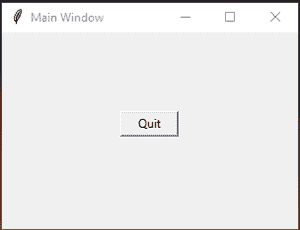
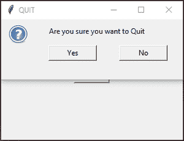
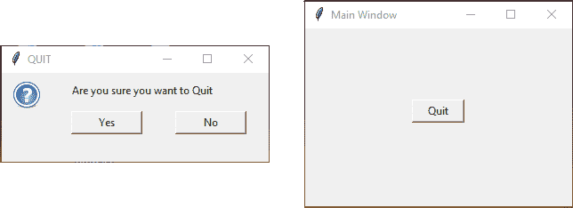

# 更改消息框的位置–Tkinter

> 原文:[https://www . geesforgeks . org/change-of-position-messagebox-tkinter/](https://www.geeksforgeeks.org/change-the-position-of-messagebox-tkinter/)

**先决条件:**

*   [Python tkinter](https://www.geeksforgeeks.org/python-gui-tkinter/)
*   [python tkinter message box widget](https://www.geeksforgeeks.org/python-tkinter-messagebox-widget/)
*   [python tkinter top level widget](https://www.geeksforgeeks.org/python-tkinter-toplevel-widget/)

Python 提供了许多用于创建和开发图形用户界面的库和框架。在所有的图形用户界面库或框架中，Tkinter 是最常用的方法，因为它在创建图形用户界面应用程序时相对更快、更容易。

## 创建消息框

消息框小部件用于显示 python 应用程序中的消息框。要创建消息框，请使用**顶级()**小部件。顶层小部件用于在所有其他窗口之上创建一个窗口。它用于向用户提供一些额外的信息。这些窗口由窗口管理器直接组织和管理，不需要每次都有任何父窗口与之关联。

一旦你的消息框准备好了，就可以给它添加标签和按钮来传递特定的信息。

**语法:**

```py
Toplevel widget
toplevel = Toplevel(root, bg, fg, bd, height,....)

Create Label
Label(toplevel,text="Enter text here..").pack()

Create Button
Button(toplevel,text="Enter text here..").pack()

Set Size
toplevel=Toplevel(root)
toplevel.geometry("dimension")

```

**示例:**

## 蟒蛇 3

```py
from tkinter import *

def messagebox():
    toplevel = Toplevel(root)

    toplevel.title("QUIT")
    toplevel.geometry("300x100")

    l1=Label(toplevel, image="::tk::icons::question")
    l1.grid(row=0, column=0, pady=(7, 0), padx=(10, 30), sticky="e")
    l2=Label(toplevel,text="Are you sure you want to Quit")
    l2.grid(row=0, column=1, columnspan=3, pady=(7, 10), sticky="w")

    b1=Button(toplevel,text="Yes",command=root.destroy,width = 10)
    b1.grid(row=1, column=1, padx=(2, 35), sticky="e")
    b2=Button(toplevel,text="No",command=toplevel.destroy,width = 10)
    b2.grid(row=1, column=2, padx=(2, 35), sticky="e")

root = Tk()
root.geometry("300x200")
root.title("Main Window")
Button(root,text="Quit",command=messagebox,width = 7).pack(pady=80)

root.mainloop()
```

**输出:**



**主窗口(带按钮)**


**消息框(带标签和按钮)**

## 设置位置

到目前为止，tkinter 中还没有内置的方法来设置消息框的位置。但是位置可以明确处理。

**语法:**

```py
toplevel.geometry(f"dimension+{root.winfo_x()}+{root.winfo_y()}")

```

*   root.winfo_x()-给出 X 主窗口的当前位置
*   root.winfo_y()-给出 Y 主窗口的当前位置

**或**

```py
x_position = value
y_position = value

toplevel.geometry(f"dimension+{x_position}+{y_position}")

```

**例 1:**

## 蟒蛇 3

```py
from tkinter import *

def messagebox():
    toplevel = Toplevel(root)

    toplevel.title("QUIT")
    toplevel.geometry(f"300x100+{root.winfo_x()}+{root.winfo_y()}")

    l1=Label(toplevel, image="::tk::icons::question")
    l1.grid(row=0, column=0, pady=(7, 0), padx=(10, 30), sticky="e")
    l2=Label(toplevel,text="Are you sure you want to Quit")
    l2.grid(row=0, column=1, columnspan=3, pady=(7, 10), sticky="w")

    b1=Button(toplevel,text="Yes",command=root.destroy,width = 10)
    b1.grid(row=1, column=1, padx=(2, 35), sticky="e")
    b2=Button(toplevel,text="No",command=toplevel.destroy,width = 10)
    b2.grid(row=1, column=2, padx=(2, 35), sticky="e")

root = Tk()
root.geometry("300x200")
root.title("Main Window")
Button(root,text="Quit",command=messagebox,width = 7).pack(pady=80)

root.mainloop()
```

**输出:**


**主窗口**



**当你点击“退出”按钮**


**消息框**

**例 2:**

## 蟒蛇 3

```py
from tkinter import *

def messagebox():
    toplevel = Toplevel(root)

    toplevel.title("QUIT")
    x_position = 300
    y_position = 200
    toplevel.geometry(f"300x100+{x_position}+{y_position}")

    l1=Label(toplevel, image="::tk::icons::question")
    l1.grid(row=0, column=0, pady=(7, 0), padx=(10, 30), sticky="e")
    l2=Label(toplevel, text="Are you sure you want to Quit")
    l2.grid(row=0, column=1, columnspan=3, pady=(7, 10), sticky="w")

    b1=Button(toplevel, text="Yes", command=root.destroy, width=10)
    b1.grid(row=1, column=1, padx=(2, 35), sticky="e")
    b2=Button(toplevel, text="No", command=toplevel.destroy, width=10)
    b2.grid(row=1, column=2, padx=(2, 35), sticky="e")

root = Tk()
root.geometry("300x200")
root.title("Main Window")
Button(root, text="Quit", command=messagebox, width=7).pack(pady=80)

root.mainloop()
```

**输出:**



**当您点击“退出”按钮时，将在位置(300，200)** 显示消息框