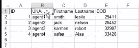
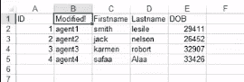

# 使用 Python 在 Excel 中更改值

> 原文:[https://www . geesforgeks . org/change-value-in-excel-using-python/](https://www.geeksforgeeks.org/change-value-in-excel-using-python/)

在本文中，我们将使用 Python 更改 Excel 电子表格中的值。

**方法 1:使用 openxml:**

openpyxl 是一个可以读写 Excel xlsx/xlsm/xltx/xltm 文件的 Python 库。它诞生于缺乏一个现有的库来从 Python 中读取/写入本地的办公开放 XML 格式。openpyxl 是以下任务所需的库。您可以使用 Python 中的以下命令安装 **openpyxl** 模块。

```
pip install openpyxl
```

**使用的功能:**

*   load_workbook():用于读取 excel 电子表格的函数
*   workbook.active:指向 excel 电子表格中的活动工作表
*   workbook.save():保存工作簿

**进场:**

1.  导入 openpyxl 库
2.  首先打开电子表格并选择主表
3.  将所需内容写入特定单元格
4.  保存电子表格

**使用的 Excel 文件:**


**下面是实现:**

## 蟒蛇 3

```
from openpyxl import load_workbook

#load excel file
workbook = load_workbook(filename="csv/Email_sample.xlsx")

#open workbook
sheet = workbook.active

#modify the desired cell
sheet["A1"] = "Full Name"

#save the file
workbook.save(filename="csv/output.xlsx")
```

**输出:**


**方法 1:使用 xlwt/xlrd/xlutils。**

此包提供了一组用于处理 Excel 文件的实用程序。因为这些实用程序可能需要 xlrd 和 xlwt 包中的一个或两个，所以它们在这里一起收集，与任何一个包分开。您可以使用 Python 中的以下命令来安装 xlwt/xlrd/xlutils 模块

```
pip install xlwt
pip install xlrd
pip install xlutils
```

**先决条件:**

*   open_workbook():用于读取 excel 电子表格的函数
*   copy():复制工作簿的内容
*   get_sheet():指向 excel 工作簿中的特定工作表
*   write():将数据写入文件
*   save():保存文件

**进场:**

1.  打开 Excel 文件
2.  制作打开的 Excel 文件的可写副本
3.  在可写副本中读取要写入的第一张纸
4.  修改所需位置的值
5.  保存工作簿
6.  运行程序

**使用的 Excel 文件:**



**下面是实现:**

## 蟒蛇 3

```
import xlwt
import xlrd
from xlutils.copy import copy

# load the excel file
rb = xlrd.open_workbook('UserBook.xls')

# copy the contents of excel file
wb = copy(rb)

# open the first sheet
w_sheet = wb.get_sheet(0)

# row number = 0 , column number = 1
w_sheet.write(0,1,'Modified !')

# save the file
wb.save('UserBook.xls')
```

**输出:**



在...之后