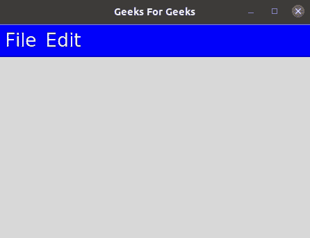

# 改变 Tkinter 菜单栏的颜色

> 原文:[https://www . geesforgeks . org/changing-of-color-of-tkinter-menu-bar/](https://www.geeksforgeeks.org/changing-the-colour-of-tkinter-menu-bar/)

**先决条件** : [Tkinter](https://www.geeksforgeeks.org/python-gui-tkinter/)

**菜单**是任何 GUI 的重要组成部分。菜单的一个常见用途是提供对各种操作的便捷访问，如保存或打开文件、退出程序或操作数据。顶层菜单显示在根窗口或任何其他顶层窗口的标题栏下。

更改菜单栏的颜色在 Windows 上不可用。这是因为 menubar 不归 Tkit 自己所有，但它是从其他第三方外包的，因此只能为用户提供有限的选择。但是如果你使用的是 Linux，那么你已经准备好了。您可以通过设置背景色和前景色来更改菜单栏的颜色。只需阅读下面给出的文章，了解更多细节。

**语法:**

> menubar = Menu(app，背景= ' #背景色'，fg = ' #文字色')

这里，要添加到菜单栏的颜色作为背景参数的输入。下面是做同样事情的恰当例子。

**程序:**

## 计算机编程语言

```
# Import the library tkinter
from tkinter import *

# Create a GUI app
app = Tk()

# Set the title and geometry to your app
app.title("Geeks For Geeks")
app.geometry("800x500")

# Create menubar by setting the color
menubar = Menu(app, background='blue', fg='white')

# Declare file and edit for showing in menubar
file = Menu(menubar, tearoff=False, background='yellow')
edit = Menu(menubar, tearoff=False, background='pink')

# Add commands in in file menu
file.add_command(label="New")
file.add_command(label="Exit", command=app.quit)

# Add commands in edit menu
edit.add_command(label="Cut")
edit.add_command(label="Copy")
edit.add_command(label="Paste")

# Display the file and edit declared in previous step
menubar.add_cascade(label="File", menu=file)
menubar.add_cascade(label="Edit", menu=edit)

# Displaying of menubar in the app
app.config(menu=menubar)

# Make infinite loop for displaying app on screen
app.mainloop()
```

**输出:**

