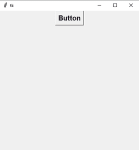
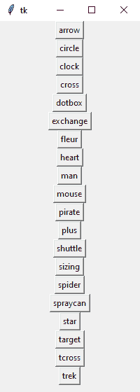

# 更改鼠标光标–Tkinter

> 原文:[https://www . geesforgeks . org/changing-the-mouse-cursor-tkinter/](https://www.geeksforgeeks.org/changing-the-mouse-cursor-tkinter/)

**先决条件:**[**Python GUI–tkinter**](https://www.geeksforgeeks.org/python-gui-tkinter/)

Python 为开发图形用户界面提供了多种选择。在所有的 GUI 方法中，tkinter 是最常用的方法。它是 Python 附带的 Tk 图形用户界面工具包的标准 Python 接口。

在本文中，我们将学习如何使用 Python 在 Tkinter 中更改鼠标光标。

*   鼠标光标被视为指示器，用于显示用户位置在计算机上的当前位置。它也被称为指针。
*   每个鼠标光标都有自己的用途。例如，拖动图像时我们使用**芙蓉**鼠标光标，旋转文本时我们使用**交换**鼠标光标等。

**在 Tkinter 中大约可以找到 20 个光标:**

*   箭
*   圆
*   时钟
*   跨过
*   剂量盒
*   交换
*   粉状填料
*   心
*   男人
*   老鼠
*   海盗
*   加
*   来往于两地之间的航班（或班车、火车）
*   胶料
*   蜘蛛；状似蜘蛛的物体；星形轮；十字叉；连接柄；十字头
*   斯普拉特利
*   星星
*   目标
*   穿过去
*   艰苦跋涉

**步骤 1:** 创建普通 Tkinter 窗口并添加按钮

## 蟒蛇 3

```
# Import Required Library
from tkinter import *

# Create Object
root = Tk()

# Set geometry
root.geometry("400x400")

Button(root,text="Button",font=("Helvetica 15 bold")).pack()

# Execute Tkinter
root.mainloop()
```

**输出:**



**步骤 2:** 在按钮中添加光标

要在按钮中添加光标，请使用**光标**属性。

```
Button(root,text="Button",font=("Helvetica 15 bold"),cursor="star").pack()
```

**使用所有光标**

*   制作一个包含所有游标的列表
*   遍历所有游标。

**下图是 GUI 的样子:-**



**下面是实现:**

## 蟒蛇 3

```
# Import Required Library
from tkinter import *

# Create Object
root = Tk()

# Set geometry
root.geometry("200x530")

# List of cursors
cursors =[
        "arrow",
        "circle",
        "clock",
        "cross",
        "dotbox",
        "exchange",
        "fleur",
        "heart",
        "man",
        "mouse",
        "pirate",
        "plus",
        "shuttle",
        "sizing",
        "spider",
        "spraycan",
        "star",
        "target",
        "tcross",
        "trek"
]

# Iterate through all cursors
for cursor in cursors:
    Button(root,text=cursor,cursor=cursor).pack()

# Execute Tkinter
root.mainloop()
```

**输出:-**

<video class="wp-video-shortcode" id="video-540155-1" width="640" height="360" preload="metadata" controls=""><source type="video/mp4" src="https://media.geeksforgeeks.org/wp-content/uploads/20210109103355/FreeOnlineScreenRecorderProject14.mp4?_=1">[https://media.geeksforgeeks.org/wp-content/uploads/20210109103355/FreeOnlineScreenRecorderProject14.mp4](https://media.geeksforgeeks.org/wp-content/uploads/20210109103355/FreeOnlineScreenRecorderProject14.mp4)</video>

要使光标全局化，请使用 **config()** 方法。

## 蟒蛇 3

```
# Import Required Library
from tkinter import *

# Create Object
root = Tk()

# Set geometry
root.geometry("400x400")

# Cursor
root.config(cursor="star")

# Execute Tkinter
root.mainloop()
```

**输出:-**

<video class="wp-video-shortcode" id="video-540155-2" width="640" height="360" preload="metadata" controls=""><source type="video/mp4" src="https://media.geeksforgeeks.org/wp-content/uploads/20210109103532/FreeOnlineScreenRecorderProject15.mp4?_=2">[https://media.geeksforgeeks.org/wp-content/uploads/20210109103532/FreeOnlineScreenRecorderProject15.mp4](https://media.geeksforgeeks.org/wp-content/uploads/20210109103532/FreeOnlineScreenRecorderProject15.mp4)</video>