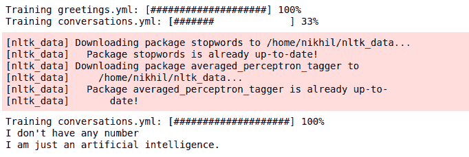

# Python 中的聊天机器人，带有聊天机器人模块

> 原文:[https://www . geesforgeks . org/chat-bot-in-python-with-chatter bot-module/](https://www.geeksforgeeks.org/chat-bot-in-python-with-chatterbot-module/)

没有人喜欢总是一个人呆着，但是有时候孤独可能是一种更好的药，让你预感到对和平环境的渴望。即使在这样孤独的隔离期间，我们可能会忽略人类，但不会忽略类人。是的，如果你已经猜到这篇文章是一个聊天机器人，那么你已经破解了它。我们不需要 6000 行代码来创建一个聊天机器人，但是一个六个字母的单词“Python”就足够了。让我们快速浏览一下 Python 的**聊天机器人**来创建我们的机器人。ChatterBot 是一个基于机器学习构建的 Python 库，内置了对话流和训练引擎。使用这个库创建的机器人将自动接受用户的响应训练。

### 装置

使用 Python 包索引安装聊天机器人

```
pip install chatterbot
```

下面是实现。

## 蟒蛇 3

```
# Import "chatbot" from
# chatterbot package.
from chatterbot import ChatBot

# Inorder to train our bot, we have
# to import a trainer package
# "ChatterBotCorpusTrainer"
from chatterbot.trainers import ChatterBotCorpusTrainer

# Give a name to the chatbot “corona bot”
# and assign a trainer component.
chatbot=ChatBot('corona bot')

# Create a new trainer for the chatbot
trainer = ChatterBotCorpusTrainer(chatbot)

# Now let us train our bot with multiple corpus
trainer.train("chatterbot.corpus.english.greetings",
              "chatterbot.corpus.english.conversations" )

response = chatbot.get_response('What is your Number')
print(response)

response = chatbot.get_response('Who are you?')
print(response)
```

**输出:**

