# 使用 Python 中的硒检查第 12 类结果

> 原文:[https://www . geesforgeks . org/check-12-class-result-use-selenium in-python/](https://www.geeksforgeeks.org/check-12th-class-result-using-selenium-in-python/)

我们将用以下信息收集 CSV 文件中的第 12 类数据:

1.  候选人姓名
2.  通过或失败状态
3.  分开
4.  获得分数

这个任务将使用 Python 的[硒库](https://www.geeksforgeeks.org/selenium-python-tutorial/)来完成。

**要求:**

你需要安装 chrome 驱动程序并设置路径。[点击此处](https://sites.google.com/a/chromium.org/chromedriver/downloads)下载。更多信息请点击[链接](https://www.geeksforgeeks.org/how-to-install-selenium-in-python/)。

**进场:**

1.  先去第 12 个网站，然后点击[链接](https://results.upmsp.edu.in/ResultIntermediate.aspx)(这是为了第 12 个结果)。
2.  然后通过紧急 ctrl + shift + i 或进入浏览器设置并手动点击调查细节来点击调查元素。
3.  然后导航到选择地区的框，然后复制 x_path。
4.  然后导航到填充辊号的框，然后复制 x_path。
5.  然后导航查看结果按钮，然后复制 x_path。
6.  我想将结果存储在 CSV 文件中，然后还导航学生姓名、不及格状态、部门、获得分数。然后通过脚本自动填写卷号，转到下一页找到学生姓名的 x_path，不及格状态，除法，获得分数。

**借助截图按部就班，复制元素的 x_path 放入代码:**

**第一步:**

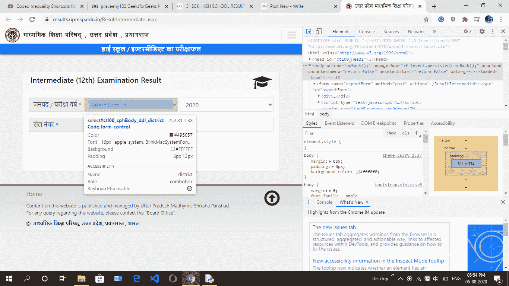

**第二步:**

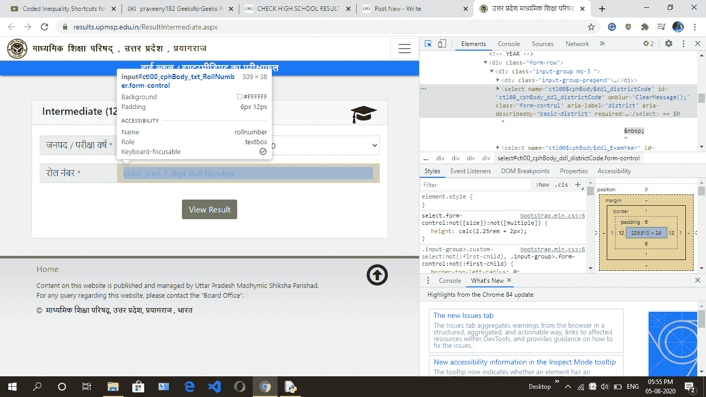

**第三步:**

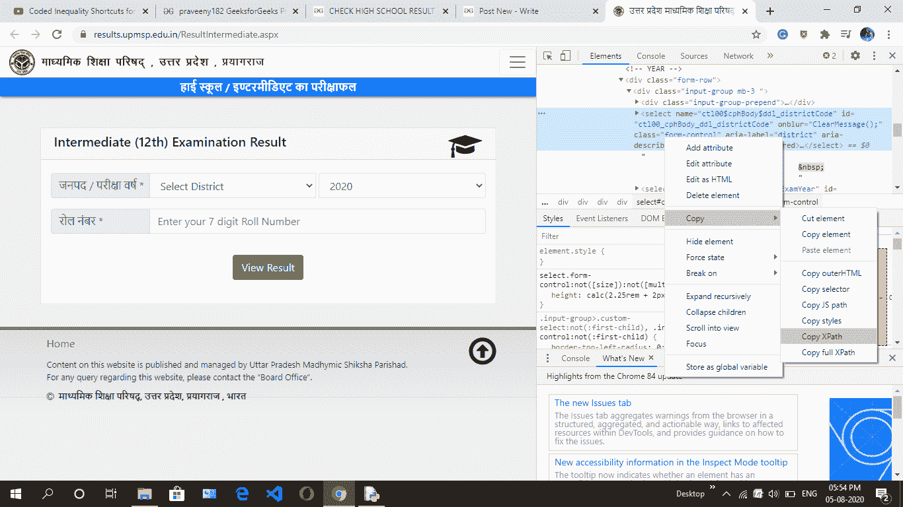

**第四步:**

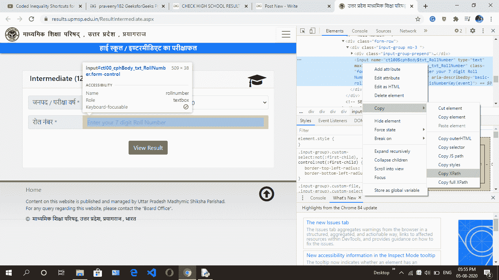

**第五步:**

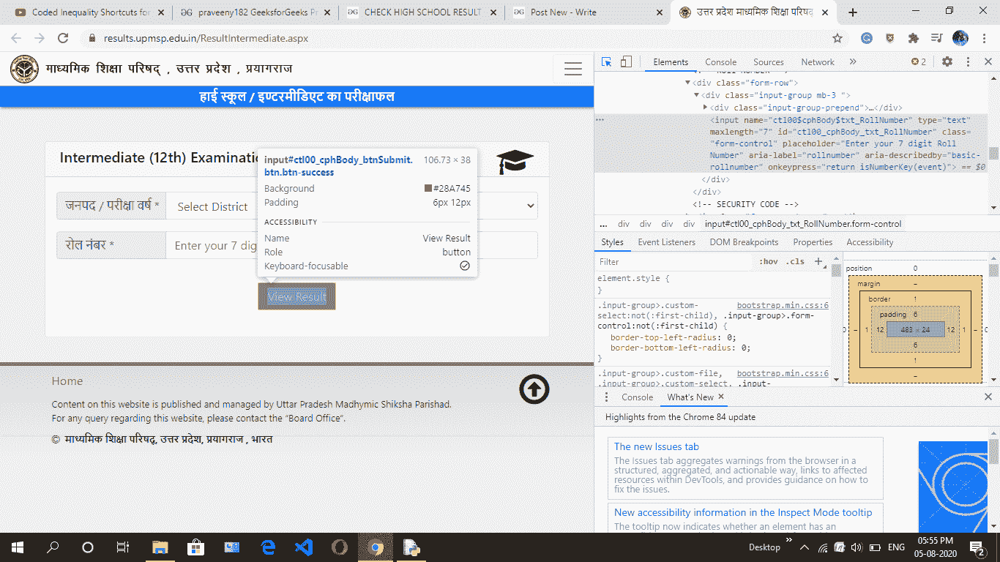

**第六步:**

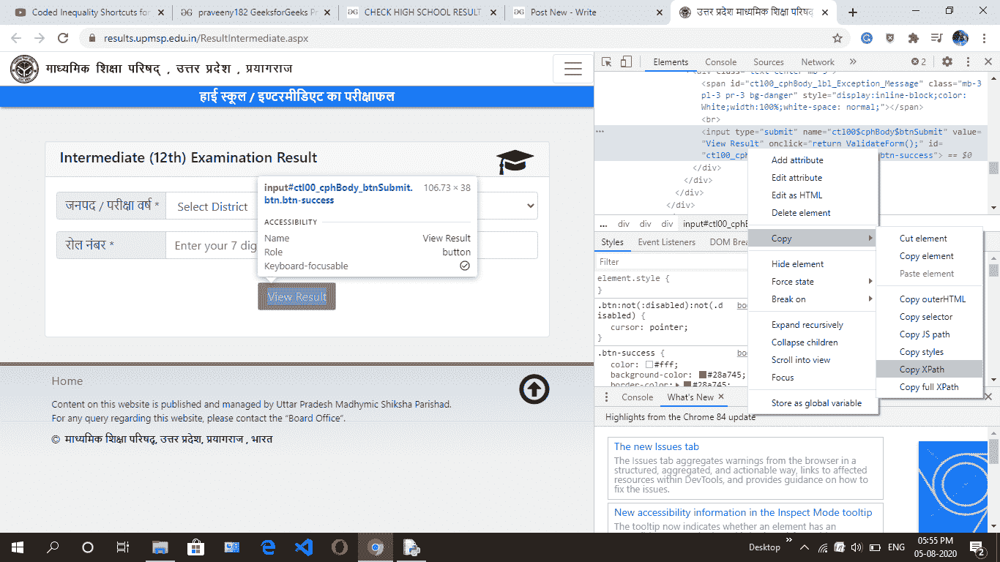

**第七步:**

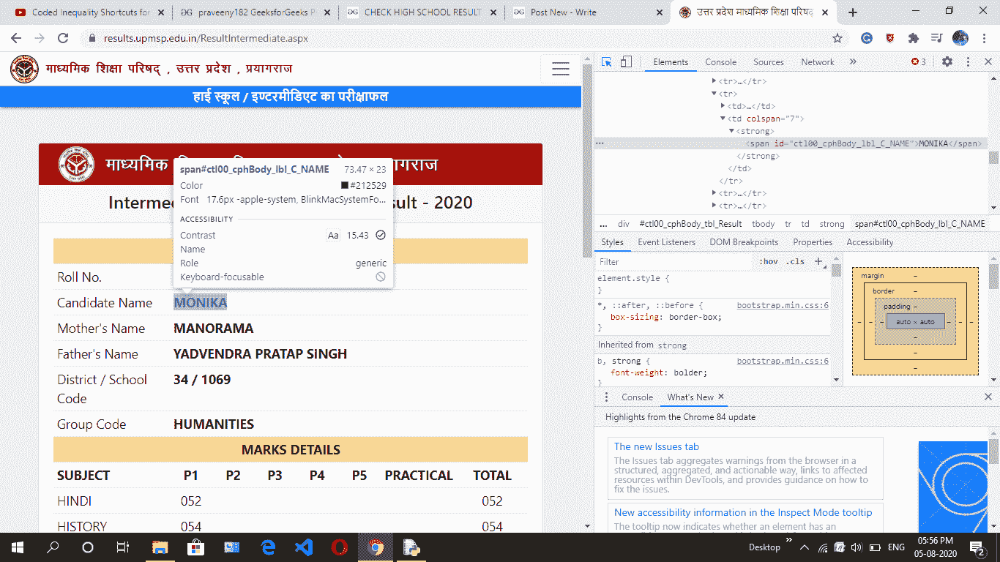

**第八步:**


**第九步:**

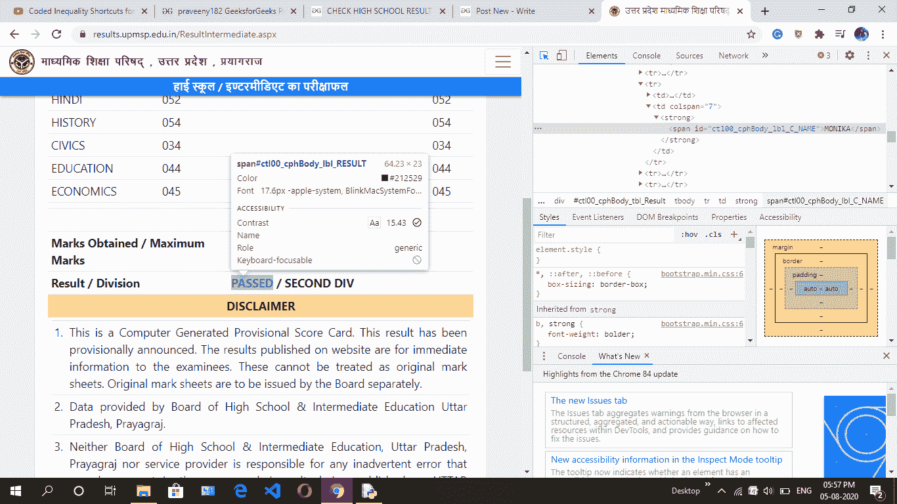

**第十步:**

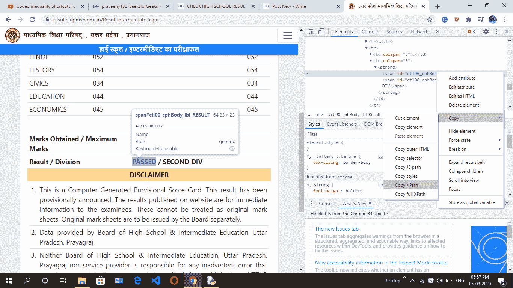

**第 11 步:**

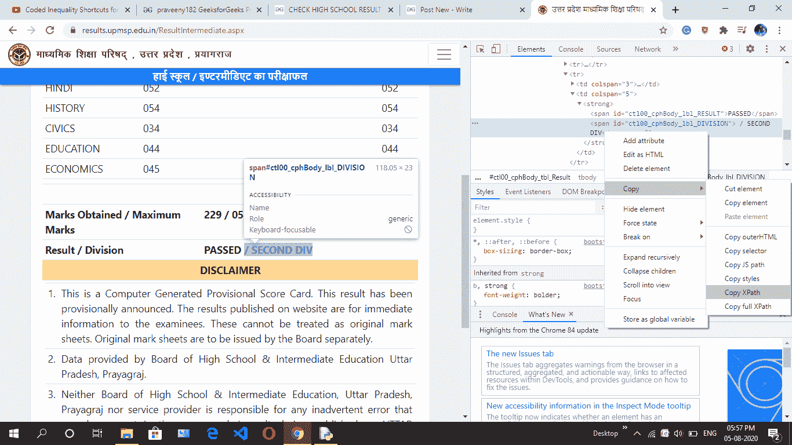

**第 12 步:**

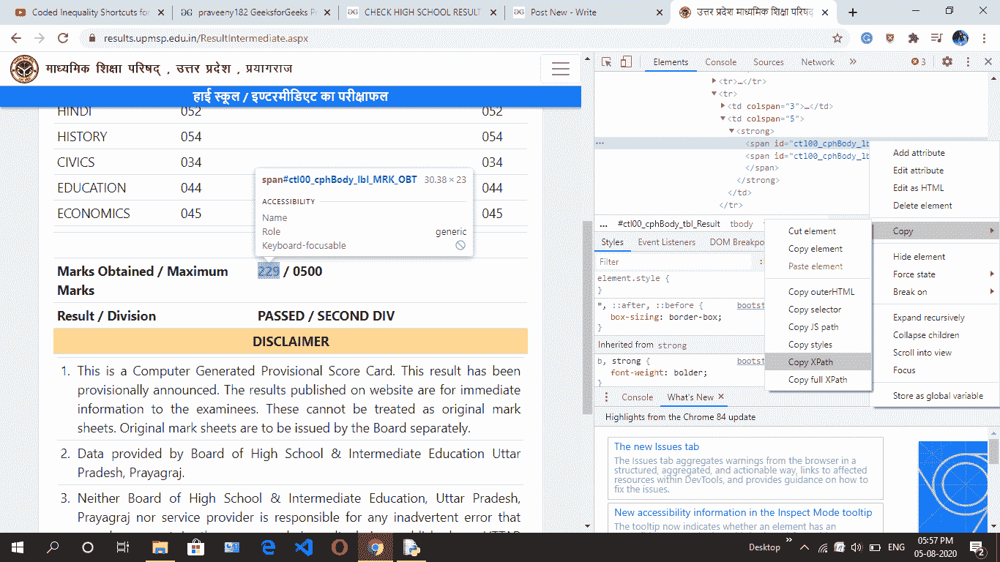

下面是实现:

## 蟒蛇 3

```
# import required libraries
from selenium import webdriver
from selenium.webdriver.common.keys import Keys
from selenium.webdriver.support.ui import Select
from selenium.common.exceptions import NoSuchElementException
import csv 
import time

# give name of csv file
filename = "abc.csv"

# open file in write mode
f = open(filename, 'w')

# creat header in file
header = "NAME,STATUS,DIV,NUM\n"

# write into the file
f.write(header)

# put rollnumber without zero like
# your number 0477593 then
# put 477593 upto XXXXX.
start_rollNum = 926840
end_rollNum = 926841

# put range of rollnumber
for i in range(start_rollNum, end_rollNum ):

    # use try and except because if any rollnumber
    # is invalid then whole program is not stop.
    try:
        driver = webdriver.Chrome()

        # link is given above copy and paste
        driver.get("https://results.upmsp.edu.in/ResultIntermediate.aspx")

        # add zero in rollnumber in starting
        t = '0' + str(i)

        # district xpath
        state = driver.find_element_by_xpath('//*[@id="ctl00_cphBody_ddl_districtCode"]')
        drp1 = Select(state)

        # select district
        drp1.select_by_visible_text('LUCKNOW')

        # put rollnumber
        driver.find_element_by_xpath('//*[@id="ctl00_cphBody_txt_RollNumber"]').send_keys(t)

        # view result xpath
        driver.find_element_by_xpath('//*[@id="ctl00_cphBody_btnSubmit"]').click()

        # student name
        name = driver.find_element_by_xpath('//*[@id="ctl00_cphBody_lbl_C_NAME"]').text

        # status pass or fail
        status = driver.find_element_by_xpath('//*[@id="ctl00_cphBody_lbl_RESULT"]').text

        # division
        div = driver.find_element_by_xpath('//*[@id="ctl00_cphBody_lbl_DIVISION"]').text

        # obatin marks
        num = driver.find_element_by_xpath('//*[@id="ctl00_cphBody_lbl_MRK_OBT"]').text

        # all details fill into csv file
        f.write(name + "," + status + "," + 
                div[1 : ] + "," + num + "\n")

        # close the driver
        driver.close()

    except NoSuchElementException as exception:
        continue

# close and save the file
f.close()
```

**输出:**

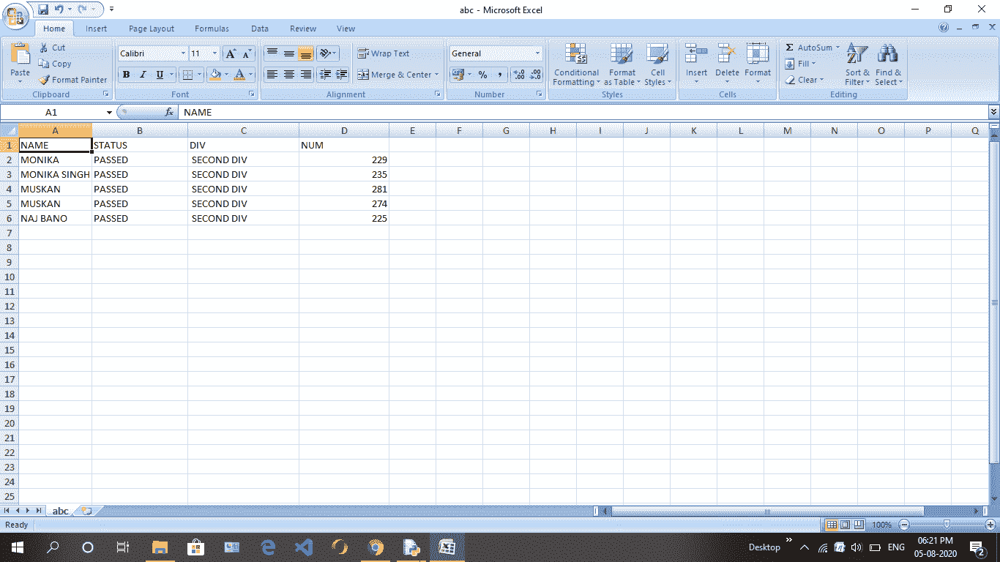

CSV 屏幕快照文件

**注意:**如果你想找到一个 topper，那么在 CSV 文件上应用一个过滤器。