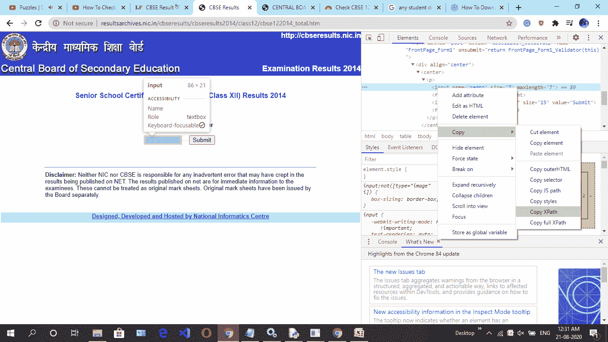
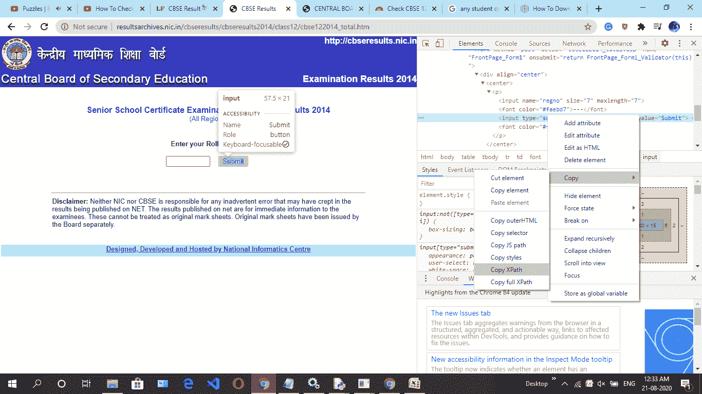
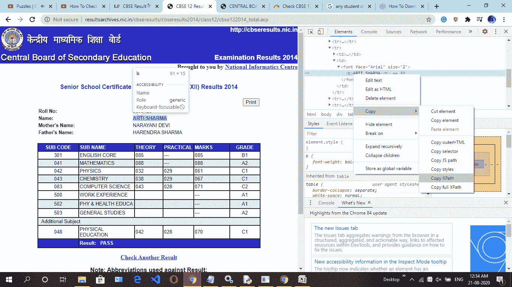
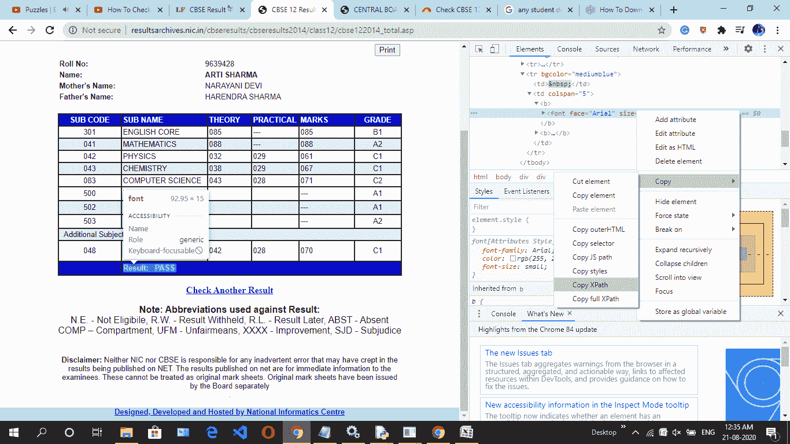
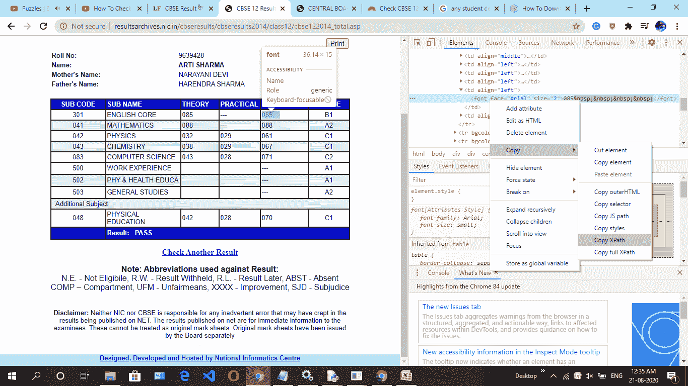
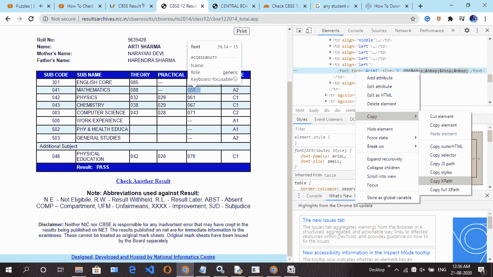
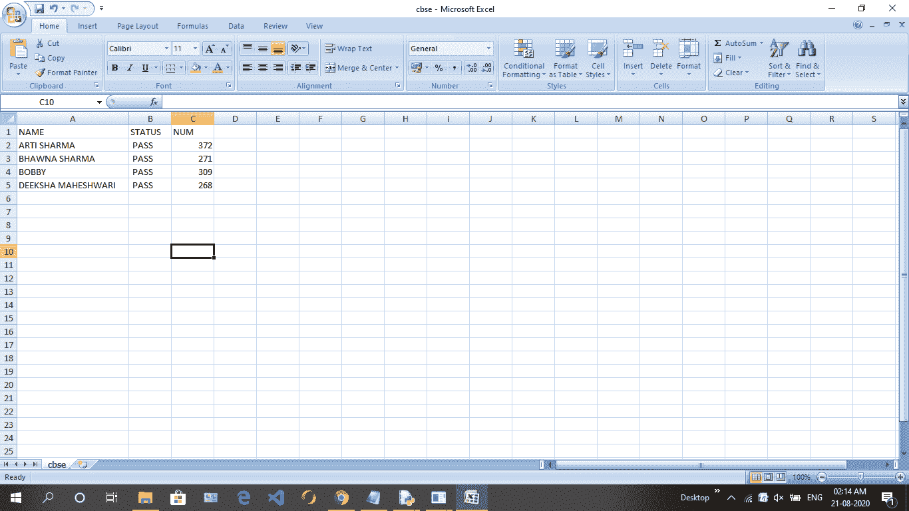

# 使用 Python 中的硒检查 CBSE 结果

> 原文:[https://www . geesforgeks . org/check-cbse-result-use-selenium in-python/](https://www.geeksforgeeks.org/check-cbse-result-using-selenium-in-python/)

**先决条件:** [硒蟒](https://www.geeksforgeeks.org/selenium-python-tutorial/)

在本文中，我们将从他们的网站上抓取 CBSE 结果，并将结果存储在 CSV 文件中。CSV 文件将包含以下信息。

1.  候选人姓名
2.  通过或失败状态
3.  获得的分数

### 需要安装

*   转到命令提示符，并输入:

```
pip install selenium
```

*   完成后，下载一个用于自动化的网络驱动程序。这里，我们将使用来自[http://chromedriver.chromium.org/](http://chromedriver.chromium.org/)的 chromedriver

**进场:**

1.  先去第 12 个网站跟着这个[链接](http://resultsarchives.nic.in/cbseresults/cbseresults2014/class12/cbse122014_total.htm)(这是给 CBSE 板第 12 个成绩 2014 的通行证)。
2.  然后通过紧急 ctrl + shift + I 或进入浏览器设置并手动点击调查细节来点击调查元素。
3.  然后导航到填充辊号的框，然后复制 x_path。
4.  然后导航视图提交按钮，然后复制 x_path。
5.  我们希望将结果存储在 CSV 文件中，然后还导航学生姓名、未通过状态、获得的分数，然后通过脚本自动填写卷号转到下一页查找学生姓名的 x_path、未通过状态、获得分数。

**给出一些截图，按照这个指令一步一步来:**

**第一步:**



**第二步:**



**第三步:**



**第四步:**



**第五步:**



**第六步:**



**跟随同样的左三科目**

**下面是实现:**

## 蟒蛇 3

```
from selenium import webdriver
from selenium.webdriver.common.keys import Keys
from selenium.webdriver.support.ui import Select
from selenium.common.exceptions import NoSuchElementException
import csv
import time

# creating csv file
filename = "cbse.csv"

# open csv file to write
f = open(filename, 'w')

# creat header in file
header = "NAME,STATUS,NUM\n"
f.write(header)

# put range of rollnumber
for i in range(9639428, 9639432):

    # use try and exception because if any
    # rollnumber is invalid then whole
    # program is not stop.
    try:
        driver = webdriver.Chrome()

        # link is given above copy and paste
        driver.get(
            "http://resultsarchives.nic.in/cbseresults/cbseresults2014/class12/cbse122014_total.htm")

        # put rollnumber
        driver.find_element_by_xpath(
            '/html/body/table[3]/tbody/tr/td/font/center[2]/form/div[1]/center/p/input[1]').send_keys(i)

        # view result xpath
        driver.find_element_by_xpath(
            '/html/body/table[3]/tbody/tr/td/font/center[2]/form/div[1]/center/p/input[2]').click()

        # student name
        name = driver.find_element_by_xpath(
            '/html/body/div[2]/table[2]/tbody/tr[2]/td[2]/font/b').text

        # status pass or fail
        status = driver.find_element_by_xpath(
            '/html/body/div[2]/div/center/table/tbody/tr[12]/td[2]/b[1]/font').text

        # first subject find xpath then next 4 subject
        m1 = driver.find_element_by_xpath(
            '/html/body/div[2]/div/center/table/tbody/tr[2]/td[5]/font').text
        m2 = driver.find_element_by_xpath(
            '/html/body/div[2]/div/center/table/tbody/tr[3]/td[5]/font').text
        m3 = driver.find_element_by_xpath(
            '/html/body/div[2]/div/center/table/tbody/tr[4]/td[5]/font').text
        m4 = driver.find_element_by_xpath(
            '/html/body/div[2]/div/center/table/tbody/tr[5]/td[5]/font').text
        m5 = driver.find_element_by_xpath(
            '/html/body/div[2]/div/center/table/tbody/tr[6]/td[5]/font').text

        # sum all marks
        num = str(int(m1)+int(m2)+int(m3)+int(m4)+int(m5))

        # all details fill into file
        f.write(name+","+status[9:]+","+num+"\n")
        driver.close()

    except NoSuchElementException as exception:
        continue

f.close()
```

**输出:**

