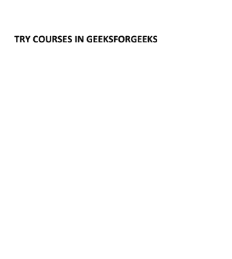

# 检查两个 PDF 文档是否与 Python 相同

> 原文:[https://www . geesforgeks . org/check-if-two-pdf-documents-与-python-相同/](https://www.geeksforgeeks.org/check-if-two-pdf-documents-are-identical-with-python/)

Python 是一种解释的通用编程语言。它是一种面向对象和过程范例的编程语言。python 中导入了各种类型的模块，比如 difflib、hashlib。

### 使用的模块:

*   [difflib](https://www.geeksforgeeks.org/python-find-close-matches-input-string-list/) :它是一个包含允许比较一组数据的功能的模块。
*   [序列匹配器](https://www.geeksforgeeks.org/sequencematcher-in-python-for-longest-common-substring/):用于比较一对输入序列。

### 使用的功能:

*   **hash_file ( string $algo，string $filename，bool $binary = false ):** 它是一个具有文件哈希的函数。
*   **object.hexdigest():** 是一个返回字符串的函数。
*   **fileObject.read(大小):**它是一个返回文件的指定字节数的函数。

### 方法

*   导入模块
*   声明一个有两个参数的函数，用于文件。
*   为 hashlib.sha1()声明两个对象
*   打开文件
*   通过将行分成更小的块来读取文件
*   现在返回两个文件，如 160 位的 h1.hexdigest()。
*   使用 hash_file()函数存储文件的哈希。
*   比较并生成适当的消息

### 正在使用的文件

*   [文件 1](https://drive.google.com/file/d/1mXx8H4RrRH-GNWyWSxWhgL3dSIhlgEsU/view?usp=sharing)


*   [文件 2](https://drive.google.com/file/d/1rsZhIpLVxttJuE5HvcHBcvjni7iYtbZD/view?usp=sharing)



**程序:**

## 蟒蛇 3

```
import hashlib
from difflib import SequenceMatcher

def hash_file(fileName1, fileName2):

    # Use hashlib to store the hash of a file
    h1 = hashlib.sha1()
    h2 = hashlib.sha1()

    with open(fileName1, "rb") as file:

        # Use file.read() to read the size of file
        # and read the file in small chunks
        # because we cannot read the large files.
        chunk = 0
        while chunk != b'':
            chunk = file.read(1024)
            h1.update(chunk)

    with open(fileName2, "rb") as file:

        # Use file.read() to read the size of file a
        # and read the file in small chunks
        # because we cannot read the large files.
        chunk = 0
        while chunk != b'':
            chunk = file.read(1024)
            h2.update(chunk)

        # hexdigest() is of 160 bits
        return h1.hexdigest(), h2.hexdigest()

msg1, msg2 = hash_file("pd1.pdf ", "pd1.pdf")

if(msg1 != msg2):
    print("These files are not identical")
else:
    print("These files are identical")
```

**输出**

> 这些文件不相同