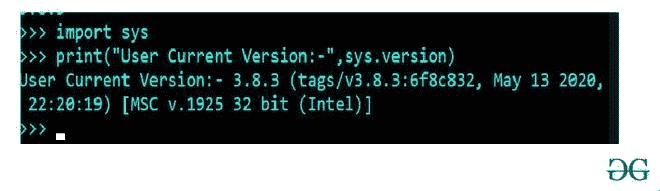
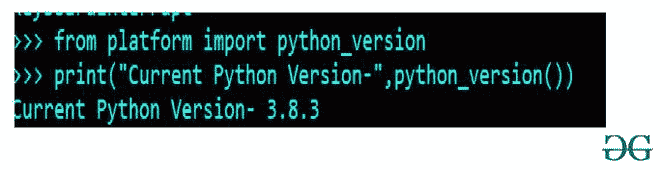
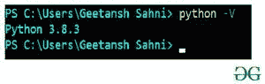

# 查看 Python 解释器的版本

> 原文:[https://www . geesforgeks . org/检查 python 解释器版本/](https://www.geeksforgeeks.org/check-the-version-of-the-python-interpreter/)

在本文中，我们将了解系统中 python 解释器的当前版本。获得解释器的版本真的很重要，因为 python 解释器在计算机编程和源代码编码行业中被广泛使用。它接受一个交互命令并执行它。

因为解释器是获取代码并帮助执行的人。有时由于旧版本的解释器 making 命令无法正常工作，并且正如我们所知，python 语言经常更新 vision，增加了一些新功能，因此用户必须用最新的发布版本更新解释器。

获取 python 解释器的版本；它们如下所示:

*   使用 sys.version 方法
*   使用 python_version()函数
*   使用 python -V 命令

**1。使用系统版本方法:**

对于此方法，用户需要导入 sys 库和 from sys.version 命令，该命令将返回用户当前使用的 python 版本。对于这种方法，用户必须打开 Python shell 并编写下面给出的命令，使用这个命令，用户将以字符串的形式获得 Python 解释器的当前工作版本。

以下是用户获取 python 解释器当前运行版本必须遵循的一些步骤

1.  打开 cmd/终端/windows powershell
2.  写“python”，按回车键进入 python 解释器
3.  编写与下面输入框中给出的命令相同的命令，在结果中，用户将获得当前的解释器版本。

## 蟒蛇 3

```py
import sys

print("User Current Version:-", sys.version)
```

**输出:**



**2。使用 python_version()函数:**

这个函数可以通过导入平台库来访问，并且总是返回一个运行用户的 python 版本的字符串。为了更好地理解，可以采取以下步骤:-

1.  打开 cmd/终端/windows powershell
2.  写“python”，按回车键进入 python 解释器
3.  现在，在给定的代码框中编写与下面提到的相同的命令，并按 enter 键，这样它将以字符串的形式返回当前 python 解释器版本。

## 蟒蛇 3

```py
from platform import python_version

print("Current Python Version-", python_version())
```

**输出:**



**3。使用 python -V 命令:-**

该方法是所有其他方法中最简单的方法之一，因为在该方法中，用户使用 python 中的一个内置命令获得当前 python 版本。

以下是用户获取 python 解释器当前运行版本必须遵循的一些步骤

1.  打开 cmd/终端/windows powershell
2.  现在，在给定的代码框中编写与下面提到的相同的命令，并按 enter 键，这样它将以字符串的形式返回当前 python 解释器版本。

```py
 python -V
```

**输出:**

