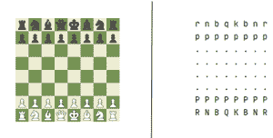
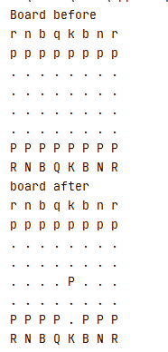

# Python 中的棋库

> 原文:[https://www.geeksforgeeks.org/chess-library-in-python/](https://www.geeksforgeeks.org/chess-library-in-python/)

*棋*模块是一个纯 Python *棋*库，具有移动生成、移动验证和对常用格式的支持。我们可以用它下棋。它将帮助我们移动国王、王后、马前卒、主教和骑士。我们需要了解象棋的基础知识才能和它下棋。这个模块用 python 完成了真实游戏中可能的每一项任务。

#### 安装:

```py
pip install chess
```

我们只需要导入象棋库，有了它，我们就可以下棋了。当我们导入棋盘库时，我们必须调用名为棋盘的函数，这样我们就可以看到棋盘的状态。

#### 下面是制作调用棋库功能板的代码。

## 蟒蛇 3

```py
# import required module
import chess

# create board object
board=chess.Board()

# display chess board
print(board)
```



左边的照片是图形用户界面表示，左边的图片是 ASCII 板

#### 我们可以通过下面的代码了解哪些是合法的行动:

## 蟒蛇 3

```py
# legal moves
board.legal_moves
```

**输出:**

> <legalmovegenerator at="" nf3="" nc3="" na3="" h3="" g3="" f3="" e3="" d3="" c3="" b3="" a3="" h4="" g4="" f4="" e4="" d4="" c4="" b4="" a4=""></legalmovegenerator>

如果我们必须移动任何一个棋子，我们可以用上面的命令来检查我们能移动的棋子。

#### 移动玩家:

## 蟒蛇 3

```py
# moving players
board.push_san("e4")
# It means moving the particular piece at
# e place to 4th position

# Display chess board 
print(board)
```

**输出:**



搬家后改变。

#### 要检查将死:

## 蟒蛇 3

```py
# Verifying check mate
board.is_checkmate()
```

**输出:**

> 如果有将死，那么它将是真或假。它将是一个布尔值。

#### 要检查是否处于僵局:

相持是国际象棋游戏中的一种情况，在这种情况下，轮到谁移动，谁就没有被控制，但没有合法的移动。国际象棋的规则规定，当僵局发生时，比赛以平局结束。

## 蟒蛇 3

```py
# Verifying stalemate
board.is_stalemate()
```

**输出:**

```py
It will return a boolean value a TRUE or FALSE.
```

#### 我们也可以借助上述功能进行检测检查:

## 蟒蛇 3

```py
# code
board.is_check()
```

**输出:**

```py
It will return a boolean value a TRUE or FALSE.
```

根据 2014 年 7 月的新规则，一旦出现五倍重复，或者如果有 75 次移动没有棋子推动或捕获，游戏将以平局结束(即使没有索赔)。其他结束游戏的方式优先。所以也有检查这些东西的方法=

## 蟒蛇 3

```py
# code
board.is_fivefold_repetition()
board.is_seventyfive_moves()
```

**输出:**

```py
Both of it will return a boolean value a TRUE or FALSE.
```