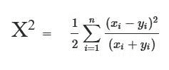

# Python 中的卡方距离

> 原文:[https://www . geesforgeks . org/chi-square-in-distance-python/](https://www.geeksforgeeks.org/chi-square-distance-in-python/)

[卡方](https://www.geeksforgeeks.org/chi-square-test-for-feature-selection-mathematical-explanation/)距离计算是一种统计方法，一般测量 2 个特征矩阵之间的相似度。这种距离通常用于许多应用，如相似图像检索、图像纹理、特征提取等。具有‘n’维的两个阵列‘x’和‘y’的卡方距离是使用以下公式数学计算的:



在本文中，我们将学习如何使用 Python 计算卡方距离。下面给出了计算卡方距离的两种不同方法。让我们用例子来看看他们两个。
**方法#1:** 使用上述公式手动计算卡方距离。

## 蟒蛇 3

```py
# importing numpy library
import numpy as np

# Function to calculate Chi-distance
def chi2_distance(A, B):

    # compute the chi-squared distance using above formula
    chi = 0.5 * np.sum([((a - b) ** 2) / (a + b)
                      for (a, b) in zip(A, B)])

    return chi

# main function
if __name__== "__main__":
    a = [1, 2, 13, 5, 45, 23]
    b = [67, 90, 18, 79, 24, 98]

    result = chi2_distance(a, b)
    print("The Chi-square distance is :", result)
```

```py
Input : a = [1, 2, 13, 5, 45, 23]
        b = [67, 90, 18, 79, 24, 98] 
Output : The Chi-square distance is : 133.55428601494035

Input : a = [91, 900, 78, 30, 602, 813]
        b = [57, 49, 36, 759, 234, 928]
Output :  The Chi-square distance is : 814.776999405035
```

**方法#2:** 使用石方()方法

> **语法:** scipy.stats.chisquare(f_obs，f_exp=None，ddof=0，axis=0)
> **参数:**
> =>f _ OBS:array 1
> =>f _ exp:array 2，可选
> =>ddof(δ自由度–p 值的调整):int，可选
> =>axis:int 或 None，可选
> 默认值
> **返回:**
> == > chisq : float 或 ndarray
> == >测试的 p 值:float 或 ndarray

## 蟒蛇 3

```py
# importing scipy
from scipy.stats import chisquare

k = [3, 4, 6, 2, 9, 5, 2]
print(chisquare(k))
```

**输出:**

```py
Power_divergenceResult(statistic=8.516129032258064, pvalue=0.20267440425509237)
```