# 特征选择卡方检验–数学解释

> 原文:[https://www . geesforgeks . org/chi-square-测试-特征选择-数学-解释/](https://www.geeksforgeeks.org/chi-square-test-for-feature-selection-mathematical-explanation/)

任何有监督机器学习风险中涉及的主要任务之一是从给定的数据集中选择最佳特征以获得最佳结果。选择这些特征的一种方法是卡方检验。

数学上，卡方检验是对两个分布进行的，这两个分布决定了它们各自方差的相似程度。在其**零假设**中，它假设给定的分布是独立的。因此，通过确定输出类标签最依赖的要素，该测试可用于确定给定数据集的最佳要素。对于数据集中的每个要素，计算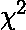，然后根据值按降序排列。的值越高，输出标签对特征的依赖性就越强，特征对确定输出的重要性就越高。

让所讨论的特征有 m 个属性值，输出有 k 个类标签。那么的值由以下表达式给出:-

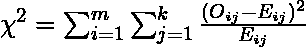

在哪里

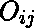–观察频率

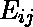–预期频率

对于每个特征，创建一个包含 m 行和 k 列的应急表。每个单元格(I，j)表示属性特征为 I、类别标签为 k 的行数。因此，该表中的每个单元格表示观察到的频率。要计算每个像元的预期频率，首先计算要素值在总数据集中的比例，然后将其乘以当前类别标签的总数。

**已解决示例:**

请考虑下表

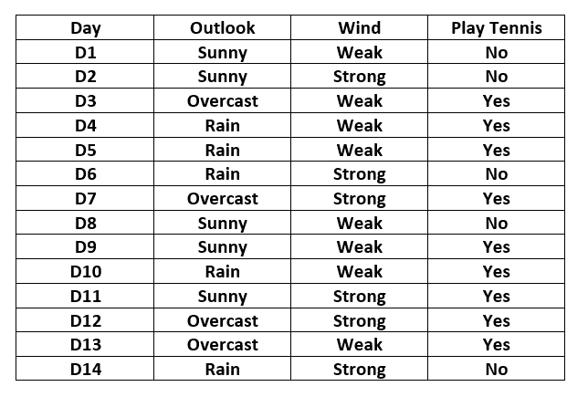

这里的输出变量是名为“PlayTennis”的列，它决定了在给定的天气条件下是否在给定的一天打网球。

功能“展望”的应急表构建如下

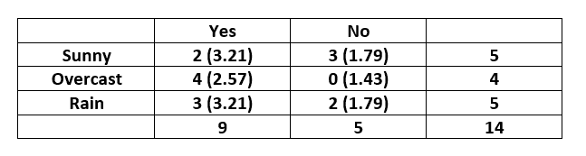

请注意，括号内给出了每个单元格的预期值。

单元格的期望值(晴天，是)计算为，其他单元格也是如此。

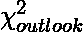值计算如下:-

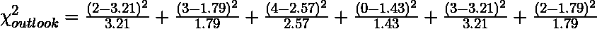

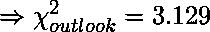

特征“风”的应急表如下所示

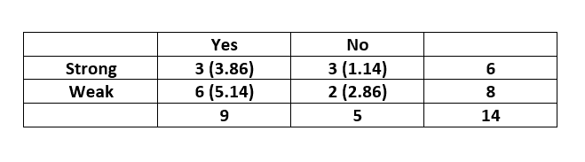

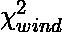值计算如下:-

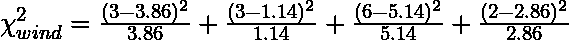

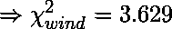

通过比较这两个分数，我们可以得出结论，特征“Wind”比特征“Outlook”对确定输出更重要。

[本文](https://www.geeksforgeeks.org/ml-chi-square-test-for-feature-selection/)演示如何使用卡方检验进行特征选择。