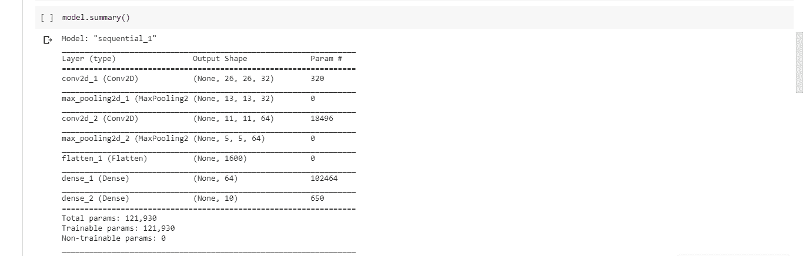
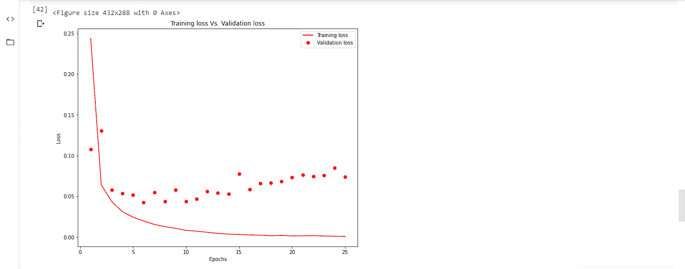

# 在 Keras 中选择最佳的时期数来训练神经网络

> 原文:[https://www . geeksforgeeks . org/choose-最佳时期数-训练一个神经网络-in-keras/](https://www.geeksforgeeks.org/choose-optimal-number-of-epochs-to-train-a-neural-network-in-keras/)

在样本数据上训练神经网络的关键问题之一是**过拟合**。当用于训练神经网络模型的时期的数量超过必要时，训练模型在很大程度上学习特定于样本数据的模式。这使得模型无法在新的数据集上表现良好。该模型在训练集(样本数据)上给出了高精度，但在测试集上未能达到良好的精度。换句话说，模型由于过度拟合训练数据而失去了泛化能力。

为了减轻过拟合和增加神经网络的泛化能力，模型应该针对最佳的时期数进行训练。训练数据的一部分专用于模型的验证，以在每个训练时期之后检查模型的性能。监控训练集和验证集的损失和准确性，以查看历元数，之后模型开始过拟合。

## keras .回调.回调. early ystopping()

可以通过提前停止回叫功能来监控损失/准确度值。如果正在监控损失，当观察到损失值增加时，训练将停止。或者，如果正在监控准确度，当观察到准确度值下降时，训练停止。

> **带默认值的语法:**
> 
> *keras . callbacks . callbacks . early stopping(monitor = ' val _ loss '，min_delta=0，persistence = 0，verbose=0，mode='auto '，baseline=None，restore_best_weights=False)*
> 
> **理解几个重要论点:**
> 
> *   **监控:**应分配功能要监控的值。可能是验证损失或验证准确性。
> *   **模式:**是应该观察监测量变化的模式。这可以是“最小”或“最大”或“自动”。当监控值为损耗时，其值为“最小值”。当监控值为精度时，其值为“最大值”。当模式设置为“自动”时，该功能会使用合适的模式自动监控。
> *   **min_delta:** 应设置要考虑的变化的最小值，即被监控值的变化应高于“min_delta”值。
> *   **耐心:**耐心是第一次暂停后继续训练的历元数。模型等待耐心等待模型的任何改进。
> *   **verbose:** Verbose 是一个整数值-0、1 或 2。该值用于选择训练时进度的显示方式。
>     *   详细= 0:静默模式-在此模式下不显示任何内容。
>     *   Verbose = 1:显示描述训练进度的条。
>     *   Verbose = 2:在此模式下，每个时期显示一行，显示每个时期的训练进度。
> *   **restore_best_weights:** 这是一个布尔值。真值恢复最佳权重。

**寻找最佳时期数，避免在 MNIST 数据集上过度拟合。**

**第一步:加载数据集并预处理**

```py
import keras
from keras.utils.np_utils import to_categorical
from keras.datasets import mnist

# Loading data
(train_images, train_labels), (test_images, test_labels)= mnist.load_data()

# Reshaping data-Adding number of channels as 1 (Grayscale images)
train_images = train_images.reshape((train_images.shape[0], 
                                     train_images.shape[1], 
                                     train_images.shape[2], 1))

test_images = test_images.reshape((test_images.shape[0], 
                                   test_images.shape[1],
                                   test_images.shape[2], 1))

# Scaling down pixel values
train_images = train_images.astype('float32')/255
test_images = test_images.astype('float32')/255

# Encoding labels to a binary class matrix
y_train = to_categorical(train_labels)
y_test = to_categorical(test_labels)
```

**第二步:建立 CNN 模型**

```py
from keras import models
from keras import layers

model = models.Sequential()
model.add(layers.Conv2D(32, (3, 3), activation ="relu", 
                             input_shape =(28, 28, 1)))
model.add(layers.MaxPooling2D(2, 2))
model.add(layers.Conv2D(64, (3, 3), activation ="relu"))
model.add(layers.MaxPooling2D(2, 2))
model.add(layers.Flatten())
model.add(layers.Dense(64, activation ="relu"))
model.add(layers.Dense(10, activation ="softmax"))

model.summary()
```

**输出:模型总结**

<center>
</center>

**第四步:用 RMSprop 优化器、分类交叉熵损失函数和准确度作为成功度量来编译模型**

```py
model.compile(optimizer ="rmsprop", loss ="categorical_crossentropy",
                                             metrics =['accuracy'])
```

**第五步:通过分割当前训练集**创建验证集和训练集

```py
val_images = train_images[:10000]
partial_images = train_images[10000:]
val_labels = y_train[:10000]
partial_labels = y_train[10000:]
```

**第六步:初始化早期预测回调并训练模型**

```py
from keras import callbacks
earlystopping = callbacks.EarlyStopping(monitor ="val_loss", 
                                        mode ="min", patience = 5, 
                                        restore_best_weights = True)

history = model.fit(partial_images, partial_labels, batch_size = 128, 
                    epochs = 25, validation_data =(val_images, val_labels), 
                    callbacks =[earlystopping])
```


训练在第 11 个时期停止，即模型将从第 12 个时期开始过度拟合。**因此，训练大部分数据集的最佳时期数是 11。**

**在不使用提前停止回叫功能的情况下观察损失值:**
训练模型直到 25 个时期，并绘制训练损失值和验证损失值与时期数量的关系图。剧情看起来像是:



**推断:**
随着历元数增加到 11 以上，训练集损失减少，变得接近于零。然而，验证损失的增加描述了模型对训练数据的过度拟合。

**参考文献:**

*   https://keras.io/callbacks/
*   https://keras.io/datasets/