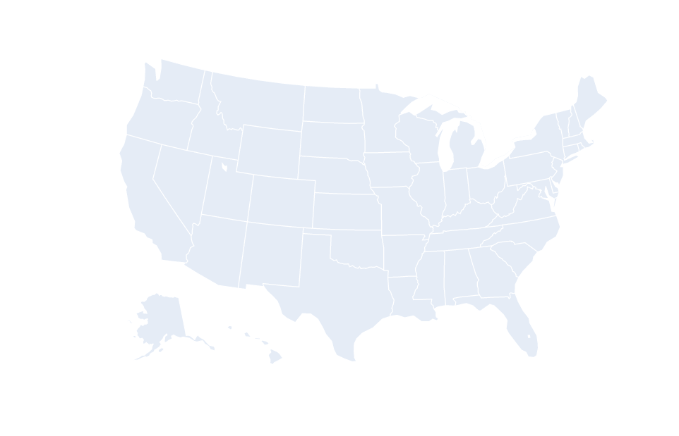

# 在 Python 中使用 Plotly 绘制地图

> 原文:[https://www . geeksforgeeks . org/cholopleth-maps-use-plotly-in-python/](https://www.geeksforgeeks.org/choropleth-maps-using-plotly-in-python/)

Plotly 是一个 Python 库，在数据科学家中非常流行，用于创建交互式数据可视化。Plotly 中可用的可视化之一是 Choropleth 地图。晕圈图用于绘制带有阴影或图案区域的地图，这些区域与统计变量成比例。它们由彩色多边形组成。它们用于表示一个量的空间变化。

为了创建它们，我们需要两种主要类型的输入–

*   几何信息–
    *   这可以是一个 GeoJSON 文件(这里每个特征都有一个 *id* 或者属性中的一些标识值，或者
    *   这可以是美国和世界各国的内置几何图形
*   以要素标识符为索引的值列表

> **语法–**plot . express . cholopleth((data _ frame =无，lat =无，lon =无，locations =无，locationmode =无，geojson =无，color =无，scope =无，center =无，title =无，width =无，height =无)
> 
> **参数:**
> 
> *   lat =该值用于根据地图上的纬度定位标记
> *   long =该值用于根据地图上的经度定位标记
> *   locations =该值根据 locationmode 进行解释，并映射到经度/纬度。
> *   locationmode =国际标准化组织 3、美国各州或国家名称之一。这确定了用于将位置中的条目与地图上的区域相匹配的位置集。
> *   geojson =包含一个多边形要素集合，其 id 是来自位置的引用
> *   颜色=用于给标记指定颜色
> *   范围=可能的值–“世界”、“美国”、“欧洲”、“亚洲”、“非洲”、“北美”或“南美”默认为“世界”,除非投影设置为“albers usa ”,强制为“usa”
> *   中心=设置地图的中心点

**示例:**

## 蟒蛇 3

```py
# code for creating choropleth map of USA states
# import plotly library
import plotly

# import plotly.express module
# this module is used to create entire figures at once
import plotly.express as px

# create figure
fig = px.choropleth(locationmode="USA-states", color=[1], scope="usa")

fig.show()
```

**输出:**



地图可以用来突出显示或描绘特定区域。下面给出了实现这种功能的实现。

**示例:**

## 蟒蛇 3

```py
#code for representing states of USA
#pass list of states in locations
#list will have two-letter abbreviations of states
fig = px.choropleth(locations=["CA","TX","NY"], locationmode="USA-states", color=[1,2,3], scope="usa")

fig.show()
```