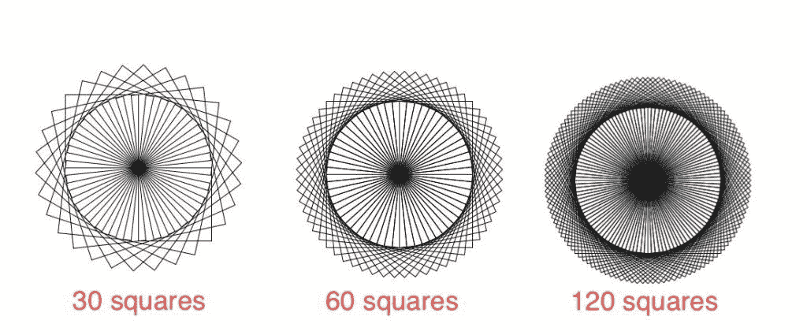

# 使用 Python 的正方形圆

> 原文:[https://www . geeksforgeeks . org/使用 python 的方块圈/](https://www.geeksforgeeks.org/circle-of-squares-using-python/)

**Turtle** 库使用户能够使用命令绘制图片或形状，为他们提供了一个虚拟画布。*海龟*自带 Python 的标准库。它需要一个支持 *Tk* 的 Python 版本，因为它使用*Tkit*作为图形。在本文中，我们将使用 Python 的海龟模块从正方形中生成一个圆形图案。

**例:**



不同方块数的图案

**进场:**

为了画圆，我们需要画 **n** 个正方形，每次将乌龟光标旋转 **d** 度。选择 **n** 和 **d** 使得`n*d=360`，从而完成一整圈。在下面的实现中，我们将绘制一个由 60 个正方形组成的圆，每次将光标旋转 6 度。

**使用的功能:**

*   **fd(x)** :将光标前移 *x* 像素。
*   **rt(x)** :将光标的朝向向右旋转 *x* 度。

下面是实现。

```py
from turtle import *

# loop for number of squares
for i in range(60):

    # loop for drawing each square
    for j in range(4):

        # drawing each side of
        # square of length 100 
        fd(100)

        # turning 90 degrees
        # to the right
        rt(90)

    # turning 6 degrees for
    # the next square
    rt(6)
```

**输出:**

<video class="wp-video-shortcode" id="video-417818-1" width="665" height="394" preload="metadata" controls=""><source type="video/mp4" src="https://media.geeksforgeeks.org/wp-content/uploads/20200522160726/recc.mp4?_=1">[https://media.geeksforgeeks.org/wp-content/uploads/20200522160726/recc.mp4](https://media.geeksforgeeks.org/wp-content/uploads/20200522160726/recc.mp4)</video>