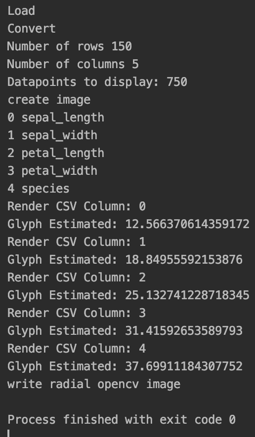
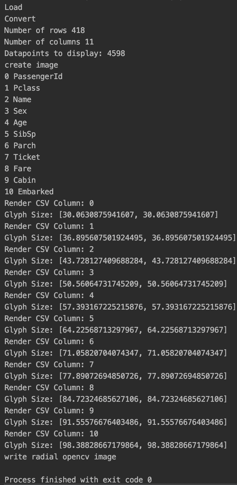

# 使用 hishiryo Python 实现数据集的圆形可视化

> 原文:[https://www . geesforgeks . org/circular-visualization-of-dataset-use-his hiryo-python/](https://www.geeksforgeeks.org/circular-visualization-of-dataset-using-hishiryo-python/)

在各种表示数据的方式中，数据的循环表示是渲染数据点并对其进行相应分析的方式之一。本文讨论了为进一步分析目的而实现所述数据可视化的方法。

**hishiryo:** 该工具有助于生成数据的圆形视觉表示。将每个数据点转换为像素，然后将其显示为圆形图，并支持各种数据类型，如整数、浮点和文本作为其分类列。

### **安装:**

这个模块没有内置 Python。要安装它，请在终端中键入以下命令。

```py
pip install hishiryo
```

安装后，需要目标数据集来继续编码部分。

### **使用的功能**

**hishiryoconverter . convertcsvtoradialbitmap:**将输入的 CSV 文件转换为径向位图并保存到磁盘上

> **语法:**hishiryoconverter . convertcsvtoradialbitmap(输入 _ 路径、分隔符、输出 _ 路径、半径、无、“点”)
> 
> **参数:**
> 
> *   输入路径:csv 的路径。
> *   输出路径:图像文件的路径。
> *   分隔符:csv 文件中的字符分隔符(例如“，”)
> *   半径(以像素为单位) :将绘制像素的磁盘半径的大小。越高，图像越大越清晰。
> *   排序依据:需要对数据进行排序的列。
> *   字形类型:像素的表示类型。选项:[“点”、“正方形”或“多边形”]。

**下面是实现:**

## 蟒蛇 3

```py
# import library
from hishiryo import Hishiryo

# initialize data set and parameters.
HishiryoConverter = Hishiryo.Hishiryo()
input_path = "iris.csv"
separator = ','
output_path = "iris.png"
radius = 1500

# utility function that converts
HishiryoConverter.convertCSVToRadialBitmap(input_path, 
                                           separator,
                                           output_path,
                                           radius, None,
                                           "Dot")
```

运行代码后，进程元数据在控制台输出，相应的图像在期望的目的地输出。

**输出:**

 

### 颜色分配:

颜色是根据可变类型分配的。

*   **蓝色圆圈–**整数值
*   **红色圆圈–**浮动值
*   **随机颜色–**分类变量。
*   **黑色–**默认或 0 或无数据。

使用自定义参数，这里我们改变数据集、字形类型和半径。

## 蟒蛇 3

```py
# import library
from hishiryo import Hishiryo

HishiryoConverter = Hishiryo.Hishiryo()

# initialize data set and parameters.
input_path = "titanic.csv"
separator = ','
output_path = "titanic.png"
radius = 5000

# utility function that converts
# altered glyph type, dataset and radius
HishiryoConverter.convertCSVToRadialBitmap(input_path, separator,
                                           output_path, radius,
                                           None, "Polygon")
```

**输出:**

 