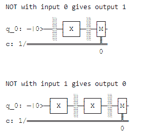

# 使用 Python 中的 Qiskit 的量子电路的经典非逻辑门

> 原文:[https://www . geeksforgeeks . org/python 中使用量子电路的经典非逻辑门/](https://www.geeksforgeeks.org/classical-not-logic-gates-with-quantum-circuit-using-qiskit-in-python/)

在本文中，我们将看到如何使用量子门对给定的输入(0 或 1)应用非门，我们必须将 0 转换为 1，将 1 转换为 0。这在经典计算机中很容易做到，但我们如何在量子计算机中做到这一点。我们必须用量子比特来表示输入，然后在那个量子比特上应用 X(量子计算机中非门的表示)运算，然后返回结果量子比特

**QISKIT** 是位于一侧量子算法和另一侧物理量子设备之间的包。它将 Python 等常见编程语言翻译成量子机器语言。这意味着除了 IBM Q 实验室之外的任何人都可以对量子计算机进行编程。

要安装此模块，请在终端中运行以下命令:

```
pip3 install qiskit
```

## **进场:**

*   使用内置函数 quantum circuit 创建具有单个经典量子位和位的量子电路 **qc** ，该函数采用第一个参数“整数量子位的数量”和第二个参数“整数位的数量”，并返回量子电路。(QuantumCircuit(1，1)返回带有一个量子位 q[0]和一位 c[0]的量子电路)
*   用量子位表示输入(‘0’表示量子位状态|0 >，而‘1’表示|1 >):
    *   使用 qiskit 功能 [](https://qiskit.org/documentation/stubs/qiskit.circuit.Reset.html) 复位 qc 量子位()。
    *   由于量子位最初是|0⟩，所以对于‘0’的输入，我们不需要做任何事情。
    *   对于输入‘1’，我们做一个 x 来旋转|0⟩到|1⟩.函数的作用是对给定的参数应用非门。
*   使用屏障()在输入状态和栅极操作之间设置屏障。
*   对量子位 0 应用非，我们可以用 x 对它做非
*   在闸门操作和测量之间设置一道屏障
*   最后，我们提取量子位 q[0]的|0⟩/|1⟩输出，并使用 qiskit measure()函数将其编码到位 c[0]中。
*   要可视化和查看电路图，请使用 qiskit draw() [](https://qiskit.org/documentation/stubs/qiskit.visualization.pulse_v2.draw.html#qiskit.visualization.pulse_v2.draw)功能。

**下面是实现:**

## 蟒蛇 3

```
# importing qiskit
from qiskit import * 

# importing plot_histogram to visualize Output
from qiskit.visualization import plot_histogram 
import numpy as np

def NOT(inp):

    # Creating a quantum circuit with a 
    # single qubit and a single classical bit using 
    qc = QuantumCircuit(1, 1)
    qc.reset(0)

    # We encode '0' as the qubit state |0⟩, and '1' as |1⟩
    # Since the qubit is initially |0⟩, so for
    # an input of 0, we don't need to do anything.
    # For an input of '1', we do an x to rotate the |0⟩ to |1⟩
    # The x() function is to apply NOT gate on given parameter.
    if inp == '1':

        # applying NOT on qubit 0.
        qc.x(0) 

    # barrier between input state and gate operation
    qc.barrier()

    # Now we've encoded the input,
    # we can do a NOT on it using x

    # NOT on |0> converted to |1> and wise verse.
    qc.x(0) 

    # barrier between gate operation and measurement
    qc.barrier()

    # Finally, we extract the |0⟩/|1⟩ output of
    # the qubit q[0] and encode it in the bit c[0]
    qc.measure(0, 0)

    # to visualize
    qc.draw('mpl') 

    # To run the program on a simulator
    backend = Aer.get_backend('qasm_simulator')

    # Since the output will be deterministic,
    # so we can use just a single shot to get it
    job = execute(qc, backend, shots=1, memory=True)
    output = job.result().get_memory()[0]

    return qc, output

# Sending input to NOT function
for inp in ['0', '1']:
    qc, out = NOT(inp)

    print('NOT with input', inp, 'gives output', out)
    display(qc.draw())
    print('\n')
```

**输出:**

