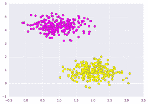
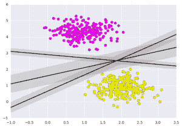
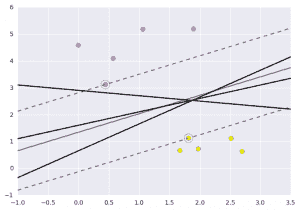

# 使用 Python 中的支持向量机对数据进行分类

> 原文:[https://www . geesforgeks . org/classing-data-use-support-vector-machines-VMs-in-python/](https://www.geeksforgeeks.org/classifying-data-using-support-vector-machinessvms-in-python/)

**支持向量机简介:**
在机器学习中，支持向量机(SVMs，也称支持向量网络)是带有相关学习算法的监督学习模型，用于分析用于分类和回归分析的数据。
支持向量机(SVM)是一种由分离超平面正式定义的判别分类器。换句话说，给定标记的训练数据(监督学习)，该算法输出一个最优超平面，该超平面对新的例子进行分类。

**什么是支持向量机？**

SVM 模型将示例表示为空间中的点，映射后，各个类别的示例会被尽可能宽的空白区域分开。
除了执行线性分类之外，支持向量机还可以高效地执行非线性分类，将它们的输入隐式映射到高维特征空间中。

**SVM 是做什么的？**

给定一组训练示例，每个示例被标记为属于两个类别中的一个或另一个，SVM 训练算法构建一个模型，该模型将新示例分配给一个或另一个类别，使其成为非概率二元线性分类器。

让你从这篇[文章](https://www.geeksforgeeks.org/getting-started-with-classification/)中有了基本的了解，然后再继续。在这里，我将讨论一个关于使用机器学习工具(即与 Python 兼容的 scikit-learn)对[癌症](http://archive.ics.uci.edu/ml/datasets/Breast+Cancer+Wisconsin+%28Diagnostic%29) UCI 数据集进行 SVM 分类的示例。
**先决条件:**[Numpy](https://www.geeksforgeeks.org/numpy-in-python-set-1-introduction/)[Pandas](https://www.geeksforgeeks.org/data-analysis-visualization-python/)[matplot-lib](https://www.geeksforgeeks.org/graph-plotting-in-python-set-1/)[scikit-learn](https://www.geeksforgeeks.org/learning-model-building-scikit-learn-python-machine-learning-library/)
我们来看一个支持向量分类的快速例子。首先我们需要创建一个数据集:

```py
# importing scikit learn with make_blobs
from sklearn.datasets.samples_generator import make_blobs

# creating datasets X containing n_samples
# Y containing two classes
X, Y = make_blobs(n_samples=500, centers=2,
                  random_state=0, cluster_std=0.40)
import matplotlib.pyplot as plt
# plotting scatters 
plt.scatter(X[:, 0], X[:, 1], c=Y, s=50, cmap='spring');
plt.show() 
```

输出:
[](https://media.geeksforgeeks.org/wp-content/uploads/g22.png)

支持向量机所做的，不仅仅是在两个类之间画一条线，而是考虑一个关于某个给定宽度的线的区域。这里有一个它可能是什么样子的例子:

```py
# creating line space between -1 to 3.5 
xfit = np.linspace(-1, 3.5)

# plotting scatter
plt.scatter(X[:, 0], X[:, 1], c=Y, s=50, cmap='spring')

# plot a line between the different sets of data
for m, b, d in [(1, 0.65, 0.33), (0.5, 1.6, 0.55), (-0.2, 2.9, 0.2)]:
    yfit = m * xfit + b
    plt.plot(xfit, yfit, '-k')
    plt.fill_between(xfit, yfit - d, yfit + d, edgecolor='none', 
    color='#AAAAAA', alpha=0.4)

plt.xlim(-1, 3.5);
plt.show()
```

[](https://media.geeksforgeeks.org/wp-content/uploads/g31.png)

**导入数据集**

这是支持向量机的直觉，它优化了表示数据集之间垂直距离的线性判别模型。现在让我们使用训练数据训练分类器。在训练之前，我们需要将癌症数据集导入为 csv 文件，在这里我们将训练所有特征中的两个特征。

```py
# importing required libraries
import numpy as np
import pandas as pd
import matplotlib.pyplot as plt

# reading csv file and extracting class column to y.
x = pd.read_csv("C:\...\cancer.csv")
a = np.array(x)
y  = a[:,30] # classes having 0 and 1

# extracting two features
x = np.column_stack((x.malignant,x.benign))

# 569 samples and 2 features
x.shape 

print (x),(y)
```

```py
[[  122.8   1001\.  ]
 [  132.9   1326\.  ]
 [  130\.    1203\.  ]
 ..., 
 [  108.3    858.1 ]
 [  140.1   1265\.  ]
 [   47.92   181\.  ]]

array([ 0.,  0.,  0.,  0.,  0.,  0.,  0.,  0.,  0.,  0.,  0.,  0.,  0.,
         0.,  0.,  0.,  0.,  0.,  0.,  1.,  1.,  1.,  0.,  0.,  0.,  0.,
         0.,  0.,  0.,  0.,  0.,  0.,  0.,  0.,  0.,  0.,  0.,  1.,  0.,
         0.,  0.,  0.,  0.,  0.,  0.,  0.,  1.,  0.,  1.,  1.,  1.,  1.,
         1.,  0.,  0.,  1.,  0.,  0.,  1.,  1.,  1.,  1.,  0.,  1., ....,
         1.])

```

**拟合支持向量机**

现在我们将为这些点安装一个支持向量机分类器。虽然可能性模型的数学细节很有趣，但我们会在其他地方读到。相反，我们将把 scikit-learn 算法视为完成上述任务的黑盒。

```py
# import support vector classifier 
# "Support Vector Classifier"
from sklearn.svm import SVC  
clf = SVC(kernel='linear') 

# fitting x samples and y classes 
clf.fit(x, y) 
```

拟合后，该模型可用于预测新值:

```py
clf.predict([[120, 990]])

clf.predict([[85, 550]])
```

```py
array([ 0.])
array([ 1.])

```

让我们来看看这个图表是怎么显示的。

[](https://media.geeksforgeeks.org/wp-content/uploads/g11.png) 
这是通过分析采集的数据和预处理方法，利用 matplotlib 函数制作最优超平面得到的。

本文由 **阿夫扎尔·安萨里** 供稿。如果你喜欢 GeeksforGeeks 并想投稿，你也可以使用[contribute.geeksforgeeks.org](http://www.contribute.geeksforgeeks.org)写一篇文章或者把你的文章邮寄到 contribute@geeksforgeeks.org。看到你的文章出现在极客博客主页上，帮助其他极客。

如果你发现任何不正确的地方，或者你想分享更多关于上面讨论的话题的信息，请写评论。