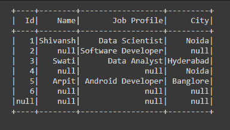
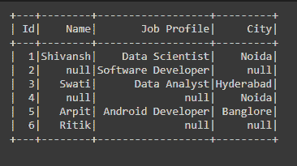
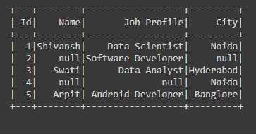
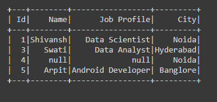

# 用 Pyspark

中的 dropna 清洁数据

> 原文:[https://www . geesforgeks . org/cleaning-data-with-drop na-in-py spark/](https://www.geeksforgeeks.org/cleaning-data-with-dropna-in-pyspark/)

在处理由许多行和列组成的大数据帧时，它们也由一些行或列中的许多空值或无值组成，或者一些行完全为空或无。因此，在这种情况下，如果我们对包含许多空值或无值的同一数据帧应用操作，那么我们将无法从该数据帧获得正确或所需的输出。为了从数据框中获得正确的输出，我们必须清理它，这意味着我们必须使数据框没有空值或无值。

因此，在本文中，我们将学习如何清理数据框。为了清洁数据框，我们使用 **dropna()** 功能。该函数用于根据给定的参数从数据框中删除空值。

> **语法:** df.dropna(how=“任意”，thresh =无，subset =无)
> 
> 其中，df 是数据帧
> 
> **参数:**
> 
> *   how:此参数用于确定行或列是否必须移除。
>     *   任何'–如果数据框中的任何值为空，则删除该行或列。
>     *   all '–如果特定行或列的所有值都为空，则删除。
> *   阈值:如果特定行或列的非空值小于阈值，则删除该行或列。
> *   子集:如果给定的子集列包含任何空值，则填充该行或列。

要使用 dropna 方法删除空值，首先，我们将创建一个 Pyspark dataframe，然后应用它。

## 计算机编程语言

```py
# importing necessary libraries
from pyspark.sql import SparkSession

# function to create new SparkSession
def create_session():
    spk = SparkSession.builder \
        .master("local") \
        .appName("Employee_detail.com") \
        .getOrCreate()
    return spk

def create_df(spark, data, schema):
    df1 = spark.createDataFrame(data, schema)
    return df1

if __name__ == "__main__":

    # calling function to create SparkSession
    spark = create_session()

    input_data = [(1, "Shivansh", "Data Scientist", "Noida"),
                  (2, None, "Software Developer", None),
                  (3, "Swati", "Data Analyst", "Hyderabad"),
                  (4, None, None, "Noida"),
                  (5, "Arpit", "Android Developer", "Banglore"),
                  (6, "Ritik", None, None),
                  (None, None, None, None)]
    schema = ["Id", "Name", "Job Profile", "City"]

    # calling function to create dataframe
    df = create_df(spark, input_data, schema)
    df.show()
```

**输出:**



**例 1:使用 PySpark 中的任意参数，用 dropna 清洗数据。**

在下面的代码中，我们已经在 dropna()函数中传递了***how =“any”*****参数，这意味着如果有任何行或列具有任何空值，那么我们将从 Dataframe 中删除该行或列。**

## **计算机编程语言**

```py
# if any row having any Null
# value we are dropping that
# rows
df = df.dropna(how="any")
df.show()
```

****输出:****

****

****例 2:使用 PySpark 中的所有参数，用 dropna 清洗数据。****

**在下面的代码中，我们已经在 dropna()函数中传递了*****how = " all "***参数，这意味着如果所有的行或列都具有所有的 Null 值，那么我们将从 Dataframe 中删除该特定的行或列。****

## ****计算机编程语言****

```py
**# if any row having all Null
#  values we are dropping that
# rows.
df = df.dropna(how="all")
df.show()**
```

******输出:******

********

******例 3:使用 PySpark 中的 thresh 参数用 dropna 清洗数据。******

****在下面的代码中，我们在 dropna()函数中传递了 *thresh=2* 参数，这意味着如果有任何行或列的非空值少于 thresh 值，那么我们将从 Dataframe 中删除该行或列。****

## ****计算机编程语言****

```py
**# if thresh value is not
# satisfied then dropping
# that row
df = df.dropna(thresh=2)
df.show()**
```

******输出:******

********

******例 4:使用 PySpark 中的子集参数，用 dropna 清洗数据。******

****在下面的代码中，我们在 dropna()函数中传递了*子集='City'* 参数，该参数是 City 列中相应的列名。如果该列中存在任何空值，则我们将从数据框中删除该行。****

## ****计算机编程语言****

```py
**# if the subset column any value
# is NULL then dropping that row
df = df.dropna(subset="City")
df.show()**
```

******输出:******

********

******例 5:使用 PySpark 中的 thresh 和 subset 参数用 dropna 清洗数据。******

****在下面的代码中，我们在 dropna()函数中传递了 *(thresh=2，子集=(“Id”、“Name”、“City”))*参数，因此当 *thresh=2* 和*子集=(“Id”、“Name”、“City”)*这两个条件都满足时，空值将会下降，这意味着在这三列中 dropna 函数会检查 *thresh=2* 是否也满足，如果满足，则删除该特定的行或列。****

## ****计算机编程语言****

```py
**# if thresh value is satisfied with subset
# column then dropping that row
df = df.dropna(thresh=2,subset=("Id","Name","City"))
df.show()**
```

******输出:******

********