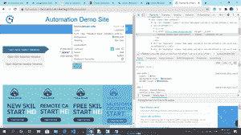
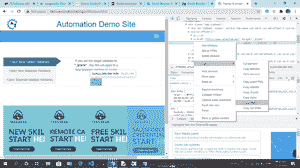

# 使用 Python 中的 Selenium 关闭特定网页

> 原文:[https://www . geesforgeks . org/close-specific-web-page-使用 python 中的硒/](https://www.geeksforgeeks.org/close-specific-web-page-using-selenium-in-python/)

**先决条件:** [硒基础](https://www.geeksforgeeks.org/selenium-basics-components-features-uses-and-limitations/)、[硒关闭()和退出()](https://www.geeksforgeeks.org/how-to-use-close-and-quit-method-in-selenium-python/)

Selenium 是通过程序控制 web 浏览器，执行浏览器自动化的强大工具。它适用于所有浏览器，在所有主要操作系统上工作，其脚本是用各种语言编写的，即[【Python】](https://www.geeksforgeeks.org/python-programming-language/)[Java](https://www.geeksforgeeks.org/java/)[c#](https://www.geeksforgeeks.org/csharp-programming-language/)等，我们将使用 Python。

*close()* 方法是关闭浏览器窗口的 web 驱动程序命令。在自动化过程中，如果打开了多个浏览器窗口，那么 *close()* 命令将关闭当时正在关注的当前浏览器窗口。

**要求:**

需要安装 *chromedriver* 并设置路径。[点击此处](https://sites.google.com/a/chromium.org/chromedriver/downloads)下载，更多信息请点击[此链接](https://www.geeksforgeeks.org/browser-automation-using-selenium/)。

**分步方法:**

*   导入所需模块

## 蟒蛇 3

```
# import modules
from selenium import webdriver
from selenium.webdriver.support.ui import Select
import time
```

*   取任意[网址](http://demo.automationtesting.in/Windows.html)。

## 蟒蛇 3

```
# assign web page url
driver.get("http://demo.automationtesting.in/Windows.html")
```

*   我们想要这个网页的子窗口，然后点击任何按钮。



*   复制 XPath。



*   使用 find_element_by_xpath()方法查找 xpath。

## 蟒蛇 3

```
# find XPath
driver.find_element_by_xpath('//*[@id="Tabbed"]/a/button').click()
```

*   创建一个句柄变量，该变量存储打开的浏览器窗口的所有句柄值。
*   然后关闭网页的指定条件。

## 蟒蛇 3

```
# return all handles value of open browser window
handles = driver.window_handles

for i in handles:
    driver.switch_to.window(i)

    # close specified web page
    if driver.title == "Frames & windows":
        time.sleep(2)
        driver.close()
```

*close()* 方法关闭当前窗口页面。有些页面使用时间长，有些页面使用时间短。如果我们想要关闭一个特定的网页，我们需要使用一些条件。

**实施:**

## 蟒蛇 3

```
# import modules
from selenium import webdriver
from selenium.webdriver.support.ui import Select
import time

# use chrome driver
driver = webdriver.Chrome()

# assign web page url
driver.get("http://demo.automationtesting.in/Windows.html")

# find XPath
driver.find_element_by_xpath('//*[@id="Tabbed"]/a/button').click()

# return all handles value of open browser window
handles = driver.window_handles

for i in handles:
    driver.switch_to.window(i)

    # close specified web page
    if driver.title == "Frames & windows":
        time.sleep(2)
        driver.close()
```

**输出:**

<video class="wp-video-shortcode" id="video-500525-1" width="640" height="360" preload="metadata" controls=""><source type="video/mp4" src="https://media.geeksforgeeks.org/wp-content/uploads/20201015110114/15.10.2020_10.54.08_REC.mp4?_=1">[https://media.geeksforgeeks.org/wp-content/uploads/20201015110114/15.10.2020_10.54.08_REC.mp4](https://media.geeksforgeeks.org/wp-content/uploads/20201015110114/15.10.2020_10.54.08_REC.mp4)</video>