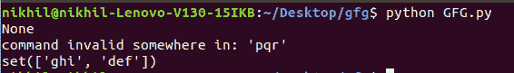
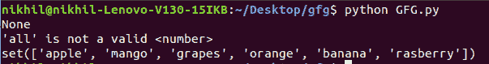

# Python 中的 Cmdparse 模块

> 原文:[https://www.geeksforgeeks.org/cmdparse-module-in-python/](https://www.geeksforgeeks.org/cmdparse-module-in-python/)

为编写面向行的命令解释器提供简单框架的类称为 cmd 类。这些通常对管理工具、原型和测试工具很有用，这些工具稍后将被包装在更复杂的界面中。命令行界面可以使用 cmd 模块轻松实现。

如今图形用户界面被大量使用，以至于命令行解释器似乎已经过时了。命令行界面有几个优点:

*   命令行界面是可移植的，可以在任何地方运行。
*   中央处理器和内存资源远比图形用户界面便宜。
*   用命令行打开文件比进入驱动程序和搜索菜单更容易。
*   创建面向文本的文档要快得多。

## Cmd 类

该模块只定义了一个类:Cmd 类。命令行解释器是通过对`cmd.Cmd`类进行子类化来创建的。Cmd 实例或子类实例可以被视为面向行的解释器框架。

*   **创建命令:**在解释器提示符下输入的一行文本的第一部分是命令。identchars 成员中包含的最长字符串是 Command。
    非重音字母、数字和下划线符号是默认识别字符。行尾是命令的参数。
*   **参数:**只需`do_xxx`方法多取一个参数，对应用户在命令名称后输入的字符串部分。
*   **错误:**解释器使用以下格式发出错误信号:

    ```py
    *** : 
    ```

*   **Return Value:** In the most common case: commands shouldn’t return a value. When you want to exit the interpreter loop any command that returns a true value stops the interpreter is an exception.

    **示例:**

    ```py
    def add(self, d):
        k = d.split()
        if len(k)!= 2:
           print "*** invalid number of arguments"
           return
        try:
           k = [int(i) for i in k]
        except ValueError:
           print "*** arguments should be numbers"
           return
        print k[0]+k[1]
    ```

## Cmdparse 模块

cmdparser 包包含两个用于编写文本命令解析器的模块。
这个模块特别使用了内置的 Python cmd 模块。该软件包由两个模块组成:

*   cmdparser.cmdparser
*   cmdparser.datetimeparse

#### 装置

我们可以从 PyPI 安装 cmdparse 包。例如

```py
pip install cmdparse

```

#### cmdparse 概述

Cmd 模块允许从文本命令规范创建解析树，如下所示

```py
chips( spam | ham [eggs] | beans [eggs [...]] )

```

可以使用这些解析树来检查特定的命令字符串。此外，它允许列出部分命令字符串的有效完成。

**示例:**

```py
from cmdparser import cmdparser

parse_tree = cmdparser.parse_spec("abc (def|ghi) <jkl> [mno]")

# Returns None to indicate
# successful parse
parse_tree.check_match(("abc", "def", "anything"))

# Returns an appropriate 
# parsing error message
parse_tree.check_match(("abc", "ghi", "anything", "pqr"))

# Returns the list ["def", "ghi"]
parse_tree.get_completions(("abc", ))
```

**输出:**



可以设置动态令牌，其中接受的字符串列表可以随时间变化，或者在处理固定令牌字符串时可以接受任意字符串或字符串列表。查看模块的文档字符串，了解可用类的细节，例如:

```py
from cmdparser import cmdparser

class fruitToken(cmdparser.Token):

    def get_values(self, context):
        # Static list here, but could
        # easily be dynamic
        return ["rasberry", "orange", "mango",
                "grapes", "apple", "banana"]

def my_ident_factory(token):

    if token == "number":
        return cmdparser.IntegerToken(token)

    elif token == "fruit":
        return fruitToken(token)

    return None

parse_tree = cmdparser.parse_tree("take <number> <fruit> bags",
                                  ident_factory = my_ident_factory)

# Returns None to indicate successful
# parse, and the "cmd_fields" dict will
# be initialised as:
# { "take": ["take"], "<number>": ["23"],
#   "<fruit>": ["apple"], "bags": ["bags"] }
cmd_fields = {}

parse_tree.check_match(("take", "23",
                        "apple", "bags"), 
                       fields = cmd_fields)

# Returns an appropriate 
# parsing error message
parse_tree.check_match(("take", "all", 
                        "rasberry", "bags"))

# Returns the list ["rasberry",
# "orange", "mango", ..., "banana"]
parse_tree.get_completions(("take", "5"))
```

**输出:**



有四个类是适用于用户派生令牌的基类:

*   **令牌:**当其中一组固定值合适时，这是有用的，其中列表可以是固定的或动态的。应该重写`get_values()`方法，以字符串形式返回有效令牌列表。
*   **Anytoken:** 它类似于 token，但任何字符串都是可以预期的。可以通过`validate()`方法进行验证，但是`validate()`方法不允许制表符结束，因为它只在整个命令被解析后被调用。如果需要，还有一种`convert()`方法
*   **AnyTokenString:** 类似于 AnyToken，但是命令行上的所有剩余项目都会被消耗掉。
*   **Subtree:** It matches the entire command subtree and stores the result against the specified token in the fields dictionary. The command specification string should be passed to the constructor, and type classes will override the `convert()` method and interpret the command in some way (although this is strictly optional).

    装饰器用于从`cmd.Cmd`派生的命令处理程序，它允许从文档字符串帮助文本中自动提取命令字符串，并允许将命令解析和完成添加到类的命令处理方法中。
    实现了 do_XXX()形式的各种方法来实现 cmd。Cmd 类。

    ```py
    from cmdparser import cmdparser

    @cmdparser.CmdClassDecorator()
    class CommandHandler(cmd.Cmd):

        @cmdparser.CmdMethodDecorator():
        def do_command(self, args, fields):
            """command ( add | delete ) <name>

            The example explains the use of 
            command to demonstrate use of the cmd
            decorators.
            """

            # Method body - it will only be called 
            # if a command parses successfully according
            # to the specification above.
    ```

    #### 日期时间地址概述

    Datetimeparse 模块添加了特定的令牌类型来解析人类可读的日期和时间规范。指定了绝对和相对两种类型的日期，并根据需要将其转换为其他实例。
    一些例子是

    ```py
    1:35 on friday last week
    11 feb 2019

    ```

    当前定义的类有:

    *   **DateSubtree:** 包括文字日期(2020-03-14)、与当天相关的星期几(上周周六)、描述性版本(2019 年 6 月 26 日)，以及昨天、今天和明天以及解析日历日期。返回值为`datetime.date`实例。
    *   **时间树:**12 或 24 小时格式的时间由时间树解析。返回值如`time.localtime()`返回。
    *   **RelativeTimeSubtree:** 返回值是`cmdparser.DateDelta`的一个实例，它是一个包含`datetime.timedelta`的包装类。它解析表示当前时间偏移的短语，例如 3 天和 2 小时前。
    *   **DateTimeSubstree:**`datetime.datetime`实例是返回值。分析日期和时间的规范，接受日期子树和时间子树短语的组合，或者接受相对时间子树短语；在后一种情况下，时间是相对于当前时间而言的。
    *   **class calendarperiodsubtree:**解析过去日历期间的规范。返回值是表示指定日期范围的 2 元组`datetime.date`实例，其中第一个日期包含在内，第二个包含在外。