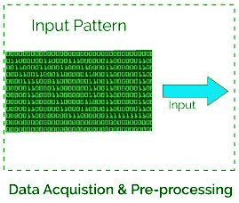

# 美国有线电视新闻网–用发生器进行图像数据预处理

> 原文:[https://www . geesforgeks . org/CNN-image-data-预处理-用生成器/](https://www.geeksforgeeks.org/cnn-image-data-pre-processing-with-generators/)

本文旨在学习如何对输入图像数据进行预处理，将其转换为有意义的浮点张量，以输入卷积神经网络。只是因为知识张量是用来存储数据的，所以可以假设为多维数组。表示具有 3 个通道的 64×64 图像的张量将具有其维度(64，64，3)。目前，数据以 JPEG 文件的形式存储在驱动器上，所以让我们看看实现它的步骤。

**算法:**

*   读取图片文件(存储在数据文件夹中)。
*   将 JPEG 内容解码为带有通道的 RGB 像素网格。
*   将这些转换成浮点张量，作为神经网络的输入。
*   将像素值(0 到 255 之间)重新缩放到[0，1]间隔(因为用这个范围训练神经网络变得有效)。



这可能看起来有点繁琐，但是 Keras 有实用程序来接管整个算法，并为您完成繁重的工作。Keras 有一个带有图像处理帮助工具的模块，位于`keras.preprocessing.image`。它包含类 *ImageDataGenerator* ，可以让你快速设置 Python 生成器，可以自动将磁盘上的图像文件转换成批量的预处理张量。

**Code: Practical Implementation :**

```
# Importing the ImageDataGenerator for pre-processing 
from keras.preprocessing.image import ImageDataGenerator

# Initialising the generators for train and test data
# The rescale parameter ensures the input range in [0, 1] 
train_datagen = ImageDataGenerator(rescale = 1./255)
test_datagen = ImageDataGenerator(rescale = 1./255)

# Creating the generators with each batch of size = 20 images
# The train_dir is the path to train folder which contains input classes
# Here it is 'cat' and 'dog' so class_mode is binary

train_generator = train_datagen.flow_from_directory(
                  train_dir,
                  target_size =(150, 150),  # target_size = input image size
                  batch_size = 20,
                  class_mode ='binary')

test_generator = test_datagen.flow_from_directory(
                    test_dir,
                    target_size =(150, 150),
                    batch_size = 20,
                    class_mode ='binary')
```

**输出:**

```
It yields batches of *150 × 150* RGB images of shape *(20, 150, 150, 3)* 
and binary labels of shape *(20, )*.
```

**拟合模型:**
让我们使用生成器将模型拟合到数据，这是使用 fit_generator 方法完成的，相当于如下所示的数据生成器的拟合。它的第一个参数是一个 Python 生成器，它将无限期地产生成批的输入和目标，因为数据是无休止地生成的，在宣布一个纪元结束之前，Keras 模型需要知道要从生成器中提取多少样本。这就是*步每时代*论点的作用。
现在决定*每周期步数*参数，因为我们总共有 2000 个训练图像，并且每批图像的大小为 20，因此，每周期步数将为 2000 / 20 = 100。
代码:

```
# Your compiled model being trained with fit_generator
history = model.fit_generator(
             train_generator,
             steps_per_epoch = 100,
             epochs = 30,
             validation_data = test_generator,
             validation_steps = 50)

# Note: here the validation steps are necessary because
# the test_genrator also yield batches indefinitely in loops
```